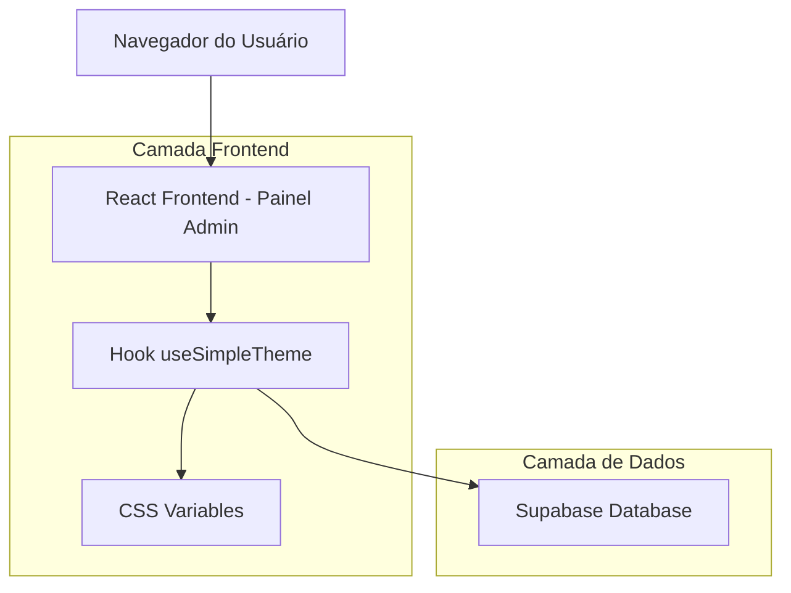
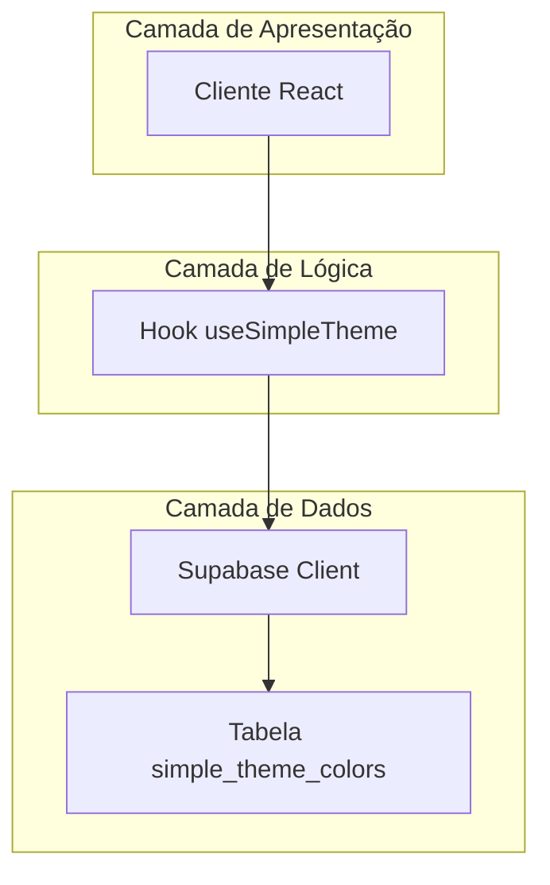
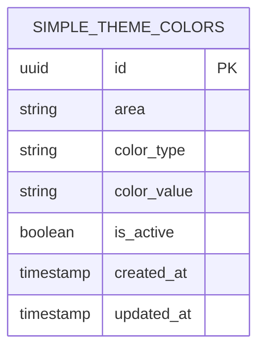

# Arquitetura Técnica - Sistema de Cores Simplificado

## 1. Design da Arquitetura



## 2. Descrição das Tecnologias

- Frontend: React@18 + TypeScript + Tailwind CSS + Vite
- Backend: Supabase (PostgreSQL + Auth + Real-time)
- Estado: React Hooks customizados
- Persistência: Supabase Database + CSS Variables

## 3. Definições de Rotas

| Rota | Propósito |
|------|-----------|
| /admin/theme-simple | Painel simplificado de personalização de cores |
| /admin/theme-simple/preview | Preview das alterações em tempo real |

## 4. Definições da API

### 4.1 API Principal

**Buscar cores ativas**
```
GET /api/theme/simple-colors
```

Resposta:
| Nome do Parâmetro | Tipo | Descrição |
|-------------------|------|-----------|
| header_bg | string | Cor de fundo do header |
| header_text | string | Cor do texto do header |
| landing_bg | string | Cor de fundo da landing page |
| dashboard_bg | string | Cor de fundo do dashboard |
| button_primary | string | Cor primária dos botões |
| button_secondary | string | Cor secundária dos botões |

Exemplo:
```json
{
  "header_bg": "#F8BBD9",
  "header_text": "#FFFFFF",
  "landing_bg": "#FEF7FF",
  "dashboard_bg": "#FFFBEB",
  "button_primary": "#F8BBD9",
  "button_secondary": "#BFDBFE"
}
```

**Atualizar cores**
```
POST /api/theme/update-simple-colors
```

Requisição:
| Nome do Parâmetro | Tipo | Obrigatório | Descrição |
|-------------------|------|-------------|-----------|
| area | string | true | Área a ser atualizada (header, landing, dashboard, buttons) |
| color_type | string | true | Tipo da cor (bg, text, primary, secondary) |
| color_value | string | true | Valor hexadecimal da cor |

Resposta:
| Nome do Parâmetro | Tipo | Descrição |
|-------------------|------|-----------|
| success | boolean | Status da operação |
| message | string | Mensagem de confirmação |

## 5. Diagrama da Arquitetura do Servidor



## 6. Modelo de Dados

### 6.1 Definição do Modelo de Dados



### 6.2 Linguagem de Definição de Dados

**Tabela de Cores Simplificada (simple_theme_colors)**
```sql
-- Criar tabela simplificada
CREATE TABLE simple_theme_colors (
    id UUID PRIMARY KEY DEFAULT gen_random_uuid(),
    area VARCHAR(20) NOT NULL CHECK (area IN ('header', 'landing', 'dashboard', 'buttons')),
    color_type VARCHAR(20) NOT NULL CHECK (color_type IN ('bg', 'text', 'primary', 'secondary')),
    color_value VARCHAR(7) NOT NULL CHECK (color_value ~ '^#[0-9A-Fa-f]{6}$'),
    is_active BOOLEAN DEFAULT true,
    created_at TIMESTAMP WITH TIME ZONE DEFAULT NOW(),
    updated_at TIMESTAMP WITH TIME ZONE DEFAULT NOW()
);

-- Criar índices
CREATE INDEX idx_simple_theme_area ON simple_theme_colors(area);
CREATE INDEX idx_simple_theme_active ON simple_theme_colors(is_active);
CREATE UNIQUE INDEX idx_simple_theme_unique ON simple_theme_colors(area, color_type) WHERE is_active = true;

-- Inserir dados iniciais (cores originais)
INSERT INTO simple_theme_colors (area, color_type, color_value) VALUES
-- Header
('header', 'bg', '#FEF7FF'),
('header', 'text', '#F8BBD9'),

-- Landing Page
('landing', 'bg', '#FEF7FF'),

-- Dashboard
('dashboard', 'bg', '#FFFBEB'),

-- Botões
('buttons', 'primary', '#F8BBD9'),
('buttons', 'secondary', '#BFDBFE');

-- Configurar RLS (Row Level Security)
ALTER TABLE simple_theme_colors ENABLE ROW LEVEL SECURITY;

-- Política para leitura pública
CREATE POLICY "Permitir leitura pública de cores" ON simple_theme_colors
    FOR SELECT USING (true);

-- Política para administradores
CREATE POLICY "Permitir administradores modificar cores" ON simple_theme_colors
    FOR ALL USING (
        EXISTS (
            SELECT 1 FROM admin_users_pet 
            WHERE user_id = auth.uid() 
            AND is_active = true
        )
    );
```

## 7. Estrutura de Hooks Simplificada

### 7.1 Hook useSimpleTheme

```typescript
interface SimpleThemeColors {
  header_bg: string;
  header_text: string;
  landing_bg: string;
  dashboard_bg: string;
  button_primary: string;
  button_secondary: string;
}

interface UseSimpleTheme {
  colors: SimpleThemeColors;
  loading: boolean;
  error: string | null;
  updateColor: (area: string, colorType: string, value: string) => Promise<boolean>;
  resetToOriginal: () => Promise<boolean>;
  applyColors: () => void;
}
```

### 7.2 Mapeamento CSS Variables

```css
:root {
  /* Header */
  --header-bg: var(--simple-header-bg, #FEF7FF);
  --header-text: var(--simple-header-text, #F8BBD9);
  
  /* Landing Page */
  --landing-bg: var(--simple-landing-bg, #FEF7FF);
  
  /* Dashboard */
  --dashboard-bg: var(--simple-dashboard-bg, #FFFBEB);
  
  /* Botões */
  --button-primary: var(--simple-button-primary, #F8BBD9);
  --button-secondary: var(--simple-button-secondary, #BFDBFE);
}
```

## 8. Fluxo de Dados Simplificado

### 8.1 Carregamento Inicial
1. Hook `useSimpleTheme` carrega cores do Supabase
2. Aplica cores como CSS variables no documento
3. Interface renderiza com cores personalizadas

### 8.2 Atualização de Cores
1. Usuário seleciona nova cor no painel
2. Hook atualiza estado local imediatamente (preview)
3. Aplica CSS variable temporariamente
4. Salva no Supabase em background
5. Confirma persistência ou reverte em caso de erro

### 8.3 Restauração Original
1. Hook carrega cores originais predefinidas
2. Atualiza banco de dados
3. Aplica CSS variables
4. Interface reflete mudanças instantaneamente

## 9. Benefícios da Arquitetura Simplificada

### 9.1 Performance
- Apenas 6 variáveis CSS para gerenciar
- Consultas de banco otimizadas
- Menos re-renderizações no React

### 9.2 Manutenibilidade
- Código limpo e focado
- Estrutura de dados simples
- Debugging facilitado

### 9.3 Escalabilidade
- Base sólida para futuras expansões
- Padrões bem definidos
- Separação clara de responsabilidades