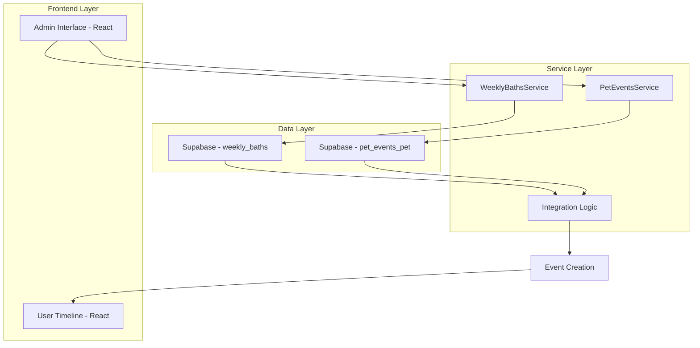
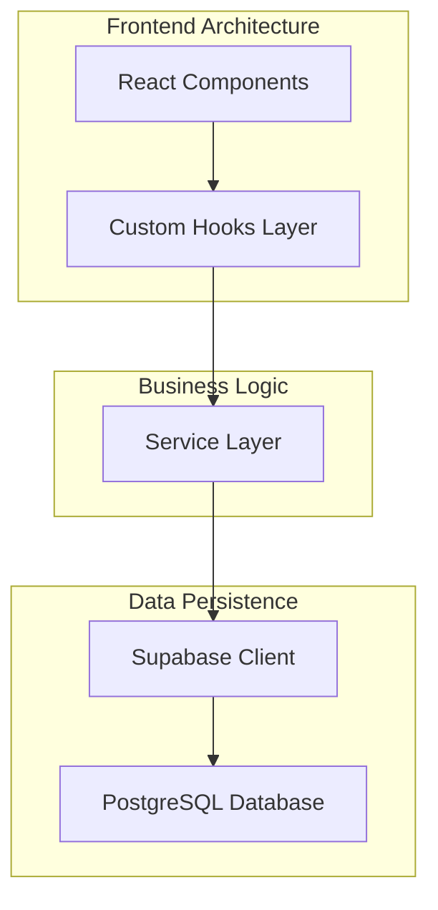
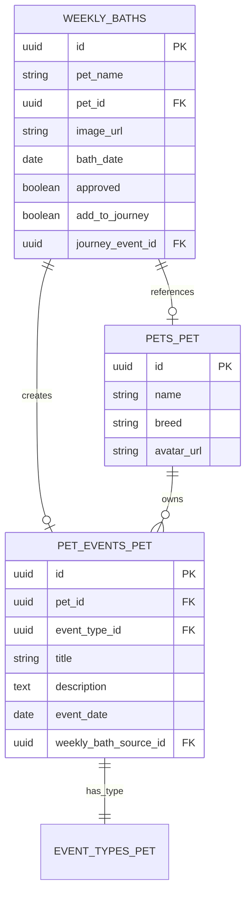

# Arquitetura Técnica - Integração Banhos Semanais e Jornada de Crescimento

## 1. Arquitetura do Sistema



## 2. Descrição das Tecnologias

* **Frontend:** React\@18 + TypeScript + TailwindCSS + Vite

* **Backend:** Supabase (PostgreSQL + Auth + Storage)

* **Estado:** React Hooks + Context API

* **Validação:** Zod para schemas TypeScript

* **UI Components:** Lucide React para ícones

## 3. Definições de Rotas

| Rota                     | Propósito                                        |
| ------------------------ | ------------------------------------------------ |
| /admin/weekly-baths      | Interface de curadoria aprimorada com integração |
| /growth-journey/:petId   | Jornada do pet com eventos integrados            |
| /admin/integration-stats | Painel de estatísticas de integração             |

## 4. Definições da API

### 4.1 Modificações no Banco de Dados

**Alterações na tabela weekly\_baths:**

```sql
-- Adicionar campos para integração
ALTER TABLE weekly_baths 
ADD COLUMN add_to_journey BOOLEAN DEFAULT false,
ADD COLUMN journey_event_id UUID REFERENCES pet_events_pet(id) ON DELETE SET NULL;

-- Índices para performance
CREATE INDEX idx_weekly_baths_add_to_journey ON weekly_baths(add_to_journey);
CREATE INDEX idx_weekly_baths_journey_event_id ON weekly_baths(journey_event_id);
```

### 4.2 Interfaces TypeScript

**WeeklyBath Interface (Atualizada):**

```typescript
interface WeeklyBath {
  id: string;
  created_at: string;
  updated_at: string;
  pet_name: string;
  pet_id?: string;
  image_url: string;
  bath_date: string;
  approved: boolean;
  approved_by?: string;
  approved_at?: string;
  week_start: string;
  display_order: number;
  curator_notes?: string;
  add_to_journey: boolean;        // NOVO
  journey_event_id?: string;      // NOVO
}
```

**Integration Service:**

```typescript
interface IntegrationService {
  // Criar evento na jornada a partir do banho
  createJourneyEventFromBath(bathId: string): Promise<PetEvent>;
  
  // Verificar se pet existe e é válido
  validatePetForIntegration(petId: string): Promise<boolean>;
  
  // Obter estatísticas de integração
  getIntegrationStats(dateRange?: DateRange): Promise<IntegrationStats>;
}
```

### 4.3 APIs Principais

**Aprovação com Integração:**

```
POST /api/weekly-baths/:id/approve-with-integration
```

Request:

| Parâmetro        | Tipo    | Obrigatório | Descrição                       |
| ---------------- | ------- | ----------- | ------------------------------- |
| approved\_by     | string  | true        | ID do administrador             |
| add\_to\_journey | boolean | true        | Se deve criar evento na jornada |

Response:

| Parâmetro      | Tipo       | Descrição                    |
| -------------- | ---------- | ---------------------------- |
| bath           | WeeklyBath | Banho atualizado             |
| journey\_event | PetEvent?  | Evento criado (se aplicável) |
| success        | boolean    | Status da operação           |

**Buscar Pets para Seleção:**

```
GET /api/pets/for-selection
```

Response:

```json
{
  "pets": [
    {
      "id": "uuid",
      "name": "Luna",
      "breed": "Golden Retriever",
      "avatar_url": "https://...",
      "owner_name": "João Silva"
    }
  ]
}
```

## 5. Arquitetura do Servidor



## 6. Modelo de Dados

### 6.1 Diagrama de Entidades



### 6.2 Scripts SQL de Implementação

**1. Modificações na tabela weekly\_baths:**

```sql
-- Adicionar novos campos
ALTER TABLE weekly_baths 
ADD COLUMN add_to_journey BOOLEAN DEFAULT false,
ADD COLUMN journey_event_id UUID REFERENCES pet_events_pet(id) ON DELETE SET NULL;

-- Criar índices para performance
CREATE INDEX idx_weekly_baths_add_to_journey ON weekly_baths(add_to_journey);
CREATE INDEX idx_weekly_baths_journey_event_id ON weekly_baths(journey_event_id);

-- Atualizar políticas RLS
CREATE POLICY "Admins can update integration fields" ON weekly_baths
  FOR UPDATE
  TO authenticated
  USING (
    EXISTS (
      SELECT 1 FROM profiles_pet
      WHERE profiles_pet.id = auth.uid()
      AND profiles_pet.email IN (SELECT email FROM admin_users_pet)
    )
  );
```

**2. Modificações na tabela pet\_events\_pet:**

```sql
-- Adicionar campo para rastrear origem do evento
ALTER TABLE pet_events_pet 
ADD COLUMN weekly_bath_source_id UUID REFERENCES weekly_baths(id) ON DELETE SET NULL;

-- Criar índice
CREATE INDEX idx_pet_events_weekly_bath_source ON pet_events_pet(weekly_bath_source_id);
```

**3. Função para criar evento na jornada:**

```sql
CREATE OR REPLACE FUNCTION create_journey_event_from_bath(
  bath_id UUID,
  admin_id UUID
) RETURNS UUID AS $$
DECLARE
  bath_record weekly_baths%ROWTYPE;
  event_type_id UUID;
  new_event_id UUID;
BEGIN
  -- Buscar dados do banho
  SELECT * INTO bath_record FROM weekly_baths WHERE id = bath_id;
  
  IF NOT FOUND THEN
    RAISE EXCEPTION 'Banho não encontrado';
  END IF;
  
  IF bath_record.pet_id IS NULL THEN
    RAISE EXCEPTION 'Pet não especificado para o banho';
  END IF;
  
  -- Buscar tipo de evento "Banho e Tosa"
  SELECT id INTO event_type_id 
  FROM event_types_pet 
  WHERE name = 'Banho e Tosa' 
  LIMIT 1;
  
  IF NOT FOUND THEN
    RAISE EXCEPTION 'Tipo de evento "Banho e Tosa" não encontrado';
  END IF;
  
  -- Criar evento na jornada
  INSERT INTO pet_events_pet (
    pet_id,
    event_type_id,
    title,
    description,
    event_date,
    weekly_bath_source_id,
    created_by
  ) VALUES (
    bath_record.pet_id,
    event_type_id,
    'Banho e Tosa - ' || bath_record.pet_name,
    'Evento criado automaticamente a partir dos banhos semanais.',
    bath_record.bath_date,
    bath_id,
    admin_id
  ) RETURNING id INTO new_event_id;
  
  -- Criar foto do evento
  INSERT INTO event_photos_pet (
    event_id,
    file_path,
    caption,
    is_primary
  ) VALUES (
    new_event_id,
    bath_record.image_url,
    'Foto do banho semanal',
    true
  );
  
  -- Atualizar banho com referência ao evento
  UPDATE weekly_baths 
  SET journey_event_id = new_event_id 
  WHERE id = bath_id;
  
  RETURN new_event_id;
END;
$$ LANGUAGE plpgsql SECURITY DEFINER;

-- Conceder permissões
GRANT EXECUTE ON FUNCTION create_journey_event_from_bath(UUID, UUID) TO authenticated;
```

**4. Dados iniciais:**

```sql
-- Garantir que existe o tipo de evento "Banho e Tosa"
INSERT INTO event_types_pet (name, description, icon, color)
VALUES ('Banho e Tosa', 'Serviços de higiene e estética', 'bath', '#3B82F6')
ON CONFLICT (name) DO NOTHING;
```

