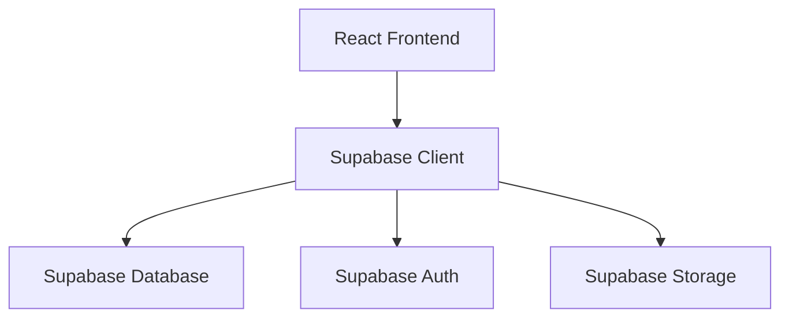
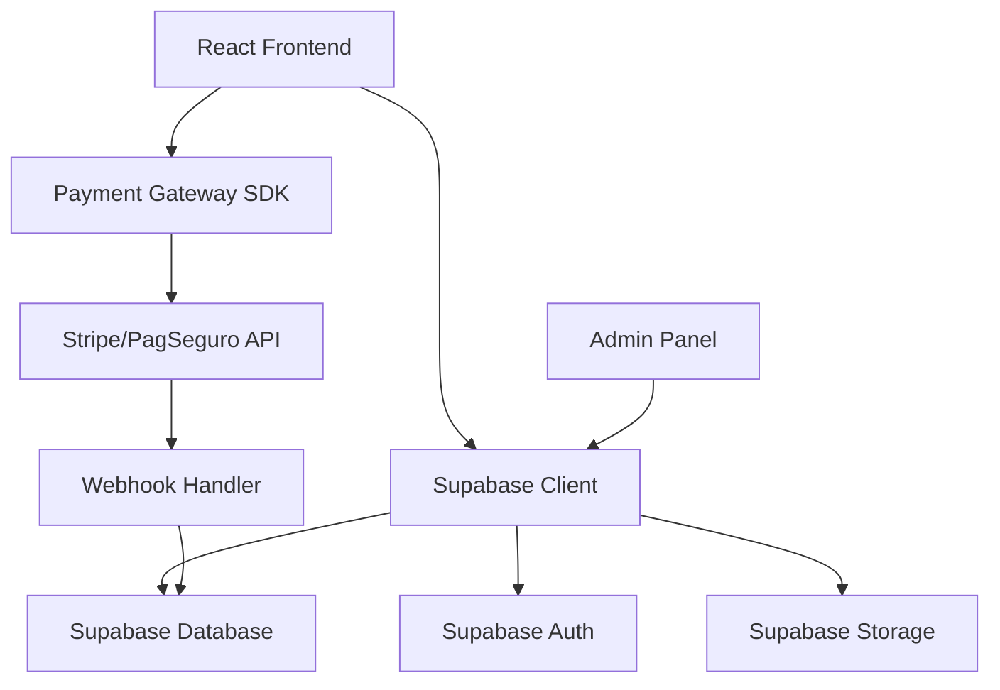

# Avaliação Completa do E-commerce - PetShop Romeo & Julieta

## 1. Visão Geral do Projeto

O PetShop Romeo & Julieta é uma plataforma web desenvolvida em React/TypeScript com Supabase como backend, focada em serviços para pets. O projeto possui uma base sólida para serviços de pet care, mas o módulo de e-commerce está em desenvolvimento inicial, necessitando de implementações significativas para se tornar uma loja online completa.

## 2. Análise da Estrutura Atual do Banco de Dados

### 2.1 Tabelas Existentes Relacionadas ao E-commerce

#### ✅ **Implementadas e Funcionais**
- `products_pet` - Produtos da loja
- `cart_items_pet` - Itens do carrinho
- `orders_pet` - Pedidos
- `order_items_pet` - Itens dos pedidos
- `coupons_pet` - Cupons de desconto
- `coupon_usage_pet` - Histórico de uso de cupons
- `product_reviews_pet` - Avaliações de produtos
- `wishlist_pet` - Lista de desejos
- `product_categories_pet` - Categorias de produtos
- `inventory_pet` - Controle de estoque
- `stock_movements_pet` - Movimentação de estoque

#### 🔄 **Parcialmente Implementadas**
- `payment_transactions` - Transações de pagamento (mencionada no código, mas não no schema principal)

### 2.2 Estrutura das Tabelas Principais

**products_pet:**
- ✅ Campos básicos: name, description, price, category
- ✅ Controle de estoque: in_stock
- ✅ Sistema de avaliações: rating, reviews_count
- ✅ Badges promocionais: badge (Bestseller, Oferta, Novo)
- ✅ Preços: price, original_price

**cart_items_pet:**
- ✅ Relacionamento usuário-produto
- ✅ Quantidade e preço no momento da adição
- ✅ Constraint de unicidade (user_id, product_id)

**orders_pet:**
- ✅ Numeração de pedidos
- ✅ Status completo do pedido
- ✅ Valores: total, frete, desconto, valor final
- ✅ Métodos de pagamento
- ✅ Endereços de entrega e cobrança
- ✅ Rastreamento e entrega

## 3. Avaliação das Funcionalidades Existentes

### 3.1 Frontend - Páginas Implementadas

#### ✅ **Store.tsx - Loja Principal**
- **Status:** Implementada e funcional
- **Funcionalidades:**
  - Listagem de produtos
  - Filtros por categoria
  - Adicionar ao carrinho
  - Contador de itens no carrinho
  - Interface responsiva
  - Autenticação obrigatória

#### 🔄 **Checkout.tsx - Finalização**
- **Status:** Implementada apenas para assinaturas
- **Limitações:**
  - Focada em planos de assinatura, não produtos
  - Não integrada com carrinho de produtos
  - Métodos de pagamento limitados (PIX e cartão)

### 3.2 Serviços Backend

#### ✅ **CartService**
- **Status:** Completamente implementado
- **Funcionalidades:**
  - Adicionar/remover itens
  - Atualizar quantidades
  - Validação de estoque
  - Sincronização com inventário
  - Cálculo de totais

#### ✅ **ProductsService**
- **Status:** Implementado básico
- **Funcionalidades:**
  - Buscar produtos
  - Filtrar por categoria
  - Busca por texto
  - Produto individual

#### ✅ **OrdersService**
- **Status:** Bem implementado
- **Funcionalidades:**
  - Criar pedidos
  - Gerenciar status
  - Rastreamento
  - Estatísticas do usuário
  - Histórico completo

#### 🔄 **PaymentService**
- **Status:** Implementação simulada
- **Limitações:**
  - Apenas simulações de pagamento
  - Não integrado com gateways reais
  - Focado em assinaturas

## 4. Funcionalidades Faltantes para E-commerce Completo

### 4.1 Críticas (Impedem funcionamento)

#### 🚫 **Checkout de Produtos**
- Página de checkout específica para produtos do carrinho
- Integração carrinho → checkout → pagamento → pedido
- Cálculo de frete
- Aplicação de cupons de desconto

#### 🚫 **Gateway de Pagamento Real**
- Integração com Stripe, PagSeguro, ou Mercado Pago
- Processamento real de cartões
- PIX com QR Code funcional
- Webhooks de confirmação

#### 🚫 **Gestão de Estoque Ativa**
- Redução automática no estoque após compra
- Alertas de estoque baixo
- Controle de produtos esgotados

### 4.2 Importantes (Melhoram experiência)

#### ⚠️ **Painel Administrativo de E-commerce**
- Gestão de produtos (CRUD completo)
- Gestão de pedidos
- Relatórios de vendas
- Controle de estoque
- Gestão de cupons

#### ⚠️ **Sistema de Avaliações**
- Interface para avaliar produtos
- Exibição de avaliações na loja
- Moderação de comentários

#### ⚠️ **Busca Avançada**
- Filtros por preço, avaliação, marca
- Ordenação (preço, popularidade, avaliação)
- Busca com autocomplete

### 4.3 Opcionais (Funcionalidades avançadas)

#### 💡 **Recomendações**
- Produtos relacionados
- "Quem comprou também comprou"
- Histórico de visualizações

#### 💡 **Marketing**
- Sistema de cupons avançado
- Promoções por categoria
- Cashback
- Programa de fidelidade

## 5. Arquitetura Recomendada

### 5.1 Arquitetura Atual

### 5.2 Arquitetura Recomendada para E-commerce Completo

### 5.3 Tecnologias Recomendadas

**Frontend:**
- React 18 + TypeScript (mantido)
- Tailwind CSS (mantido)
- React Query/TanStack Query (para cache e sincronização)
- React Hook Form (formulários)
- Zustand (gerenciamento de estado do carrinho)

**Backend/Serviços:**
- Supabase (mantido como principal)
- Stripe ou Mercado Pago (pagamentos)
- Supabase Edge Functions (webhooks e lógica complexa)
- Supabase Realtime (atualizações em tempo real)

**Infraestrutura:**
- Vercel ou Netlify (deploy frontend)
- Supabase (backend completo)
- CDN para imagens (Cloudinary ou Supabase Storage)

## 6. Plano de Desenvolvimento Priorizado

### 6.1 Fase 1: Fundação E-commerce (2-3 semanas)

**Prioridade: CRÍTICA**

#### Semana 1-2: Checkout e Pagamentos
- [ ] Criar página de checkout para produtos
- [ ] Integrar gateway de pagamento (Stripe recomendado)
- [ ] Implementar cálculo de frete
- [ ] Sistema de aplicação de cupons
- [ ] Fluxo completo: carrinho → checkout → pagamento → pedido

#### Semana 2-3: Gestão de Estoque
- [ ] Implementar redução automática de estoque
- [ ] Sistema de alertas de estoque baixo
- [ ] Controle de produtos esgotados
- [ ] Histórico de movimentações

**Entregáveis:**
- E-commerce básico funcional
- Compras reais processadas
- Controle de estoque ativo

### 6.2 Fase 2: Administração (2-3 semanas)

**Prioridade: ALTA**

#### Semana 1-2: Painel Admin
- [ ] CRUD completo de produtos
- [ ] Gestão de pedidos (status, rastreamento)
- [ ] Relatórios básicos de vendas
- [ ] Gestão de cupons

#### Semana 2-3: Melhorias UX
- [ ] Sistema de avaliações de produtos
- [ ] Busca avançada com filtros
- [ ] Ordenação de produtos
- [ ] Wishlist funcional

**Entregáveis:**
- Painel administrativo completo
- Experiência de compra melhorada
- Sistema de feedback dos clientes

### 6.3 Fase 3: Otimizações (2-3 semanas)

**Prioridade: MÉDIA**

#### Funcionalidades Avançadas
- [ ] Sistema de recomendações
- [ ] Produtos relacionados
- [ ] Histórico de visualizações
- [ ] Notificações de reestoque
- [ ] Programa de fidelidade básico

#### Performance e SEO
- [ ] Otimização de imagens
- [ ] SEO para páginas de produtos
- [ ] Cache inteligente
- [ ] Lazy loading

**Entregáveis:**
- E-commerce otimizado e performático
- Funcionalidades de marketing
- Experiência premium

### 6.4 Fase 4: Expansão (Futuro)

**Prioridade: BAIXA**

- [ ] App mobile (React Native)
- [ ] Integração com marketplaces
- [ ] Sistema de afiliados
- [ ] Multi-idiomas
- [ ] Análytics avançados

## 7. Estimativas de Desenvolvimento

### 7.1 Recursos Necessários

**Desenvolvedor Frontend:** 60-80 horas
**Desenvolvedor Backend:** 40-60 horas
**Designer UX/UI:** 20-30 horas
**QA/Testes:** 20-30 horas

### 7.2 Cronograma Realista

**Com 1 desenvolvedor full-stack:**
- Fase 1: 3-4 semanas
- Fase 2: 3-4 semanas
- Fase 3: 2-3 semanas
- **Total: 8-11 semanas**

**Com equipe (2-3 desenvolvedores):**
- Fase 1: 2 semanas
- Fase 2: 2-3 semanas
- Fase 3: 1-2 semanas
- **Total: 5-7 semanas**

### 7.3 Custos Estimados (Serviços)

**Mensais:**
- Supabase Pro: $25/mês
- Stripe: 2.9% + $0.30 por transação
- Vercel Pro: $20/mês (opcional)
- Cloudinary: $89/mês (opcional)

**Únicos:**
- Domínio: $10-15/ano
- SSL: Gratuito (Vercel/Netlify)

## 8. Riscos e Mitigações

### 8.1 Riscos Técnicos

**Alto:** Integração com gateway de pagamento
- **Mitigação:** Usar Stripe (documentação excelente) e ambiente de testes

**Médio:** Performance com muitos produtos
- **Mitigação:** Implementar paginação e cache desde o início

**Baixo:** Sincronização de estoque
- **Mitigação:** Usar transações do banco de dados

### 8.2 Riscos de Negócio

**Alto:** Abandono de carrinho
- **Mitigação:** Checkout simplificado e múltiplas opções de pagamento

**Médio:** Fraudes em pagamento
- **Mitigação:** Usar ferramentas anti-fraude do gateway

## 9. Conclusões e Recomendações

### 9.1 Estado Atual

O projeto possui uma **base sólida** para e-commerce com:
- ✅ Estrutura de banco bem planejada
- ✅ Serviços backend robustos
- ✅ Interface de loja funcional
- ✅ Sistema de carrinho completo

### 9.2 Próximos Passos Críticos

1. **Implementar checkout de produtos** (não apenas assinaturas)
2. **Integrar gateway de pagamento real**
3. **Ativar controle de estoque automático**
4. **Criar painel administrativo básico**

### 9.3 Recomendação Final

O projeto está **70% pronto** para ser um e-commerce funcional. Com 4-6 semanas de desenvolvimento focado, pode se tornar uma loja online completa e profissional.

**Prioridade imediata:** Focar na Fase 1 (Fundação E-commerce) para ter um MVP funcional rapidamente.

---

*Documento gerado em: $(date)*
*Versão: 1.0*
*Autor: SOLO Document Assistant