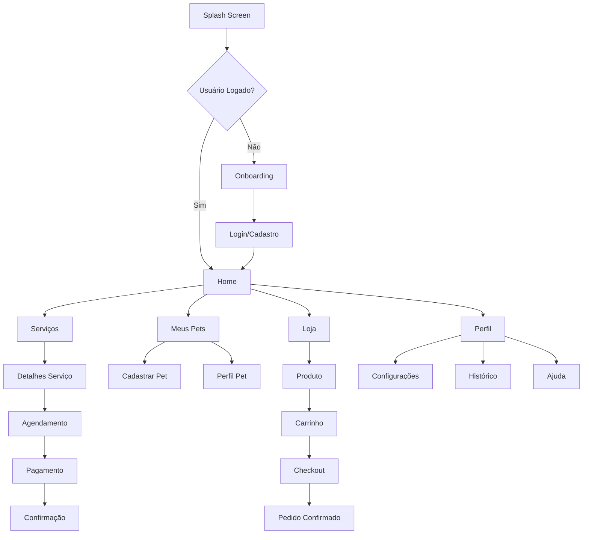

# Documento de Requisitos do Produto (PRD)
## PetShop Romeu & Julieta - Aplicativo Mobile

---

## 1. Visão Geral do Produto

O **PetShop Romeu & Julieta Mobile** é um aplicativo Flutter que oferece uma experiência completa de cuidados para pets, permitindo agendamento de serviços, compra de produtos e gerenciamento de informações dos animais de estimação.

O aplicativo resolve a necessidade de proprietários de pets terem acesso rápido e conveniente aos serviços do petshop, eliminando filas e facilitando o agendamento através de uma interface mobile intuitiva e moderna.

O objetivo é se tornar a principal plataforma mobile de serviços pet da região, oferecendo conveniência, qualidade e experiência superior aos clientes.

---

## 2. Funcionalidades Principais

### 2.1 Perfis de Usuário

| Perfil | Método de Cadastro | Permissões Principais |
|--------|-------------------|----------------------|
| Cliente | Email + senha ou Google/Apple Sign-In | Pode agendar serviços, comprar produtos, gerenciar pets, visualizar histórico |
| Administrador | Convite interno | Pode gerenciar agendamentos, produtos, serviços, visualizar relatórios |

### 2.2 Módulos Funcionais

Nosso aplicativo mobile consiste nas seguintes páginas principais:

1. **Tela de Boas-vindas**: splash screen, onboarding interativo, introdução aos recursos
2. **Autenticação**: login, cadastro, recuperação de senha, autenticação social
3. **Home**: dashboard personalizado, serviços em destaque, agendamentos próximos, promoções
4. **Serviços**: catálogo completo, filtros por categoria, detalhes e preços, agendamento rápido
5. **Agendamento**: seleção de pet, escolha de horário, confirmação, pagamento
6. **Meus Pets**: cadastro de pets, perfis individuais, histórico médico, fotos
7. **Loja**: produtos para pets, carrinho de compras, checkout, rastreamento de pedidos
8. **Perfil**: dados pessoais, configurações, histórico de serviços, métodos de pagamento
9. **Notificações**: lembretes de agendamento, promoções, atualizações de pedidos
10. **Ajuda**: FAQ, chat de suporte, tutoriais, contato

### 2.3 Detalhes das Páginas

| Nome da Página | Nome do Módulo | Descrição da Funcionalidade |
|----------------|----------------|-----------------------------|
| Tela de Boas-vindas | Splash Screen | Exibir logo animado, verificar autenticação, redirecionar usuário |
| Tela de Boas-vindas | Onboarding | Apresentar recursos principais através de slides interativos com animações |
| Autenticação | Login | Autenticar com email/senha, Google Sign-In, Apple Sign-In, lembrar credenciais |
| Autenticação | Cadastro | Criar conta com dados pessoais, validação de email, termos de uso |
| Autenticação | Recuperação | Enviar link de redefinição por email, validar código, alterar senha |
| Home | Dashboard | Mostrar resumo personalizado, próximos agendamentos, serviços favoritos |
| Home | Serviços Destaque | Exibir serviços populares, promoções ativas, acesso rápido ao agendamento |
| Home | Navegação Rápida | Botões de acesso direto para agendamento, loja, meus pets |
| Serviços | Catálogo | Listar todos os serviços disponíveis com imagens, preços e descrições |
| Serviços | Filtros | Filtrar por categoria, preço, duração, disponibilidade |
| Serviços | Detalhes | Mostrar informações completas, avaliações, galeria de fotos |
| Agendamento | Seleção Pet | Escolher pet cadastrado, visualizar informações relevantes |
| Agendamento | Calendário | Mostrar disponibilidade em calendário interativo, horários livres |
| Agendamento | Confirmação | Revisar detalhes, adicionar observações, confirmar agendamento |
| Agendamento | Pagamento | Processar pagamento via PIX, cartão, confirmar transação |
| Meus Pets | Lista Pets | Exibir todos os pets cadastrados com fotos e informações básicas |
| Meus Pets | Cadastro Pet | Formulário completo com foto, dados, histórico médico |
| Meus Pets | Perfil Pet | Visualizar/editar informações, histórico de serviços, fotos |
| Loja | Catálogo Produtos | Listar produtos com filtros, busca, categorias, preços |
| Loja | Carrinho | Gerenciar itens, calcular total, aplicar cupons de desconto |
| Loja | Checkout | Finalizar compra, escolher entrega, processar pagamento |
| Perfil | Dados Pessoais | Visualizar/editar informações do usuário, foto de perfil |
| Perfil | Configurações | Notificações, privacidade, tema, idioma |
| Perfil | Histórico | Visualizar agendamentos passados, compras, avaliações |
| Notificações | Central | Listar todas as notificações, marcar como lida, filtros |
| Notificações | Configurações | Gerenciar tipos de notificação, horários, canais |
| Ajuda | FAQ | Perguntas frequentes organizadas por categoria |
| Ajuda | Chat Suporte | Chat em tempo real com atendimento, histórico de conversas |
| Ajuda | Tutoriais | Guias passo-a-passo com vídeos e imagens |

---

## 3. Fluxo Principal de Processos

### Fluxo do Cliente:
1. **Primeiro Acesso**: Download → Onboarding → Cadastro → Verificação Email → Login
2. **Cadastro de Pet**: Home → Meus Pets → Adicionar Pet → Preencher Dados → Salvar
3. **Agendamento de Serviço**: Home → Serviços → Escolher Serviço → Selecionar Pet → Escolher Data/Hora → Confirmar → Pagar
4. **Compra de Produto**: Home → Loja → Buscar Produto → Adicionar ao Carrinho → Checkout → Pagar → Acompanhar Entrega
5. **Gerenciamento**: Perfil → Histórico → Reagendar/Cancelar → Avaliar Serviço

### Fluxo do Administrador:
1. **Gestão de Agendamentos**: Dashboard Admin → Agenda → Confirmar/Reagendar → Atualizar Status
2. **Gestão de Produtos**: Produtos → Adicionar/Editar → Controlar Estoque → Definir Promoções

---

## 4. Design da Interface do Usuário

### 4.1 Estilo de Design

**Paleta de Cores:**
- **Primária**: Rosa delicado (#F8BBD9) - Botões principais, destaques
- **Secundária**: Azul suave (#BFDBFE) - Elementos informativos, ícones
- **Terciária**: Amarelo suave (#FEF3C7) - Alertas, promoções
- **Neutras**: Branco (#FFFFFF), Cinza claro (#F8FAFC), Cinza escuro (#1E293B)

**Tipografia:**
- **Títulos**: Playfair Display (elegante, serifada)
- **Corpo**: Inter (moderna, legível)
- **Tamanhos**: 32px (títulos), 18px (subtítulos), 16px (corpo), 14px (legendas)

**Estilo de Botões:**
- Bordas arredondadas (12px radius)
- Sombras suaves (elevation 2-4)
- Estados hover/pressed com feedback tátil
- Ícones integrados quando apropriado

**Layout:**
- Design card-based com espaçamento generoso
- Bottom navigation com 5 abas principais
- Floating Action Button para ações primárias
- Animações suaves de transição (300ms)

**Ícones e Emojis:**
- Material Design Icons como base
- Ícones customizados para pets (🐕🐱)
- Emojis contextuais para feedback emocional
- Ilustrações minimalistas para onboarding

### 4.2 Visão Geral do Design das Páginas

| Nome da Página | Nome do Módulo | Elementos de UI |
|----------------|----------------|----------------|
| Splash Screen | Animação Logo | Logo centralizado com animação de fade-in, background gradiente rosa-azul, indicador de carregamento |
| Onboarding | Slides Interativos | ViewPager com 3 slides, ilustrações coloridas, botões "Próximo/Pular", indicadores de progresso |
| Login | Formulário | Campos de entrada com ícones, botão primário rosa, links secundários, opções de login social |
| Home | Dashboard | AppBar com saudação personalizada, cards de serviços em grid 2x2, lista horizontal de pets, FAB para agendamento |
| Serviços | Lista/Grid | SearchBar no topo, chips de filtro, cards de serviço com imagem/preço, botão "Agendar" em cada card |
| Agendamento | Stepper | Progress indicator no topo, formulário em etapas, calendário interativo, botões de navegação |
| Meus Pets | Lista + FAB | Cards de pets com foto circular, informações básicas, FAB para adicionar novo pet |
| Loja | E-commerce | Barra de busca, filtros em drawer, grid de produtos, badge no carrinho, preços destacados |
| Perfil | Lista Configurações | Avatar circular no topo, lista de opções com ícones, switches para configurações, botão logout |

### 4.3 Responsividade

**Estratégia Mobile-First:**
- Design otimizado para telas de 5" a 6.7"
- Suporte a tablets com layout adaptativo
- Orientação portrait prioritária
- Touch targets mínimos de 44px
- Gestos intuitivos (swipe, pinch, long-press)
- Feedback háptico para ações importantes

**Acessibilidade:**
- Contraste mínimo WCAG AA (4.5:1)
- Suporte a leitores de tela
- Navegação por teclado
- Textos escaláveis
- Indicadores visuais claros

---

## 5. Requisitos Técnicos

### 5.1 Plataformas Suportadas
- **iOS**: 12.0+ (iPhone 6s em diante)
- **Android**: API 21+ (Android 5.0+)
- **Arquiteturas**: ARM64, x86_64

### 5.2 Funcionalidades Nativas
- **Câmera**: Captura de fotos para pets
- **Galeria**: Seleção de imagens existentes
- **Notificações Push**: Lembretes e atualizações
- **Localização**: Endereço para entrega (opcional)
- **Biometria**: Login com impressão digital/Face ID
- **Calendário**: Integração com agenda do dispositivo
- **Compartilhamento**: Compartilhar agendamentos/produtos

### 5.3 Integrações Externas
- **Supabase**: Backend, autenticação, banco de dados
- **Firebase**: Push notifications, analytics, crashlytics
- **Stripe/PagSeguro**: Processamento de pagamentos
- **Google Maps**: Localização e rotas (opcional)
- **WhatsApp Business**: Chat de suporte

### 5.4 Performance e Segurança
- **Tempo de carregamento**: < 3 segundos
- **Tamanho do app**: < 50MB
- **Offline**: Cache de dados essenciais
- **Criptografia**: Dados sensíveis em AES-256
- **Autenticação**: JWT tokens com refresh
- **Validação**: Input sanitization e validação

---

## 6. Critérios de Aceitação

### 6.1 Funcionalidades Obrigatórias
- ✅ Cadastro e login de usuários
- ✅ Gerenciamento completo de pets
- ✅ Agendamento de serviços com calendário
- ✅ Catálogo de produtos com carrinho
- ✅ Processamento de pagamentos
- ✅ Notificações push
- ✅ Perfil de usuário editável
- ✅ Histórico de agendamentos e compras

### 6.2 Métricas de Sucesso
- **Adoção**: 1000+ downloads no primeiro mês
- **Engajamento**: 70%+ usuários ativos mensais
- **Conversão**: 25%+ taxa de agendamento
- **Satisfação**: 4.5+ estrelas nas lojas
- **Performance**: 95%+ uptime, < 2s loading
- **Retenção**: 60%+ usuários retornam em 30 dias

### 6.3 Testes de Qualidade
- **Testes Unitários**: 80%+ cobertura de código
- **Testes de Integração**: APIs e fluxos principais
- **Testes de UI**: Automação com Flutter Driver
- **Testes de Usabilidade**: 10+ usuários beta
- **Testes de Performance**: Stress testing
- **Testes de Segurança**: Penetration testing

---

## 7. Roadmap de Desenvolvimento

### Fase 1 - MVP (8 semanas)
- Autenticação e cadastro
- Gerenciamento básico de pets
- Agendamento de serviços
- Perfil de usuário
- Notificações básicas

### Fase 2 - E-commerce (4 semanas)
- Catálogo de produtos
- Carrinho e checkout
- Processamento de pagamentos
- Histórico de pedidos

### Fase 3 - Melhorias (4 semanas)
- Chat de suporte
- Avaliações e reviews
- Programa de fidelidade
- Relatórios e analytics

### Fase 4 - Expansão (6 semanas)
- Múltiplas unidades
- Agendamento em grupo
- Integração com veterinários
- Marketplace de terceiros

---

**Documento criado em:** Janeiro 2024  
**Versão:** 1.0  
**Autor:** Equipe de Produto PetShop Romeu & Julieta  
**Status:** Aprovado para desenvolvimento  
**Próxima revisão:** Após conclusão do MVP