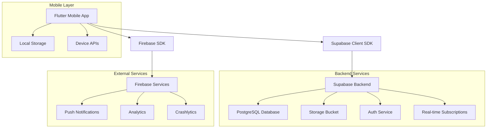
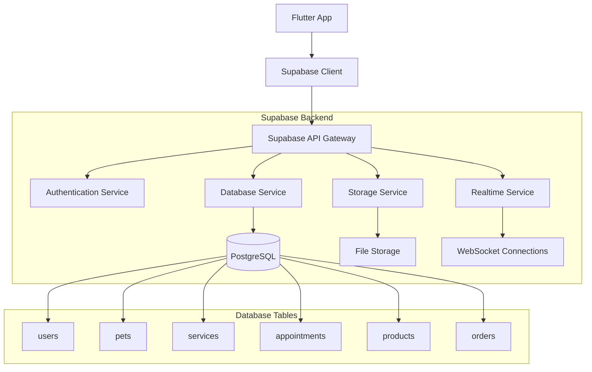
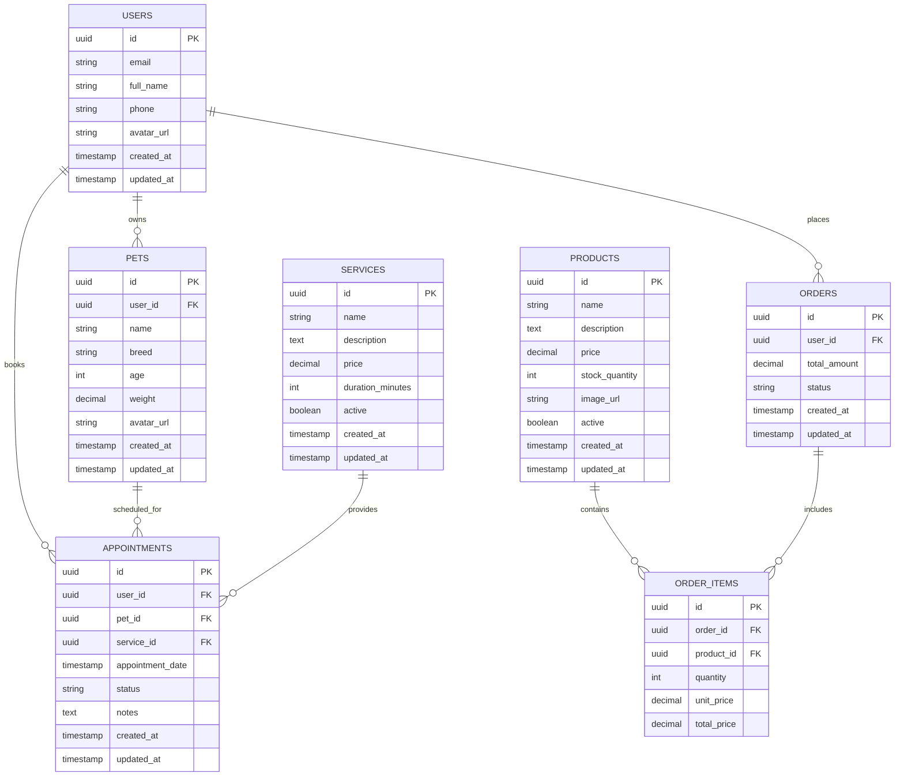

# Arquitetura Técnica - PetShop Romeu & Julieta Mobile
## Flutter Application Architecture

---

## 1. Arquitetura Geral



---

## 2. Stack Tecnológico

### Frontend (Mobile)
- **Framework**: Flutter 3.16+
- **Language**: Dart 3.0+
- **State Management**: Provider + ChangeNotifier
- **Navigation**: GoRouter 12.1+
- **UI Components**: Material 3 + Custom Widgets
- **Animations**: Flutter Animations + Lottie

### Backend (Supabase)
- **Database**: PostgreSQL (Supabase)
- **Authentication**: Supabase Auth
- **Storage**: Supabase Storage
- **Real-time**: Supabase Realtime
- **APIs**: Supabase REST + GraphQL

### External Services
- **Push Notifications**: Firebase Cloud Messaging
- **Analytics**: Firebase Analytics
- **Crash Reporting**: Firebase Crashlytics
- **Maps**: Google Maps (opcional)

---

## 3. Definições de Rotas

### 3.1 Estrutura de Navegação

| Rota | Propósito | Autenticação |
|------|-----------|-------------|
| `/` | Splash Screen | Não |
| `/onboarding` | Introdução ao app | Não |
| `/auth/login` | Tela de login | Não |
| `/auth/register` | Tela de cadastro | Não |
| `/auth/forgot-password` | Recuperação de senha | Não |
| `/home` | Tela principal | Sim |
| `/services` | Lista de serviços | Sim |
| `/services/:id` | Detalhes do serviço | Sim |
| `/booking` | Agendamento | Sim |
| `/booking/:id` | Detalhes do agendamento | Sim |
| `/store` | Loja de produtos | Sim |
| `/store/cart` | Carrinho de compras | Sim |
| `/profile` | Perfil do usuário | Sim |
| `/profile/pets` | Gerenciar pets | Sim |
| `/profile/pets/:id` | Detalhes do pet | Sim |
| `/notifications` | Central de notificações | Sim |
| `/help` | Central de ajuda | Sim |

### 3.2 Configuração GoRouter

```dart
// lib/core/navigation/app_router.dart
final GoRouter appRouter = GoRouter(
  initialLocation: '/',
  redirect: (context, state) {
    final authService = context.read<AuthService>();
    final isLoggedIn = authService.isAuthenticated;
    
    // Rotas públicas
    final publicRoutes = ['/auth/login', '/auth/register', '/onboarding'];
    
    if (!isLoggedIn && !publicRoutes.contains(state.location)) {
      return '/auth/login';
    }
    
    if (isLoggedIn && state.location.startsWith('/auth')) {
      return '/home';
    }
    
    return null;
  },
  routes: [
    GoRoute(
      path: '/',
      builder: (context, state) => const SplashScreen(),
    ),
    GoRoute(
      path: '/onboarding',
      builder: (context, state) => const OnboardingScreen(),
    ),
    ShellRoute(
      builder: (context, state, child) => MainLayout(child: child),
      routes: [
        GoRoute(
          path: '/home',
          builder: (context, state) => const HomeScreen(),
        ),
        GoRoute(
          path: '/services',
          builder: (context, state) => const ServicesScreen(),
          routes: [
            GoRoute(
              path: '/:id',
              builder: (context, state) => ServiceDetailScreen(
                serviceId: state.pathParameters['id']!,
              ),
            ),
          ],
        ),
        // ... outras rotas
      ],
    ),
  ],
);
```

---

## 4. Definições de API

### 4.1 Serviços Core

#### Autenticação
```dart
// lib/services/auth_service.dart
class AuthService extends ChangeNotifier {
  final SupabaseClient _supabase = Supabase.instance.client;
  User? _user;
  
  User? get user => _user;
  bool get isAuthenticated => _user != null;
  
  // Login com email/senha
  Future<AuthResponse> signInWithEmail(String email, String password) async {
    try {
      final response = await _supabase.auth.signInWithPassword(
        email: email,
        password: password,
      );
      _user = response.user;
      notifyListeners();
      return response;
    } catch (e) {
      throw AuthException(e.toString());
    }
  }
  
  // Registro
  Future<AuthResponse> signUpWithEmail(String email, String password, {
    required String fullName,
    required String phone,
  }) async {
    try {
      final response = await _supabase.auth.signUp(
        email: email,
        password: password,
        data: {
          'full_name': fullName,
          'phone': phone,
        },
      );
      return response;
    } catch (e) {
      throw AuthException(e.toString());
    }
  }
  
  // Logout
  Future<void> signOut() async {
    await _supabase.auth.signOut();
    _user = null;
    notifyListeners();
  }
}
```

#### Serviços de Pet
```dart
// lib/services/pets_service.dart
class PetsService {
  final SupabaseClient _supabase = Supabase.instance.client;
  
  // Buscar pets do usuário
  Future<List<Pet>> getUserPets() async {
    try {
      final response = await _supabase
          .from('pets')
          .select('*')
          .eq('user_id', _supabase.auth.currentUser!.id)
          .order('created_at', ascending: false);
      
      return response.map((json) => Pet.fromJson(json)).toList();
    } catch (e) {
      throw ServiceException('Erro ao buscar pets: $e');
    }
  }
  
  // Criar novo pet
  Future<Pet> createPet(CreatePetRequest request) async {
    try {
      final response = await _supabase
          .from('pets')
          .insert({
            'user_id': _supabase.auth.currentUser!.id,
            'name': request.name,
            'breed': request.breed,
            'age': request.age,
            'weight': request.weight,
            'avatar_url': request.avatarUrl,
          })
          .select()
          .single();
      
      return Pet.fromJson(response);
    } catch (e) {
      throw ServiceException('Erro ao criar pet: $e');
    }
  }
  
  // Atualizar pet
  Future<Pet> updatePet(String petId, UpdatePetRequest request) async {
    try {
      final response = await _supabase
          .from('pets')
          .update(request.toJson())
          .eq('id', petId)
          .eq('user_id', _supabase.auth.currentUser!.id)
          .select()
          .single();
      
      return Pet.fromJson(response);
    } catch (e) {
      throw ServiceException('Erro ao atualizar pet: $e');
    }
  }
}
```

#### Serviços de Agendamento
```dart
// lib/services/booking_service.dart
class BookingService {
  final SupabaseClient _supabase = Supabase.instance.client;
  
  // Buscar horários disponíveis
  Future<List<TimeSlot>> getAvailableSlots({
    required DateTime date,
    required String serviceId,
  }) async {
    try {
      final response = await _supabase.rpc('get_available_slots', params: {
        'service_date': date.toIso8601String(),
        'service_id': serviceId,
      });
      
      return response.map((json) => TimeSlot.fromJson(json)).toList();
    } catch (e) {
      throw ServiceException('Erro ao buscar horários: $e');
    }
  }
  
  // Criar agendamento
  Future<Booking> createBooking(CreateBookingRequest request) async {
    try {
      final response = await _supabase
          .from('appointments')
          .insert({
            'user_id': _supabase.auth.currentUser!.id,
            'pet_id': request.petId,
            'service_id': request.serviceId,
            'appointment_date': request.appointmentDate.toIso8601String(),
            'notes': request.notes,
            'status': 'scheduled',
          })
          .select('''
            *,
            pets(*),
            services(*)
          ''')
          .single();
      
      return Booking.fromJson(response);
    } catch (e) {
      throw ServiceException('Erro ao criar agendamento: $e');
    }
  }
  
  // Buscar agendamentos do usuário
  Future<List<Booking>> getUserBookings() async {
    try {
      final response = await _supabase
          .from('appointments')
          .select('''
            *,
            pets(*),
            services(*)
          ''')
          .eq('user_id', _supabase.auth.currentUser!.id)
          .order('appointment_date', ascending: false);
      
      return response.map((json) => Booking.fromJson(json)).toList();
    } catch (e) {
      throw ServiceException('Erro ao buscar agendamentos: $e');
    }
  }
}
```

### 4.2 Modelos de Dados

#### Modelo Pet
```dart
// lib/models/pet.dart
class Pet {
  final String id;
  final String userId;
  final String name;
  final String breed;
  final int age;
  final double weight;
  final String? avatarUrl;
  final DateTime createdAt;
  final DateTime updatedAt;
  
  Pet({
    required this.id,
    required this.userId,
    required this.name,
    required this.breed,
    required this.age,
    required this.weight,
    this.avatarUrl,
    required this.createdAt,
    required this.updatedAt,
  });
  
  factory Pet.fromJson(Map<String, dynamic> json) {
    return Pet(
      id: json['id'],
      userId: json['user_id'],
      name: json['name'],
      breed: json['breed'],
      age: json['age'],
      weight: json['weight'].toDouble(),
      avatarUrl: json['avatar_url'],
      createdAt: DateTime.parse(json['created_at']),
      updatedAt: DateTime.parse(json['updated_at']),
    );
  }
  
  Map<String, dynamic> toJson() {
    return {
      'id': id,
      'user_id': userId,
      'name': name,
      'breed': breed,
      'age': age,
      'weight': weight,
      'avatar_url': avatarUrl,
      'created_at': createdAt.toIso8601String(),
      'updated_at': updatedAt.toIso8601String(),
    };
  }
}
```

#### Modelo Booking
```dart
// lib/models/booking.dart
class Booking {
  final String id;
  final String userId;
  final String petId;
  final String serviceId;
  final DateTime appointmentDate;
  final String status;
  final String? notes;
  final Pet pet;
  final Service service;
  final DateTime createdAt;
  
  Booking({
    required this.id,
    required this.userId,
    required this.petId,
    required this.serviceId,
    required this.appointmentDate,
    required this.status,
    this.notes,
    required this.pet,
    required this.service,
    required this.createdAt,
  });
  
  factory Booking.fromJson(Map<String, dynamic> json) {
    return Booking(
      id: json['id'],
      userId: json['user_id'],
      petId: json['pet_id'],
      serviceId: json['service_id'],
      appointmentDate: DateTime.parse(json['appointment_date']),
      status: json['status'],
      notes: json['notes'],
      pet: Pet.fromJson(json['pets']),
      service: Service.fromJson(json['services']),
      createdAt: DateTime.parse(json['created_at']),
    );
  }
}
```

---

## 5. Arquitetura do Servidor (Supabase)



---

## 6. Modelo de Dados

### 6.1 Diagrama ER



### 6.2 DDL (Data Definition Language)

#### Tabela Users
```sql
-- Tabela de usuários (gerenciada pelo Supabase Auth)
CREATE TABLE public.users (
    id UUID REFERENCES auth.users(id) PRIMARY KEY,
    email VARCHAR(255) UNIQUE NOT NULL,
    full_name VARCHAR(100) NOT NULL,
    phone VARCHAR(20),
    avatar_url TEXT,
    created_at TIMESTAMP WITH TIME ZONE DEFAULT NOW(),
    updated_at TIMESTAMP WITH TIME ZONE DEFAULT NOW()
);

-- RLS (Row Level Security)
ALTER TABLE public.users ENABLE ROW LEVEL SECURITY;

-- Políticas de segurança
CREATE POLICY "Users can view own profile" ON public.users
    FOR SELECT USING (auth.uid() = id);

CREATE POLICY "Users can update own profile" ON public.users
    FOR UPDATE USING (auth.uid() = id);

-- Trigger para atualizar updated_at
CREATE OR REPLACE FUNCTION update_updated_at_column()
RETURNS TRIGGER AS $$
BEGIN
    NEW.updated_at = NOW();
    RETURN NEW;
END;
$$ language 'plpgsql';

CREATE TRIGGER update_users_updated_at BEFORE UPDATE ON public.users
    FOR EACH ROW EXECUTE FUNCTION update_updated_at_column();
```

#### Tabela Pets
```sql
-- Tabela de pets
CREATE TABLE public.pets (
    id UUID DEFAULT gen_random_uuid() PRIMARY KEY,
    user_id UUID REFERENCES public.users(id) ON DELETE CASCADE NOT NULL,
    name VARCHAR(100) NOT NULL,
    breed VARCHAR(100) NOT NULL,
    age INTEGER NOT NULL CHECK (age >= 0),
    weight DECIMAL(5,2) NOT NULL CHECK (weight > 0),
    avatar_url TEXT,
    created_at TIMESTAMP WITH TIME ZONE DEFAULT NOW(),
    updated_at TIMESTAMP WITH TIME ZONE DEFAULT NOW()
);

-- Índices
CREATE INDEX idx_pets_user_id ON public.pets(user_id);
CREATE INDEX idx_pets_created_at ON public.pets(created_at DESC);

-- RLS
ALTER TABLE public.pets ENABLE ROW LEVEL SECURITY;

-- Políticas
CREATE POLICY "Users can manage own pets" ON public.pets
    FOR ALL USING (auth.uid() = user_id);

-- Trigger
CREATE TRIGGER update_pets_updated_at BEFORE UPDATE ON public.pets
    FOR EACH ROW EXECUTE FUNCTION update_updated_at_column();
```

#### Tabela Services
```sql
-- Tabela de serviços
CREATE TABLE public.services (
    id UUID DEFAULT gen_random_uuid() PRIMARY KEY,
    name VARCHAR(100) NOT NULL,
    description TEXT,
    price DECIMAL(10,2) NOT NULL CHECK (price >= 0),
    duration_minutes INTEGER NOT NULL CHECK (duration_minutes > 0),
    active BOOLEAN DEFAULT true,
    created_at TIMESTAMP WITH TIME ZONE DEFAULT NOW(),
    updated_at TIMESTAMP WITH TIME ZONE DEFAULT NOW()
);

-- Índices
CREATE INDEX idx_services_active ON public.services(active);
CREATE INDEX idx_services_price ON public.services(price);

-- RLS
ALTER TABLE public.services ENABLE ROW LEVEL SECURITY;

-- Políticas (leitura pública para usuários autenticados)
CREATE POLICY "Authenticated users can view services" ON public.services
    FOR SELECT USING (auth.role() = 'authenticated');

-- Trigger
CREATE TRIGGER update_services_updated_at BEFORE UPDATE ON public.services
    FOR EACH ROW EXECUTE FUNCTION update_updated_at_column();
```

#### Tabela Appointments
```sql
-- Tabela de agendamentos
CREATE TABLE public.appointments (
    id UUID DEFAULT gen_random_uuid() PRIMARY KEY,
    user_id UUID REFERENCES public.users(id) ON DELETE CASCADE NOT NULL,
    pet_id UUID REFERENCES public.pets(id) ON DELETE CASCADE NOT NULL,
    service_id UUID REFERENCES public.services(id) ON DELETE RESTRICT NOT NULL,
    appointment_date TIMESTAMP WITH TIME ZONE NOT NULL,
    status VARCHAR(20) DEFAULT 'scheduled' CHECK (status IN ('scheduled', 'confirmed', 'in_progress', 'completed', 'cancelled')),
    notes TEXT,
    created_at TIMESTAMP WITH TIME ZONE DEFAULT NOW(),
    updated_at TIMESTAMP WITH TIME ZONE DEFAULT NOW()
);

-- Índices
CREATE INDEX idx_appointments_user_id ON public.appointments(user_id);
CREATE INDEX idx_appointments_pet_id ON public.appointments(pet_id);
CREATE INDEX idx_appointments_service_id ON public.appointments(service_id);
CREATE INDEX idx_appointments_date ON public.appointments(appointment_date);
CREATE INDEX idx_appointments_status ON public.appointments(status);

-- Constraint para evitar conflitos de horário
CREATE UNIQUE INDEX idx_appointments_no_conflict 
ON public.appointments(service_id, appointment_date) 
WHERE status NOT IN ('cancelled', 'completed');

-- RLS
ALTER TABLE public.appointments ENABLE ROW LEVEL SECURITY;

-- Políticas
CREATE POLICY "Users can manage own appointments" ON public.appointments
    FOR ALL USING (auth.uid() = user_id);

-- Trigger
CREATE TRIGGER update_appointments_updated_at BEFORE UPDATE ON public.appointments
    FOR EACH ROW EXECUTE FUNCTION update_updated_at_column();
```

#### Função para Horários Disponíveis
```sql
-- Função para buscar horários disponíveis
CREATE OR REPLACE FUNCTION get_available_slots(
    service_date DATE,
    service_id UUID
)
RETURNS TABLE(
    slot_time TIMESTAMP WITH TIME ZONE,
    available BOOLEAN
) AS $$
DECLARE
    service_duration INTEGER;
    start_hour INTEGER := 8;  -- 8h
    end_hour INTEGER := 18;   -- 18h
    slot_interval INTEGER := 60; -- 60 minutos
    current_slot TIMESTAMP WITH TIME ZONE;
BEGIN
    -- Buscar duração do serviço
    SELECT duration_minutes INTO service_duration
    FROM public.services s
    WHERE s.id = service_id AND s.active = true;
    
    IF service_duration IS NULL THEN
        RAISE EXCEPTION 'Serviço não encontrado ou inativo';
    END IF;
    
    -- Gerar slots de horário
    current_slot := service_date + (start_hour || ' hours')::INTERVAL;
    
    WHILE EXTRACT(HOUR FROM current_slot) < end_hour LOOP
        -- Verificar se o slot está disponível
        SELECT NOT EXISTS(
            SELECT 1 FROM public.appointments a
            WHERE a.service_id = get_available_slots.service_id
            AND a.appointment_date = current_slot
            AND a.status NOT IN ('cancelled', 'completed')
        ) INTO available;
        
        slot_time := current_slot;
        RETURN NEXT;
        
        current_slot := current_slot + (slot_interval || ' minutes')::INTERVAL;
    END LOOP;
END;
$$ LANGUAGE plpgsql SECURITY DEFINER;

-- Permissões
GRANT EXECUTE ON FUNCTION get_available_slots(DATE, UUID) TO authenticated;
```

---

## 7. Configurações de Segurança

### 7.1 Row Level Security (RLS)

Todas as tabelas principais têm RLS habilitado com políticas específicas:

- **users**: Usuários só podem ver/editar próprio perfil
- **pets**: Usuários só podem gerenciar próprios pets
- **appointments**: Usuários só podem gerenciar próprios agendamentos
- **services**: Leitura pública para usuários autenticados

### 7.2 Permissões Supabase

```sql
-- Permissões básicas para role 'authenticated'
GRANT SELECT ON public.services TO authenticated;
GRANT ALL ON public.users TO authenticated;
GRANT ALL ON public.pets TO authenticated;
GRANT ALL ON public.appointments TO authenticated;

-- Permissões para role 'anon' (usuários não autenticados)
GRANT SELECT ON public.services TO anon;
```

---

## 8. Considerações de Performance

### 8.1 Otimizações de Banco
- Índices em colunas frequentemente consultadas
- Paginação em consultas de listas
- Cache de consultas frequentes
- Conexão pool otimizada

### 8.2 Otimizações Mobile
- Lazy loading de imagens
- Pagination em listas longas
- Cache local com SharedPreferences
- Offline-first para dados críticos

### 8.3 Monitoramento
- Supabase Dashboard para métricas de DB
- Firebase Analytics para uso do app
- Crashlytics para erros e crashes
- Performance monitoring customizado

---

**Documento criado em:** Janeiro 2024  
**Versão:** 1.0  
**Status:** Em desenvolvimento  
**Próxima revisão:** Após implementação inicial