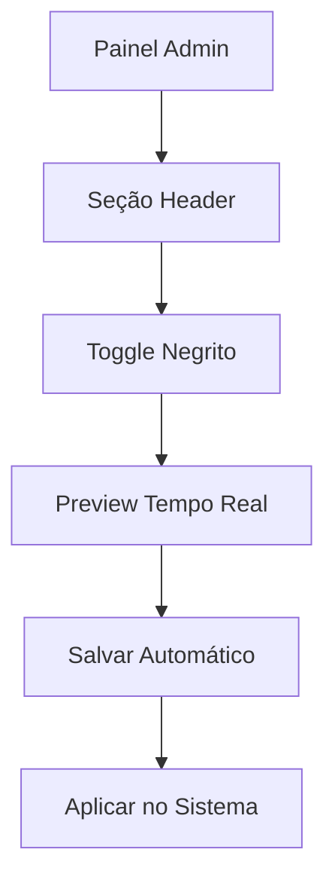

# Funcionalidade de Negrito no Texto do Header

## 1. Visão Geral do Produto

Extensão do sistema de personalização de cores para incluir controle de formatação de texto (negrito) no header. Esta funcionalidade permite que administradores controlem se o texto do header (nome da empresa e itens de menu) deve ser exibido em negrito ou não, através de um toggle simples no painel de personalização.

## 2. Funcionalidades Principais

### 2.1 Papéis de Usuário
| Papel | Método de Acesso | Permissões Principais |
|-------|------------------|----------------------|
| Administrador | Login com credenciais admin | Pode alterar configurações de negrito do header |
| Usuário Normal | Visualização apenas | Vê as alterações aplicadas no header |

### 2.2 Módulo de Funcionalidades

Nossa funcionalidade de negrito no header consiste nas seguintes páginas principais:
1. **Painel de Personalização**: seção header com toggle de negrito, preview em tempo real.
2. **Header do Sistema**: aplicação automática do negrito baseado na configuração.

### 2.3 Detalhes das Páginas

| Nome da Página | Nome do Módulo | Descrição da Funcionalidade |
|----------------|----------------|----------------------------|
| Painel de Personalização | Seção Header | Adicionar toggle "Texto em Negrito" que liga/desliga o negrito para todos os textos do header |
| Header do Sistema | Aplicação de Estilo | Aplicar dinamicamente font-weight: bold ou normal baseado na configuração salva |

## 3. Processo Principal

**Fluxo do Administrador:**
1. Administrador acessa "Configurações → Personalização"
2. Na seção "Header (Cabeçalho)", encontra o novo toggle "Texto em Negrito"
3. Liga/desliga o toggle conforme desejado
4. Visualiza o preview em tempo real
5. Configuração é salva automaticamente no banco de dados
6. Mudança é aplicada imediatamente em todo o sistema

## 4. Design da Interface do Usuário

### 4.1 Estilo de Design
- **Cores**: Manter paleta existente do sistema de personalização
- **Estilo do Toggle**: Switch moderno com estados on/off claros
- **Fonte**: Usar fonte padrão do sistema
- **Layout**: Integrar harmoniosamente na seção Header existente
- **Ícones**: Usar ícone de texto em negrito (Bold/B) para identificação visual

### 4.2 Visão Geral do Design da Página

| Nome da Página | Nome do Módulo | Elementos da UI |
|----------------|----------------|-----------------|
| Painel de Personalização | Toggle de Negrito | Switch toggle com label "Texto em Negrito", ícone de negrito, estado visual claro (ligado/desligado) |
| Preview do Header | Demonstração | Texto "Romeo e Julieta" e itens de menu com negrito aplicado/removido em tempo real |

### 4.3 Responsividade
- Desktop-first com adaptação para mobile
- Toggle funcional em dispositivos touch
- Preview responsivo que mostra mudanças em diferentes tamanhos de tela