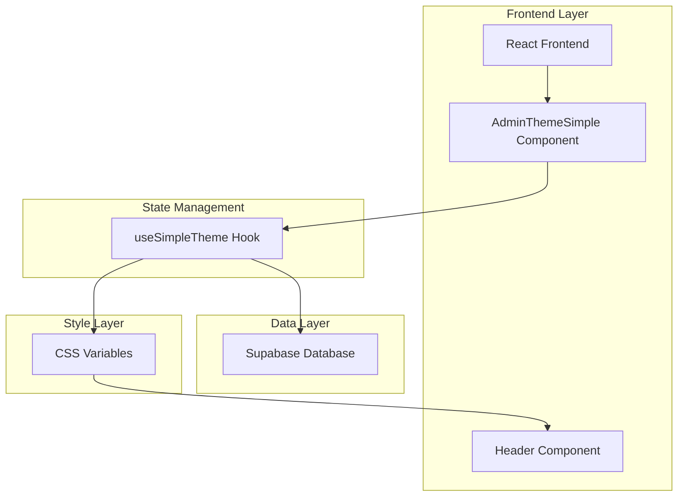
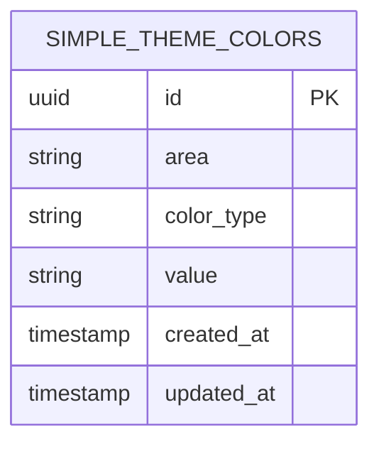

# Arquitetura Técnica - Funcionalidade de Negrito no Header

## 1. Design da Arquitetura



## 2. Descrição da Tecnologia

- Frontend: React@18 + TypeScript + Tailwind CSS + Vite
- Backend: Supabase (PostgreSQL)
- Estado: React Hooks customizados
- Estilização: CSS Variables + Tailwind

## 3. Definições de Rotas

| Rota | Propósito |
|------|-----------|
| /admin/settings | Painel de personalização onde o toggle de negrito será adicionado |
| / | Página inicial onde o header com negrito será aplicado |
| /login | Página de login com header estilizado |
| /register | Página de cadastro com header estilizado |

## 4. Definições de API

### 4.1 API Principal

**Atualização de configuração de negrito**
```
UPDATE simple_theme_colors SET value = ? WHERE area = 'header' AND color_type = 'bold'
```

Parâmetros:
| Nome do Parâmetro | Tipo | Obrigatório | Descrição |
|-------------------|------|-------------|-----------|
| value | string | true | 'true' ou 'false' para ativar/desativar negrito |
| area | string | true | Sempre 'header' |
| color_type | string | true | Sempre 'bold' |

Resposta:
| Nome do Parâmetro | Tipo | Descrição |
|-------------------|------|-----------|
| success | boolean | Status da operação |

Exemplo de dados:
```json
{
  "area": "header",
  "color_type": "bold",
  "value": "true"
}
```

## 5. Modelo de Dados

### 5.1 Definição do Modelo de Dados



### 5.2 Linguagem de Definição de Dados

**Extensão da Tabela Existente (simple_theme_colors)**
```sql
-- Adicionar suporte para configuração de negrito
INSERT INTO simple_theme_colors (area, color_type, value)
VALUES ('header', 'bold', 'false')
ON CONFLICT (area, color_type) DO NOTHING;

-- Atualizar constraint para incluir 'bold'
ALTER TABLE simple_theme_colors 
DROP CONSTRAINT IF EXISTS simple_theme_colors_color_type_check;

ALTER TABLE simple_theme_colors 
ADD CONSTRAINT simple_theme_colors_color_type_check 
CHECK (color_type IN (
    'background', 'text', 'hover', 
    'primary', 'secondary', 
    'login_bg', 'login_text', 'register_bg', 'register_text',
    'bold'
));

-- Criar índice para performance
CREATE INDEX IF NOT EXISTS idx_simple_theme_colors_area_type 
ON simple_theme_colors(area, color_type);
```

**Estrutura de Dados TypeScript**
```typescript
interface SimpleThemeColors {
  header: {
    background: string;
    text: string;
    hover: string;
    bold: boolean; // Nova propriedade
  };
  // ... outras seções
}

interface ThemeColorRecord {
  id: string;
  area: 'header' | 'landing' | 'dashboard' | 'button';
  color_type: 'background' | 'text' | 'hover' | 'primary' | 'secondary' | 'login_bg' | 'login_text' | 'register_bg' | 'register_text' | 'bold';
  value: string;
  created_at: string;
  updated_at: string;
}
```

**Variáveis CSS Adicionais**
```css
:root {
  /* Variável para controle de negrito do header */
  --simple-header-font-weight: normal;
}

/* Aplicação no header */
.header-text {
  font-weight: var(--simple-header-font-weight);
}
```