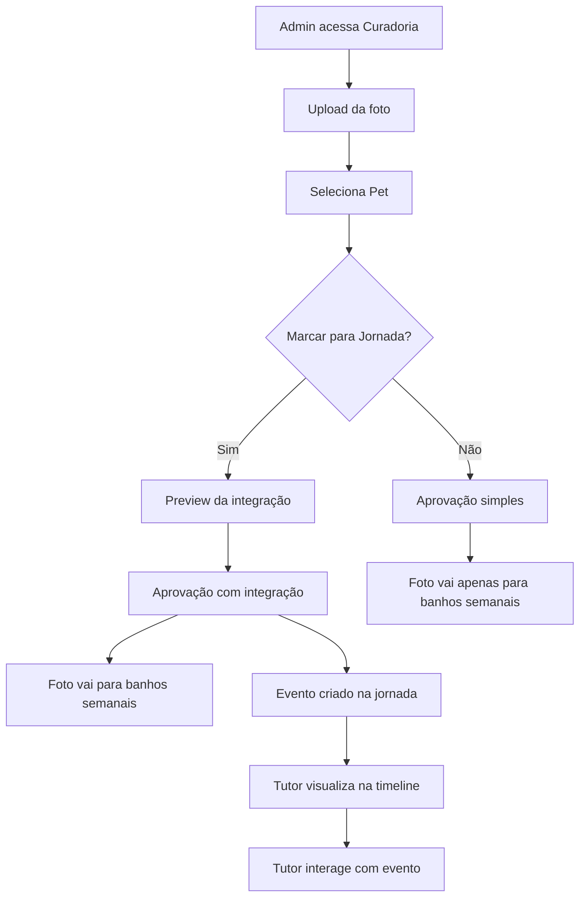

# Documento de Requisitos do Produto - Integração Banhos Semanais e Jornada de Crescimento

## 1. Visão Geral do Produto

Sistema de integração unidirecional que permite aos administradores enviar fotos aprovadas de banhos semanais diretamente para a jornada de crescimento dos pets, criando um fluxo automatizado que maximiza o valor das fotos e melhora a experiência do tutor.

- **Problema a resolver:** Atualmente as fotos de banhos semanais e jornada de crescimento funcionam de forma isolada, perdendo oportunidades de engajamento e valor para os tutores.
- **Público-alvo:** Administradores do pet shop (curadoria) e tutores de pets (beneficiários finais).
- **Valor de mercado:** Diferenciação competitiva através de experiência integrada e personalizada para cada pet.

## 2. Funcionalidades Principais

### 2.1 Papéis de Usuário

| Papel | Método de Acesso | Permissões Principais |
|-------|------------------|----------------------|
| Administrador | Login com credenciais admin | Pode gerenciar banhos semanais, selecionar pets, marcar para jornada, aprovar integrações |
| Tutor | Login com conta de usuário | Pode visualizar jornada do pet com eventos automáticos de banhos |

### 2.2 Módulos de Funcionalidade

Nossa integração consiste nas seguintes páginas principais:
1. **Curadoria de Banhos Aprimorada**: interface melhorada com seleção de pet e opção de integração com jornada.
2. **Jornada de Crescimento**: visualização dos eventos automáticos criados a partir dos banhos aprovados.
3. **Painel de Controle**: monitoramento das integrações realizadas e estatísticas.

### 2.3 Detalhes das Páginas

| Nome da Página | Nome do Módulo | Descrição da Funcionalidade |
|----------------|----------------|----------------------------|
| Curadoria de Banhos | Seletor de Pet | Dropdown com busca para selecionar pet específico, preenchimento automático do pet_id |
| Curadoria de Banhos | Checkbox Integração | Opção "Adicionar à Jornada do Pet" para marcar fotos que devem ir para a timeline |
| Curadoria de Banhos | Preview da Integração | Visualização prévia de como o evento aparecerá na jornada antes da aprovação |
| Curadoria de Banhos | Aprovação com Integração | Processo de aprovação que cria automaticamente evento na jornada quando marcado |
| Jornada de Crescimento | Eventos de Banho | Exibição de eventos automáticos tipo "Banho e Tosa" com origem rastreável |
| Jornada de Crescimento | Indicador de Origem | Badge visual indicando que evento veio dos banhos semanais |
| Painel de Controle | Estatísticas de Integração | Métricas de quantos banhos foram integrados, engajamento dos tutores |

## 3. Processo Principal

### Fluxo do Administrador:
1. Acessa curadoria de banhos semanais
2. Faz upload da foto do banho
3. Seleciona o pet específico no dropdown
4. Marca checkbox "Adicionar à Jornada do Pet" (opcional)
5. Visualiza preview de como ficará na jornada
6. Aprova o banho
7. Sistema cria automaticamente evento na jornada (se marcado)

### Fluxo do Tutor:
1. Acessa jornada do seu pet
2. Visualiza novos eventos de "Banho e Tosa" automaticamente adicionados
3. Pode interagir com as fotos (curtir, comentar, compartilhar)
4. Recebe notificação sobre novo evento na jornada

## 4. Design da Interface

### 4.1 Estilo de Design
- **Cores primárias:** Azul (#3B82F6) para ações principais, Verde (#10B981) para aprovações
- **Cores secundárias:** Cinza (#6B7280) para textos, Amarelo (#F59E0B) para alertas
- **Estilo de botões:** Arredondados com sombra sutil, estados hover bem definidos
- **Fontes:** Inter 14px para textos, Inter 16px semi-bold para títulos
- **Layout:** Card-based com espaçamento generoso, navegação lateral fixa
- **Ícones:** Lucide icons com estilo outline, tamanho 20px para ações principais

### 4.2 Visão Geral do Design das Páginas

| Nome da Página | Nome do Módulo | Elementos da UI |
|----------------|----------------|-----------------|
| Curadoria de Banhos | Seletor de Pet | Dropdown com busca, avatar do pet, nome e raça, validação visual |
| Curadoria de Banhos | Checkbox Integração | Toggle switch azul, label explicativo, tooltip informativo |
| Curadoria de Banhos | Preview da Integração | Card modal com preview da timeline, data formatada, botões de ação |
| Curadoria de Banhos | Lista de Banhos | Grid responsivo, filtros por status, ordenação por data |
| Jornada de Crescimento | Eventos de Banho | Timeline vertical, cards com foto, badge "Banho Semanal", data relativa |
| Painel de Controle | Estatísticas | Cards com métricas, gráficos simples, filtros por período |

### 4.3 Responsividade
- **Desktop-first** com adaptação para tablet (768px+) e mobile (320px+)
- **Touch-friendly** com botões mínimo 44px, gestos de swipe na timeline
- **Performance otimizada** com lazy loading de imagens e paginação virtual