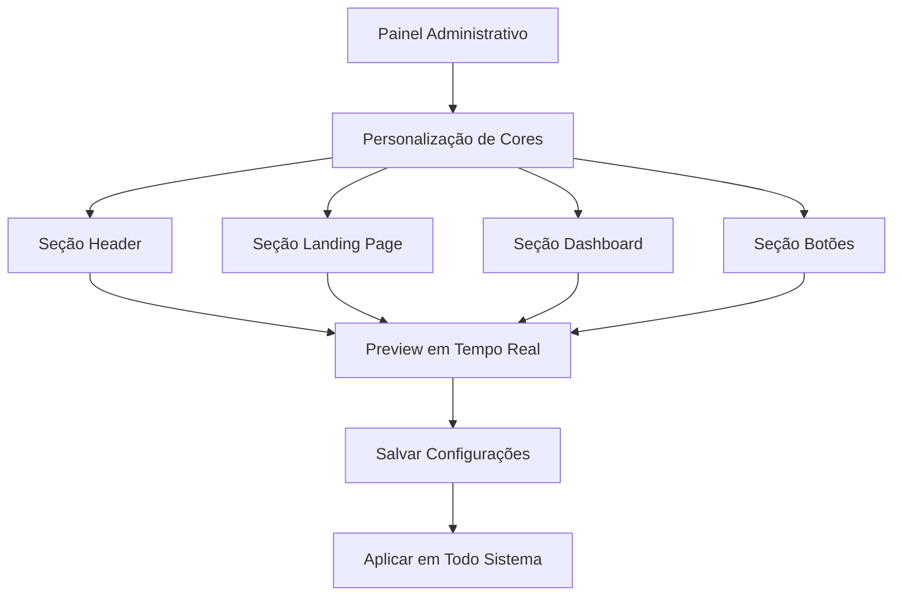

# Sistema de Personalização de Cores - Versão Simplificada

## 1. Visão Geral do Produto

Sistema simplificado de personalização de cores para o PetShop Romeo & Julieta, permitindo configurar apenas as áreas essenciais da interface com máxima praticidade e funcionalidade.

O sistema resolve a complexidade atual oferecendo apenas 6 opções de cores distribuídas em 4 áreas principais, garantindo facilidade de uso e manutenção.

## 2. Funcionalidades Principais

### 2.1 Papéis de Usuário

| Papel | Método de Acesso | Permissões Principais |
|-------|------------------|----------------------|
| Administrador | Login administrativo | Pode personalizar todas as cores do sistema |

### 2.2 Módulos de Funcionalidade

O sistema de personalização simplificado consiste nas seguintes páginas principais:
1. **Painel de Personalização**: interface única para configurar todas as cores
2. **Preview em Tempo Real**: visualização imediata das alterações

### 2.3 Detalhes das Páginas

| Nome da Página | Nome do Módulo | Descrição da Funcionalidade |
|----------------|----------------|----------------------------|
| Painel de Personalização | Seção Header | Configurar cor de fundo e cor do texto do cabeçalho |
| Painel de Personalização | Seção Landing Page | Configurar cor de fundo da página inicial |
| Painel de Personalização | Seção Dashboard | Configurar cor de fundo do painel administrativo |
| Painel de Personalização | Seção Botões | Configurar cor primária e secundária dos botões |
| Painel de Personalização | Controles Gerais | Salvar alterações, restaurar cores originais, preview em tempo real |

## 3. Processo Principal

### Fluxo do Administrador

1. **Acesso ao Painel**: Administrador acessa a seção de personalização de cores
2. **Seleção de Área**: Escolhe uma das 4 áreas disponíveis (Header, Landing, Dashboard, Botões)
3. **Configuração de Cores**: Utiliza seletor de cores para definir as tonalidades desejadas
4. **Preview Imediato**: Visualiza as alterações em tempo real na interface
5. **Persistência**: Salva as configurações que são aplicadas em todo o sistema
6. **Restauração**: Pode restaurar cores originais a qualquer momento



## 4. Design da Interface

### 4.1 Estilo de Design

**Elementos principais do design:**
- **Cores primárias**: #F8BBD9 (rosa suave), #BFDBFE (azul claro)
- **Cores secundárias**: #FEF3C7 (amarelo suave), #FFFFFF (branco)
- **Estilo dos botões**: Arredondados com sombra suave
- **Fonte**: Inter, tamanhos 14px-18px para textos, 24px-32px para títulos
- **Layout**: Design em cards com espaçamento generoso
- **Ícones**: Estilo outline com cores suaves

### 4.2 Visão Geral do Design das Páginas

| Nome da Página | Nome do Módulo | Elementos da UI |
|----------------|----------------|-----------------|
| Painel de Personalização | Seção Header | Card com 2 seletores de cor (fundo e texto), preview do header |
| Painel de Personalização | Seção Landing Page | Card com 1 seletor de cor (fundo), preview da landing page |
| Painel de Personalização | Seção Dashboard | Card com 1 seletor de cor (fundo), preview do dashboard |
| Painel de Personalização | Seção Botões | Card com 2 seletores de cor (primária e secundária), preview dos botões |
| Painel de Personalização | Controles Gerais | Botões de ação (Salvar, Restaurar), indicador de status |

### 4.3 Responsividade

O sistema é desktop-first com adaptação para tablets e dispositivos móveis, mantendo a funcionalidade completa em todas as telas.

## 5. Especificações Técnicas

### 5.1 Áreas de Personalização

**1. Header (Cabeçalho)**
- Cor de fundo do cabeçalho
- Cor do texto e navegação

**2. Landing Page (Página Inicial)**
- Cor de fundo da seção principal

**3. Dashboard (Painel Administrativo)**
- Cor de fundo do painel

**4. Botões**
- Cor primária (botões principais)
- Cor secundária (botões secundários)

### 5.2 Requisitos de Implementação

**Banco de Dados:**
- Tabela simplificada com apenas 6 registros de cores
- Estrutura: id, area, tipo_cor, valor_hex, ativo
- Remoção de todos os registros complexos existentes

**Interface:**
- 4 seções visuais distintas
- Seletores de cor nativos do navegador
- Preview em tempo real
- Persistência automática

**Sistema de Cores:**
- Apenas 6 variáveis CSS globais
- Todas as outras cores retornam aos valores originais
- Sistema de fallback para cores padrão

### 5.3 Estrutura de Dados Simplificada

```json
{
  "header": {
    "background": "#valor_hex",
    "text": "#valor_hex"
  },
  "landing": {
    "background": "#valor_hex"
  },
  "dashboard": {
    "background": "#valor_hex"
  },
  "buttons": {
    "primary": "#valor_hex",
    "secondary": "#valor_hex"
  }
}
```

## 6. Benefícios da Simplificação

### 6.1 Para o Usuário
- Interface intuitiva e fácil de usar
- Apenas opções essenciais, sem complexidade desnecessária
- Preview imediato das alterações
- Processo rápido de personalização

### 6.2 Para o Sistema
- Código mais limpo e maintível
- Menos pontos de falha
- Performance melhorada
- Banco de dados otimizado

### 6.3 Para Manutenção
- Debugging simplificado
- Menos variáveis para gerenciar
- Estrutura clara e documentada
- Facilidade para futuras expansões controladas