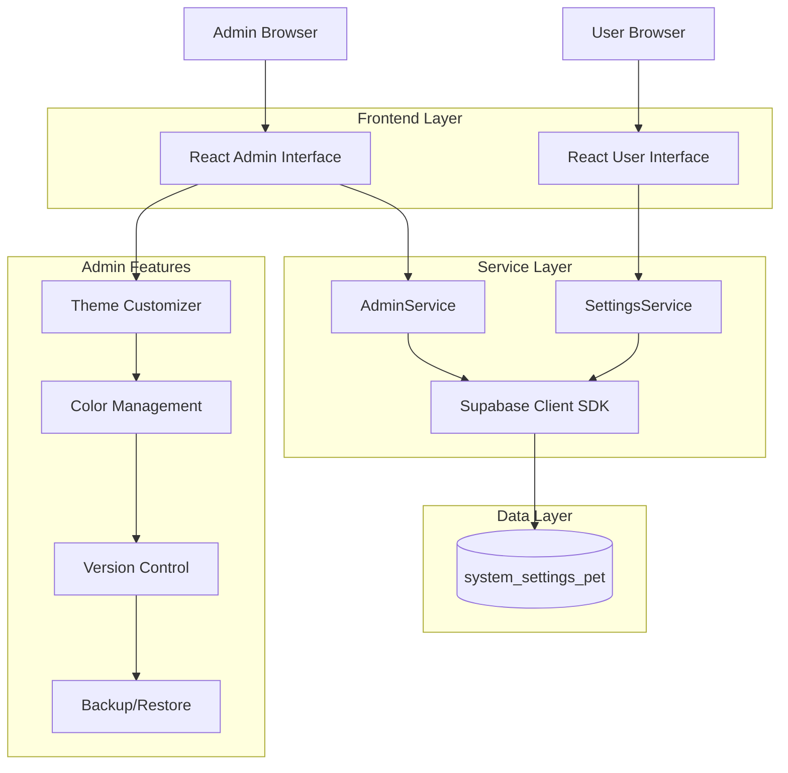
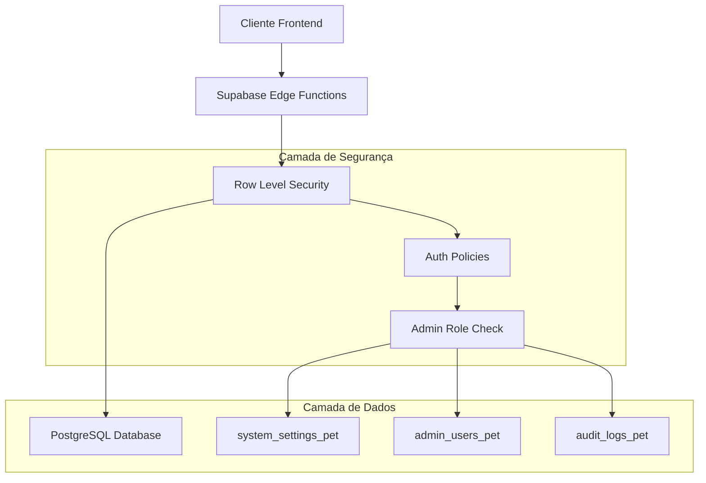
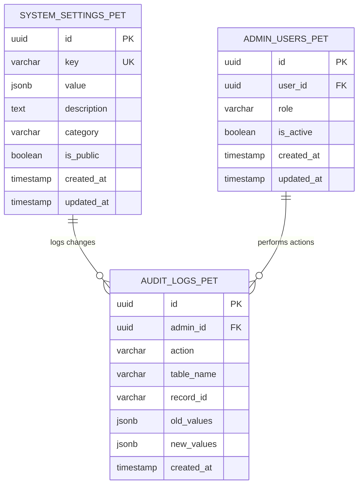
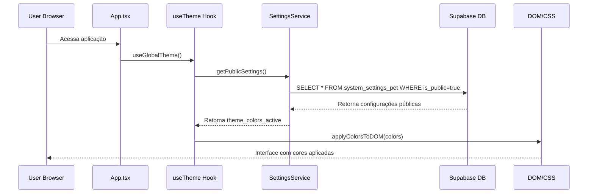
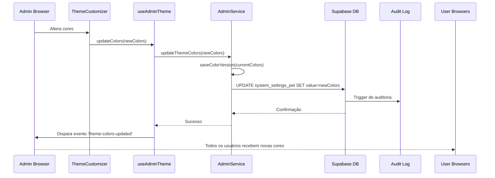
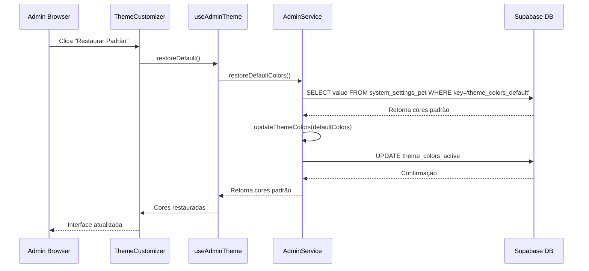

# Arquitetura Técnica - Sistema Administrativo de Cores
## PetShop Romeo & Julieta

**Data:** Janeiro 2025  
**Versão:** 2.0  
**Tipo:** Documentação de Arquitetura Técnica

---

## 1. Arquitetura do Sistema



## 2. Descrição das Tecnologias

- **Frontend**: React@18 + TypeScript + TailwindCSS + Vite
- **Backend**: Supabase (PostgreSQL + Auth + RLS)
- **Estado**: React Hooks + Context API
- **Roteamento**: React Router DOM@6
- **Estilização**: TailwindCSS + CSS Variables
- **Validação**: Zod (para validação de tipos)
- **Build**: Vite

## 3. Definições de Rotas

| Rota | Propósito | Acesso |
|------|-----------|--------|
| `/admin/theme` | Página de personalização de cores | Admin apenas |
| `/admin/settings` | Configurações gerais do sistema | Admin apenas |
| `/admin/dashboard` | Dashboard administrativo | Admin apenas |
| `/` | Página inicial (aplica cores do sistema) | Público |
| `/login` | Página de login | Público |
| `/profile` | Perfil do usuário | Autenticado |

## 4. Definições de API

### 4.1 Core API - Gerenciamento de Cores

**Buscar cores ativas do sistema**
```typescript
GET /rest/v1/system_settings_pet?key=eq.theme_colors_active&select=value
```

Request: Nenhum parâmetro adicional

Response:
| Campo | Tipo | Descrição |
|-------|------|----------|
| value | ThemeColors | Objeto JSON com todas as configurações de cores |

Exemplo de Response:
```json
{
  "value": {
    "primary": "#3B82F6",
    "secondary": "#10B981",
    "accent": "#F59E0B",
    "surface": "#FFFFFF",
    "text": "#1F2937",
    "header": {
      "background": "#1F2937",
      "text": "#FFFFFF",
      "border": "#374151"
    },
    "landing": {
      "hero_bg": "#F3F4F6",
      "hero_text": "#1F2937",
      "section_bg": "#FFFFFF"
    },
    "components": {
      "button_primary": "#3B82F6",
      "button_secondary": "#6B7280",
      "card_bg": "#FFFFFF",
      "card_border": "#E5E7EB"
    }
  }
}
```

**Atualizar cores do sistema (Admin)**
```typescript
PATCH /rest/v1/system_settings_pet?key=eq.theme_colors_active
```

Request:
| Campo | Tipo | Obrigatório | Descrição |
|-------|------|-------------|----------|
| value | ThemeColors | true | Novo objeto de configuração de cores |

Response:
| Campo | Tipo | Descrição |
|-------|------|----------|
| success | boolean | Status da operação |

**Restaurar cores padrão (Admin)**
```typescript
GET /rest/v1/system_settings_pet?key=eq.theme_colors_default&select=value
```

Response: Mesmo formato da busca de cores ativas

**Buscar histórico de versões (Admin)**
```typescript
GET /rest/v1/system_settings_pet?key=eq.theme_colors_history&select=value
```

Response:
| Campo | Tipo | Descrição |
|-------|------|----------|
| value | ColorHistory | Objeto com histórico de versões |

### 4.2 Tipos TypeScript

```typescript
// Configuração principal de cores
interface ThemeColors {
  primary: string
  secondary: string
  accent: string
  surface: string
  text: string
  header: {
    background: string
    text: string
    border: string
  }
  landing: {
    hero_bg: string
    hero_text: string
    section_bg: string
  }
  components: {
    button_primary: string
    button_secondary: string
    card_bg: string
    card_border: string
  }
}

// Versão individual no histórico
interface ColorVersion {
  version: string
  date: string
  admin_id: string
  colors: ThemeColors
  description: string
}

// Histórico completo
interface ColorHistory {
  versions: ColorVersion[]
  current_version: string
}

// Configuração do sistema
interface SystemSetting {
  id: string
  key: string
  value: any
  description: string
  category: string
  is_public: boolean
  created_at: string
  updated_at: string
}
```

## 5. Arquitetura do Servidor



## 6. Modelo de Dados

### 6.1 Diagrama de Entidades



### 6.2 Definições de Dados (DDL)

**Tabela de Configurações do Sistema**
```sql
-- Estrutura já existente, apenas adicionando configurações de cores
-- Inserir configurações de cores
INSERT INTO system_settings_pet (key, value, description, category, is_public) VALUES

-- Cores ativas do sistema
('theme_colors_active', '{
  "primary": "#3B82F6",
  "secondary": "#10B981",
  "accent": "#F59E0B",
  "surface": "#FFFFFF",
  "text": "#1F2937",
  "header": {
    "background": "#1F2937",
    "text": "#FFFFFF",
    "border": "#374151"
  },
  "landing": {
    "hero_bg": "#F3F4F6",
    "hero_text": "#1F2937",
    "section_bg": "#FFFFFF"
  },
  "components": {
    "button_primary": "#3B82F6",
    "button_secondary": "#6B7280",
    "card_bg": "#FFFFFF",
    "card_border": "#E5E7EB"
  }
}', 'Configuração ativa das cores do tema do sistema', 'theme', true),

-- Cores padrão (backup)
('theme_colors_default', '{
  "primary": "#3B82F6",
  "secondary": "#10B981",
  "accent": "#F59E0B",
  "surface": "#FFFFFF",
  "text": "#1F2937",
  "header": {
    "background": "#1F2937",
    "text": "#FFFFFF",
    "border": "#374151"
  },
  "landing": {
    "hero_bg": "#F3F4F6",
    "hero_text": "#1F2937",
    "section_bg": "#FFFFFF"
  },
  "components": {
    "button_primary": "#3B82F6",
    "button_secondary": "#6B7280",
    "card_bg": "#FFFFFF",
    "card_border": "#E5E7EB"
  }
}', 'Configuração padrão das cores (backup para restauração)', 'theme', false),

-- Histórico de versões
('theme_colors_history', '{
  "versions": [
    {
      "version": "1.0",
      "date": "2025-01-15T10:00:00Z",
      "admin_id": "system",
      "colors": {
        "primary": "#3B82F6",
        "secondary": "#10B981",
        "accent": "#F59E0B",
        "surface": "#FFFFFF",
        "text": "#1F2937",
        "header": {
          "background": "#1F2937",
          "text": "#FFFFFF",
          "border": "#374151"
        },
        "landing": {
          "hero_bg": "#F3F4F6",
          "hero_text": "#1F2937",
          "section_bg": "#FFFFFF"
        },
        "components": {
          "button_primary": "#3B82F6",
          "button_secondary": "#6B7280",
          "card_bg": "#FFFFFF",
          "card_border": "#E5E7EB"
        }
      },
      "description": "Configuração inicial do sistema"
    }
  ],
  "current_version": "1.0"
}', 'Histórico de versões das configurações de cores', 'theme', false);

-- Índices para performance
CREATE INDEX IF NOT EXISTS idx_system_settings_category ON system_settings_pet(category);
CREATE INDEX IF NOT EXISTS idx_system_settings_public ON system_settings_pet(is_public);
CREATE INDEX IF NOT EXISTS idx_system_settings_key_category ON system_settings_pet(key, category);

-- Políticas RLS para segurança
-- Permitir leitura pública apenas para configurações públicas
CREATE POLICY "Allow public read for public settings" ON system_settings_pet
    FOR SELECT USING (is_public = true);

-- Permitir leitura completa para usuários autenticados
CREATE POLICY "Allow authenticated read all settings" ON system_settings_pet
    FOR SELECT USING (auth.role() = 'authenticated');

-- Permitir escrita apenas para administradores
CREATE POLICY "Allow admin write settings" ON system_settings_pet
    FOR ALL USING (
        EXISTS (
            SELECT 1 FROM admin_users_pet 
            WHERE user_id = auth.uid() 
            AND is_active = true 
            AND role IN ('admin', 'super_admin')
        )
    );
```

**Trigger para Auditoria**
```sql
-- Função para log de auditoria
CREATE OR REPLACE FUNCTION log_system_settings_changes()
RETURNS TRIGGER AS $$
BEGIN
    -- Log apenas para mudanças em configurações de tema
    IF NEW.category = 'theme' THEN
        INSERT INTO audit_logs_pet (
            admin_id,
            action,
            table_name,
            record_id,
            old_values,
            new_values
        ) VALUES (
            auth.uid(),
            TG_OP,
            'system_settings_pet',
            NEW.id::text,
            CASE WHEN TG_OP = 'UPDATE' THEN to_jsonb(OLD) ELSE NULL END,
            to_jsonb(NEW)
        );
    END IF;
    
    RETURN NEW;
END;
$$ LANGUAGE plpgsql;

-- Trigger para auditoria
CREATE TRIGGER system_settings_audit_trigger
    AFTER INSERT OR UPDATE ON system_settings_pet
    FOR EACH ROW
    EXECUTE FUNCTION log_system_settings_changes();
```

## 7. Fluxo de Dados

### 7.1 Carregamento Inicial das Cores



### 7.2 Atualização de Cores (Admin)



### 7.3 Restauração de Cores Padrão



## 8. Segurança e Controle de Acesso

### 8.1 Políticas de Segurança

```sql
-- RLS habilitado na tabela
ALTER TABLE system_settings_pet ENABLE ROW LEVEL SECURITY;

-- Política para leitura pública (apenas configurações públicas)
CREATE POLICY "public_settings_read" ON system_settings_pet
    FOR SELECT USING (is_public = true);

-- Política para leitura completa (usuários autenticados)
CREATE POLICY "authenticated_settings_read" ON system_settings_pet
    FOR SELECT USING (auth.role() = 'authenticated');

-- Política para escrita (apenas administradores)
CREATE POLICY "admin_settings_write" ON system_settings_pet
    FOR ALL USING (
        EXISTS (
            SELECT 1 FROM admin_users_pet 
            WHERE user_id = auth.uid() 
            AND is_active = true 
            AND role IN ('admin', 'super_admin')
        )
    );
```

### 8.2 Validação Frontend

```typescript
// Hook para verificar permissões administrativas
const useAdminAuth = () => {
  const { user } = useAuth()
  const [adminUser, setAdminUser] = useState<AdminUser | null>(null)
  const [loading, setLoading] = useState(true)

  useEffect(() => {
    const checkAdminStatus = async () => {
      if (!user) {
        setAdminUser(null)
        setLoading(false)
        return
      }

      try {
        const { data, error } = await supabase
          .from('admin_users_pet')
          .select('*')
          .eq('user_id', user.id)
          .eq('is_active', true)
          .single()

        if (error) {
          setAdminUser(null)
        } else {
          setAdminUser(data)
        }
      } catch (err) {
        setAdminUser(null)
      } finally {
        setLoading(false)
      }
    }

    checkAdminStatus()
  }, [user])

  return {
    adminUser,
    loading,
    isAdmin: adminUser?.role === 'admin' || adminUser?.role === 'super_admin',
    canManageTheme: adminUser?.is_active && ['admin', 'super_admin'].includes(adminUser?.role)
  }
}
```

## 9. Performance e Otimização

### 9.1 Estratégias de Cache

```typescript
// Cache local para configurações públicas
const useThemeCache = () => {
  const [cache, setCache] = useState<Map<string, any>>(new Map())
  const CACHE_DURATION = 5 * 60 * 1000 // 5 minutos

  const getCachedValue = (key: string) => {
    const cached = cache.get(key)
    if (cached && Date.now() - cached.timestamp < CACHE_DURATION) {
      return cached.value
    }
    return null
  }

  const setCachedValue = (key: string, value: any) => {
    setCache(prev => new Map(prev.set(key, {
      value,
      timestamp: Date.now()
    })))
  }

  return { getCachedValue, setCachedValue }
}
```

### 9.2 Otimização de Consultas

```sql
-- Índices otimizados para consultas frequentes
CREATE INDEX CONCURRENTLY idx_system_settings_theme_public 
ON system_settings_pet (category, is_public) 
WHERE category = 'theme' AND is_public = true;

CREATE INDEX CONCURRENTLY idx_system_settings_theme_keys 
ON system_settings_pet (key) 
WHERE key IN ('theme_colors_active', 'theme_colors_default', 'theme_colors_history');
```

## 10. Monitoramento e Logs

### 10.1 Métricas de Sistema

```typescript
// Métricas para monitoramento
interface ThemeMetrics {
  color_changes_count: number
  last_change_date: string
  admin_users_active: number
  default_restores_count: number
  average_session_duration: number
}

// Função para coletar métricas
const collectThemeMetrics = async (): Promise<ThemeMetrics> => {
  const { data: auditLogs } = await supabase
    .from('audit_logs_pet')
    .select('*')
    .eq('table_name', 'system_settings_pet')
    .gte('created_at', new Date(Date.now() - 30 * 24 * 60 * 60 * 1000).toISOString())

  return {
    color_changes_count: auditLogs?.filter(log => log.action === 'UPDATE').length || 0,
    last_change_date: auditLogs?.[0]?.created_at || '',
    admin_users_active: 0, // Implementar consulta específica
    default_restores_count: auditLogs?.filter(log => 
      log.new_values?.key === 'theme_colors_active' && 
      log.action === 'UPDATE'
    ).length || 0,
    average_session_duration: 0 // Implementar tracking de sessão
  }
}
```

### 10.2 Alertas e Notificações

```typescript
// Sistema de alertas para mudanças críticas
const sendThemeChangeAlert = async (adminId: string, changes: any) => {
  // Implementar notificação para outros admins
  await supabase
    .from('notifications_pet')
    .insert({
      user_id: adminId,
      type: 'theme_change',
      title: 'Cores do sistema alteradas',
      message: `As cores do tema foram modificadas por um administrador.`,
      data: { changes },
      is_read: false
    })
}
```

---

**Conclusão Técnica:** Esta arquitetura fornece uma base sólida e escalável para o gerenciamento administrativo de cores, com foco em segurança, performance e manutenibilidade. O sistema é projetado para ser robusto, auditável e facilmente extensível para futuras funcionalidades de personalização.