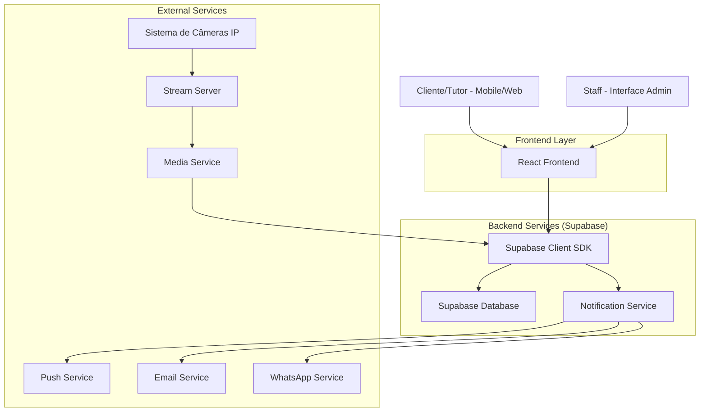
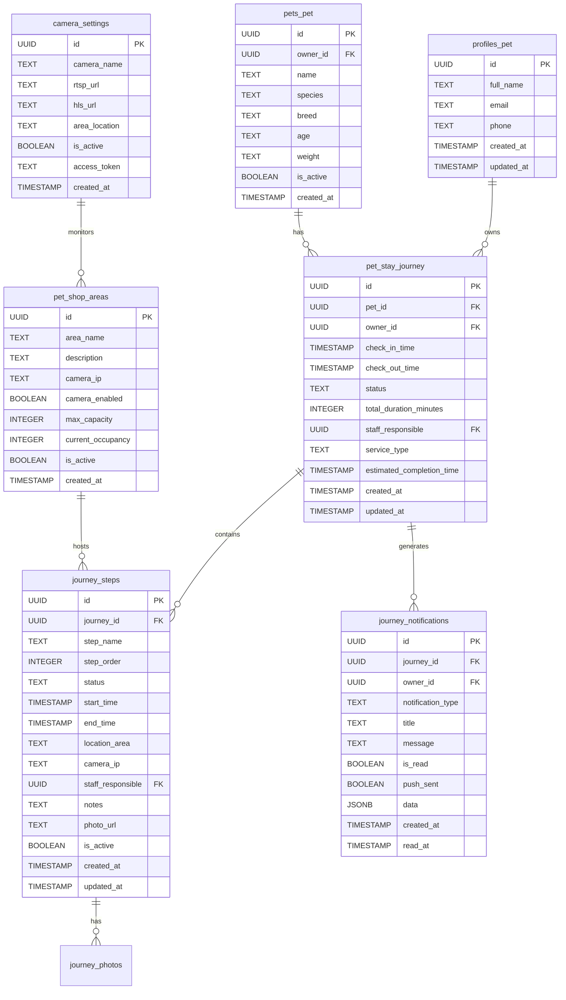

# Arquitetura Técnica - Jornada de Check-in do Pet

## 1. ARQUITETURA GERAL

### 1.1 Diagrama de Arquitetura



### 1.2 Stack Tecnológica

**Frontend:**
- React 18 + TypeScript
- Tailwind CSS para estilização
- Vite para build e desenvolvimento
- React Query para gerenciamento de estado
- React Hook Form para formulários

**Backend/Database:**
- Supabase (PostgreSQL + Auth + Real-time)
- Row Level Security (RLS) configurado
- Funções PostgreSQL para lógica complexa
- Triggers para automações

**Serviços Externos:**
- OneSignal ou Firebase para Push Notifications
- SendGrid para emails transacionais
- WhatsApp Business API
- RTSP/HLS para streaming de câmeras

## 2. MODELAGEM DE DADOS DETALHADA

### 2.1 Diagrama ER Estendido



### 2.2 Scripts SQL de Implementação

```sql
-- =============================================
-- TABELA PRINCIPAL: JORNADA DO PET
-- =============================================

CREATE TABLE pet_stay_journey (
  id UUID DEFAULT gen_random_uuid() PRIMARY KEY,
  created_at TIMESTAMP WITH TIME ZONE DEFAULT NOW(),
  updated_at TIMESTAMP WITH TIME ZONE DEFAULT NOW(),
  pet_id UUID REFERENCES pets_pet(id) ON DELETE CASCADE NOT NULL,
  owner_id UUID REFERENCES profiles_pet(id) ON DELETE CASCADE NOT NULL,
  check_in_time TIMESTAMP WITH TIME ZONE NOT NULL,
  check_out_time TIMESTAMP WITH TIME ZONE,
  status TEXT NOT NULL DEFAULT 'checked_in' 
    CHECK (status IN ('checked_in', 'in_progress', 'ready_for_pickup', 'checked_out')),
  total_duration_minutes INTEGER,
  notes TEXT,
  staff_responsible UUID REFERENCES profiles_pet(id),
  service_type TEXT,
  estimated_completion_time TIMESTAMP WITH TIME ZONE,
  priority TEXT DEFAULT 'normal' CHECK (priority IN ('low', 'normal', 'high', 'urgent'))
);

-- Índices para performance
CREATE INDEX idx_pet_journey_pet_id ON pet_stay_journey(pet_id);
CREATE INDEX idx_pet_journey_owner_id ON pet_stay_journey(owner_id);
CREATE INDEX idx_pet_journey_status ON pet_stay_journey(status);
CREATE INDEX idx_pet_journey_check_in ON pet_stay_journey(check_in_time);

-- Trigger para updated_at
CREATE TRIGGER update_pet_stay_journey_updated_at 
  BEFORE UPDATE ON pet_stay_journey 
  FOR EACH ROW EXECUTE FUNCTION update_updated_at_column();

-- =============================================
-- TABELA DE ETAPAS DA JORNADA
-- =============================================

CREATE TABLE journey_steps (
  id UUID DEFAULT gen_random_uuid() PRIMARY KEY,
  created_at TIMESTAMP WITH TIME ZONE DEFAULT NOW(),
  updated_at TIMESTAMP WITH TIME ZONE DEFAULT NOW(),
  journey_id UUID REFERENCES pet_stay_journey(id) ON DELETE CASCADE NOT NULL,
  step_name TEXT NOT NULL,
  step_order INTEGER NOT NULL,
  status TEXT NOT NULL DEFAULT 'pending' 
    CHECK (status IN ('pending', 'in_progress', 'completed', 'skipped')),
  start_time TIMESTAMP WITH TIME ZONE,
  end_time TIMESTAMP WITH TIME ZONE,
  duration_minutes INTEGER,
  location_area TEXT,
  camera_ip TEXT,
  staff_responsible UUID REFERENCES profiles_pet(id),
  notes TEXT,
  photo_url TEXT,
  is_active BOOLEAN DEFAULT true,
  requires_photo BOOLEAN DEFAULT false,
  requires_signature BOOLEAN DEFAULT false
);

-- Índices
CREATE INDEX idx_journey_steps_journey_id ON journey_steps(journey_id);
CREATE INDEX idx_journey_steps_status ON journey_steps(status);
CREATE INDEX idx_journey_steps_order ON journey_steps(journey_id, step_order);

-- Trigger
CREATE TRIGGER update_journey_steps_updated_at 
  BEFORE UPDATE ON journey_steps 
  FOR EACH ROW EXECUTE FUNCTION update_updated_at_column();

-- =============================================
-- TABELA DE ÁREAS DO PET SHOP
-- =============================================

CREATE TABLE pet_shop_areas (
  id UUID DEFAULT gen_random_uuid() PRIMARY KEY,
  created_at TIMESTAMP WITH TIME ZONE DEFAULT NOW(),
  updated_at TIMESTAMP WITH TIME ZONE DEFAULT NOW(),
  area_name TEXT NOT NULL UNIQUE,
  description TEXT,
  camera_ip TEXT,
  camera_enabled BOOLEAN DEFAULT false,
  camera_username TEXT,
  camera_password TEXT,
  max_capacity INTEGER DEFAULT 1,
  current_occupancy INTEGER DEFAULT 0,
  is_active BOOLEAN DEFAULT true,
  requires_staff BOOLEAN DEFAULT true,
  estimated_duration_minutes INTEGER DEFAULT 30
);

-- Trigger
CREATE TRIGGER update_pet_shop_areas_updated_at 
  BEFORE UPDATE ON pet_shop_areas 
  FOR EACH ROW EXECUTE FUNCTION update_updated_at_column();

-- =============================================
-- TABELA DE NOTIFICAÇÕES DA JORNADA
-- =============================================

CREATE TABLE journey_notifications (
  id UUID DEFAULT gen_random_uuid() PRIMARY KEY,
  created_at TIMESTAMP WITH TIME ZONE DEFAULT NOW(),
  journey_id UUID REFERENCES pet_stay_journey(id) ON DELETE CASCADE NOT NULL,
  owner_id UUID REFERENCES profiles_pet(id) ON DELETE CASCADE NOT NULL,
  notification_type TEXT NOT NULL 
    CHECK (notification_type IN ('check_in', 'step_started', 'step_completed', 'ready_for_pickup', 'check_out', 'photo_added')),
  title TEXT NOT NULL,
  message TEXT NOT NULL,
  is_read BOOLEAN DEFAULT false,
  read_at TIMESTAMP WITH TIME ZONE,
  push_sent BOOLEAN DEFAULT false,
  push_sent_at TIMESTAMP WITH TIME ZONE,
  email_sent BOOLEAN DEFAULT false,
  email_sent_at TIMESTAMP WITH TIME ZONE,
  whatsapp_sent BOOLEAN DEFAULT false,
  whatsapp_sent_at TIMESTAMP WITH TIME ZONE,
  data JSONB DEFAULT '{}'::jsonb
);

-- Índices
CREATE INDEX idx_journey_notifications_journey_id ON journey_notifications(journey_id);
CREATE INDEX idx_journey_notifications_owner_id ON journey_notifications(owner_id);
CREATE INDEX idx_journey_notifications_type ON journey_notifications(notification_type);
CREATE INDEX idx_journey_notifications_read ON journey_notifications(is_read);

-- =============================================
-- TABELA DE CONFIGURAÇÕES DE CÂMERAS
-- =============================================

CREATE TABLE camera_settings (
  id UUID DEFAULT gen_random_uuid() PRIMARY KEY,
  created_at TIMESTAMP WITH TIME ZONE DEFAULT NOW(),
  updated_at TIMESTAMP WITH TIME ZONE DEFAULT NOW(),
  camera_name TEXT NOT NULL UNIQUE,
  rtsp_url TEXT,
  hls_url TEXT,
  snapshot_url TEXT,
  area_location TEXT,
  is_active BOOLEAN DEFAULT true,
  access_token TEXT,
  refresh_token TEXT,
  token_expires_at TIMESTAMP WITH TIME ZONE,
  requires_auth BOOLEAN DEFAULT false,
  username TEXT,
  password TEXT,
  stream_quality TEXT DEFAULT '720p' CHECK (stream_quality IN ('480p', '720p', '1080p')),
  recording_enabled BOOLEAN DEFAULT false,
  recording_duration_hours INTEGER DEFAULT 24
);

-- Trigger
CREATE TRIGGER update_camera_settings_updated_at 
  BEFORE UPDATE ON camera_settings 
  FOR EACH ROW EXECUTE FUNCTION update_updated_at_column();

-- =============================================
-- TABELA DE FOTOS DA JORNADA
-- =============================================

CREATE TABLE journey_photos (
  id UUID DEFAULT gen_random_uuid() PRIMARY KEY,
  created_at TIMESTAMP WITH TIME ZONE DEFAULT NOW(),
  journey_id UUID REFERENCES pet_stay_journey(id) ON DELETE CASCADE NOT NULL,
  step_id UUID REFERENCES journey_steps(id) ON DELETE CASCADE,
  photo_url TEXT NOT NULL,
  thumbnail_url TEXT,
  storage_path TEXT NOT NULL,
  file_size_bytes INTEGER,
  width INTEGER,
  height INTEGER,
  is_public BOOLEAN DEFAULT false,
  uploaded_by UUID REFERENCES profiles_pet(id),
  metadata JSONB DEFAULT '{}'::jsonb
);

-- Índices
CREATE INDEX idx_journey_photos_journey_id ON journey_photos(journey_id);
CREATE INDEX idx_journey_photos_step_id ON journey_photos(step_id);
CREATE INDEX idx_journey_photos_public ON journey_photos(is_public);
```

## 3. POLÍTICAS DE SEGURANÇA (RLS)

```sql
-- =============================================
-- POLÍTICAS DE SEGURANÇA - RLS
-- =============================================

-- Habilitar RLS nas novas tabelas
ALTER TABLE pet_stay_journey ENABLE ROW LEVEL SECURITY;
ALTER TABLE journey_steps ENABLE ROW LEVEL SECURITY;
ALTER TABLE pet_shop_areas ENABLE ROW LEVEL SECURITY;
ALTER TABLE journey_notifications ENABLE ROW LEVEL SECURITY;
ALTER TABLE camera_settings ENABLE ROW LEVEL SECURITY;
ALTER TABLE journey_photos ENABLE ROW LEVEL SECURITY;

-- Políticas para pet_stay_journey
CREATE POLICY "Users can view own pet journeys" ON pet_stay_journey FOR SELECT 
  USING (auth.uid() = owner_id);

CREATE POLICY "Users can create pet journeys" ON pet_stay_journey FOR INSERT 
  WITH CHECK (auth.uid() = owner_id);

CREATE POLICY "Staff can view all journeys" ON pet_stay_journey FOR SELECT 
  USING (
    EXISTS (
      SELECT 1 FROM admin_users_pet 
      WHERE user_id = auth.uid() AND is_active = true
    )
  );

CREATE POLICY "Staff can update journey status" ON pet_stay_journey FOR UPDATE 
  USING (
    EXISTS (
      SELECT 1 FROM admin_users_pet 
      WHERE user_id = auth.uid() AND is_active = true
    )
  );

-- Políticas para journey_steps
CREATE POLICY "Users can view own journey steps" ON journey_steps FOR SELECT 
  USING (
    EXISTS (
      SELECT 1 FROM pet_stay_journey 
      WHERE pet_stay_journey.id = journey_steps.journey_id 
      AND pet_stay_journey.owner_id = auth.uid()
    )
  );

CREATE POLICY "Staff can manage all journey steps" ON journey_steps FOR ALL 
  USING (
    EXISTS (
      SELECT 1 FROM admin_users_pet 
      WHERE user_id = auth.uid() AND is_active = true
    )
  );

-- Políticas para journey_notifications
CREATE POLICY "Users can view own notifications" ON journey_notifications FOR SELECT 
  USING (auth.uid() = owner_id);

CREATE POLICY "Users can update own notifications" ON journey_notifications FOR UPDATE 
  USING (auth.uid() = owner_id);

-- Conceder permissões
GRANT SELECT ON pet_stay_journey TO authenticated;
GRANT INSERT ON pet_stay_journey TO authenticated;
GRANT UPDATE ON pet_stay_journey TO authenticated;

GRANT SELECT ON journey_steps TO authenticated;
GRANT INSERT ON journey_steps TO authenticated;
GRANT UPDATE ON journey_steps TO authenticated;

GRANT SELECT ON journey_notifications TO authenticated;
GRANT UPDATE ON journey_notifications TO authenticated;

GRANT SELECT ON pet_shop_areas TO authenticated;
GRANT SELECT ON camera_settings TO authenticated;
GRANT SELECT ON journey_photos TO authenticated;
```

## 4. FUNÇÕES POSTGRESQL

```sql
-- =============================================
-- FUNÇÕES ÚTEIS PARA A JORNADA
-- =============================================

-- Função para obter jornada ativa de um pet
CREATE OR REPLACE FUNCTION get_active_journey(pet_uuid UUID)
RETURNS TABLE (
  journey_id UUID,
  status TEXT,
  check_in_time TIMESTAMP WITH TIME ZONE,
  current_step_name TEXT,
  total_steps INTEGER,
  completed_steps INTEGER
) AS $$
BEGIN
  RETURN QUERY
  SELECT 
    psj.id,
    psj.status,
    psj.check_in_time,
    js.step_name,
    COUNT(js.id) as total_steps,
    COUNT(CASE WHEN js.status = 'completed' THEN 1 END) as completed_steps
  FROM pet_stay_journey psj
  LEFT JOIN journey_steps js ON psj.id = js.journey_id AND js.is_active = true
  WHERE psj.pet_id = pet_uuid 
    AND psj.status IN ('checked_in', 'in_progress', 'ready_for_pickup')
  GROUP BY psj.id, psj.status, psj.check_in_time, js.step_name
  ORDER BY psj.created_at DESC
  LIMIT 1;
END;
$$ LANGUAGE plpgsql SECURITY DEFINER;

-- Função para criar notificação e disparar evento
CREATE OR REPLACE FUNCTION create_journey_notification(
  journey_uuid UUID,
  owner_uuid UUID,
  notif_type TEXT,
  notif_title TEXT,
  notif_message TEXT,
  additional_data JSONB DEFAULT '{}'::jsonb
)
RETURNS UUID AS $$
DECLARE
  notification_id UUID;
BEGIN
  INSERT INTO journey_notifications (
    journey_id,
    owner_id,
    notification_type,
    title,
    message,
    data
  ) VALUES (
    journey_uuid,
    owner_uuid,
    notif_type,
    notif_title,
    notif_message,
    additional_data
  ) RETURNING id INTO notification_id;
  
  -- Disparar evento para notificação em tempo real
  PERFORM pg_notify('journey_notification', json_build_object(
    'notification_id', notification_id,
    'owner_id', owner_uuid,
    'type', notif_type,
    'title', notif_title,
    'message', notif_message,
    'data', additional_data
  )::text);
  
  RETURN notification_id;
END;
$$ LANGUAGE plpgsql SECURITY DEFINER;

-- Função para atualizar status da jornada
CREATE OR REPLACE FUNCTION update_journey_status(
  journey_uuid UUID,
  new_status TEXT,
  staff_notes TEXT DEFAULT NULL
)
RETURNS BOOLEAN AS $$
BEGIN
  UPDATE pet_stay_journey 
  SET 
    status = new_status,
    notes = COALESCE(staff_notes, notes),
    updated_at = NOW()
  WHERE id = journey_uuid;
  
  -- Se for check-out, calcular duração total
  IF new_status = 'checked_out' THEN
    UPDATE pet_stay_journey 
    SET 
      check_out_time = NOW(),
      total_duration_minutes = EXTRACT(EPOCH FROM (NOW() - check_in_time))/60
    WHERE id = journey_uuid;
  END IF;
  
  RETURN FOUND;
END;
$$ LANGUAGE plpgsql SECURITY DEFINER;
```

## 5. APIs REST DETALHADAS

### 5.1 Rotas de Jornada

```typescript
// Tipos TypeScript
interface PetJourney {
  id: string;
  pet_id: string;
  owner_id: string;
  check_in_time: string;
  check_out_time?: string;
  status: 'checked_in' | 'in_progress' | 'ready_for_pickup' | 'checked_out';
  total_duration_minutes?: number;
  notes?: string;
  staff_responsible?: string;
  service_type?: string;
  estimated_completion_time?: string;
  priority: 'low' | 'normal' | 'high' | 'urgent';
  created_at: string;
  updated_at: string;
}

interface JourneyStep {
  id: string;
  journey_id: string;
  step_name: string;
  step_order: number;
  status: 'pending' | 'in_progress' | 'completed' | 'skipped';
  start_time?: string;
  end_time?: string;
  duration_minutes?: number;
  location_area?: string;
  camera_ip?: string;
  staff_responsible?: string;
  notes?: string;
  photo_url?: string;
  is_active: boolean;
  requires_photo: boolean;
  requires_signature: boolean;
}

// POST /api/pet-journey/check-in
// Realizar check-in de um pet
interface CheckInRequest {
  pet_id: string;
  service_type?: string;
  estimated_duration_minutes?: number;
  priority?: 'low' | 'normal' | 'high' | 'urgent';
  notes?: string;
  staff_responsible?: string;
}

interface CheckInResponse {
  success: boolean;
  journey: PetJourney;
  steps: JourneyStep[];
  message: string;
}

// GET /api/pet-journey/current/:pet_id
// Obter jornada ativa de um pet
interface CurrentJourneyResponse {
  success: boolean;
  journey?: PetJourney;
  current_step?: JourneyStep;
  total_steps: number;
  completed_steps: number;
  progress_percentage: number;
}

// PUT /api/pet-journey/:journey_id/step/:step_id
// Atualizar etapa da jornada
interface UpdateStepRequest {
  status: 'in_progress' | 'completed' | 'skipped';
  notes?: string;
  photo_url?: string;
  staff_responsible?: string;
  end_time?: string;
}

interface UpdateStepResponse {
  success: boolean;
  step: JourneyStep;
  journey: PetJourney;
  notification_sent: boolean;
}

// POST /api/pet-journey/:journey_id/check-out
// Realizar check-out do pet
interface CheckOutRequest {
  final_notes?: string;
  total_amount?: number;
  payment_method?: string;
}

interface CheckOutResponse {
  success: boolean;
  journey: PetJourney;
  total_duration_minutes: number;
  completed_steps: number;
  photos: string[];
}
```

### 5.2 Rotas de Acompanhamento

```typescript
// GET /api/pet-journey/owner/:owner_id
// Obter todas as jornadas de um tutor
interface OwnerJourneysResponse {
  success: boolean;
  journeys: PetJourney[];
  active_journeys: PetJourney[];
  completed_journeys: PetJourney[];
  pagination: {
    page: number;
    limit: number;
    total: number;
    total_pages: number;
  };
}

// GET /api/pet-journey/:journey_id/details
// Obter detalhes completos de uma jornada
interface JourneyDetailsResponse {
  success: boolean;
  journey: PetJourney;
  pet: {
    id: string;
    name: string;
    species: string;
    breed: string;
    age: string;
    weight: string;
    avatar_url?: string;
  };
  owner: {
    id: string;
    full_name: string;
    email: string;
    phone?: string;
  };
  steps: JourneyStep[];
  photos: {
    id: string;
    url: string;
    thumbnail_url?: string;
    step_name: string;
    created_at: string;
  }[];
  current_step?: JourneyStep;
  next_step?: JourneyStep;
}

// GET /api/pet-journey/areas/status
// Obter status das áreas do pet shop
interface AreasStatusResponse {
  success: boolean;
  areas: {
    id: string;
    area_name: string;
    description: string;
    current_occupancy: number;
    max_capacity: number;
    camera_enabled: boolean;
    camera_ip?: string;
    pets_currently: {
      pet_name: string;
      journey_id: string;
      current_step: string;
      started_at: string;
    }[];
  }[];
}
```

### 5.3 Rotas de Notificação

```typescript
// GET /api/journey-notifications
// Obter notificações do tutor autenticado
interface NotificationsResponse {
  success: boolean;
  notifications: {
    id: string;
    journey_id: string;
    notification_type: string;
    title: string;
    message: string;
    is_read: boolean;
    created_at: string;
    data?: any;
  }[];
  unread_count: number;
}

// PUT /api/journey-notifications/:notification_id/read
// Marcar notificação como lida
interface MarkAsReadResponse {
  success: boolean;
  notification: {
    id: string;
    is_read: boolean;
    read_at: string;
  };
}

// POST /api/journey-notifications/preferences
// Atualizar preferências de notificação
interface NotificationPreferencesRequest {
  push_enabled: boolean;
  email_enabled: boolean;
  whatsapp_enabled: boolean;
  notification_types: string[];
  quiet_hours?: {
    start: string;
    end: string;
  };
}
```

## 6. COMPONENTES REACT

### 6.1 Componentes Principais

```typescript
// components/journey/PetJourneyTracker.tsx
interface PetJourneyTrackerProps {
  petId: string;
  onJourneyUpdate?: (journey: PetJourney) => void;
}

const PetJourneyTracker: React.FC<PetJourneyTrackerProps> = ({ petId, onJourneyUpdate }) => {
  const { data: journey, isLoading, error } = usePetJourney(petId);
  const { data: steps } = useJourneySteps(journey?.id);
  
  if (isLoading) return <LoadingSpinner />;
  if (error) return <ErrorMessage error={error} />;
  if (!journey) return <NoActiveJourney />;
  
  return (
    <div className="journey-tracker">
      <JourneyProgress 
        currentStep={journey.current_step}
        totalSteps={steps?.length || 0}
        progress={journey.progress_percentage}
      />
      <JourneyTimeline steps={steps} />
      <CurrentStepDetails step={journey.current_step} />
      {journey.status === 'ready_for_pickup' && <PickupReadyAlert />}
    </div>
  );
};

// components/journey/JourneyStepCard.tsx
interface JourneyStepCardProps {
  step: JourneyStep;
  isCurrent: boolean;
  isCompleted: boolean;
  onPhotoClick?: (photoUrl: string) => void;
}

const JourneyStepCard: React.FC<JourneyStepCardProps> = ({ 
  step, 
  isCurrent, 
  isCompleted,
  onPhotoClick 
}) => {
  const statusColor = {
    pending: 'bg-gray-100 text-gray-600',
    in_progress: 'bg-blue-100 text-blue-600',
    completed: 'bg-green-100 text-green-600',
    skipped: 'bg-yellow-100 text-yellow-600'
  };
  
  return (
    <div className={`step-card ${isCurrent ? 'step-card--current' : ''}`}>
      <div className="step-card__header">
        <h3 className="step-card__title">{step.step_name}</h3>
        <span className={`step-card__status ${statusColor[step.status]}`}>
          {step.status}
        </span>
      </div>
      
      {step.photo_url && (
        <div className="step-card__photo" onClick={() => onPhotoClick?.(step.photo_url)}>
          
        </div>
      )}
      
      {step.notes && (
        <div className="step-card__notes">
          <p>{step.notes}</p>
        </div>
      )}
      
      <div className="step-card__timing">
        {step.start_time && (
          <span>Início: {formatTime(step.start_time)}</span>
        )}
        {step.end_time && (
          <span>Duração: {formatDuration(step.duration_minutes)}</span>
        )}
      </div>
      
      {step.camera_ip && isCurrent && (
        <div className="step-card__camera">
          <CameraStream cameraIp={step.camera_ip} />
        </div>
      )}
    </div>
  );
};

// components/journey/StaffJourneyDashboard.tsx
interface StaffJourneyDashboardProps {
  staffId: string;
  area?: string;
}

const StaffJourneyDashboard: React.FC<StaffJourneyDashboardProps> = ({ staffId, area }) => {
  const { data: activeJourneys } = useActiveJourneys(area);
  const { data: areasStatus } = useAreasStatus();
  
  return (
    <div className="staff-dashboard">
      <div className="dashboard-header">
        <h1>Pets em Atendimento</h1>
        <div className="dashboard-stats">
          <StatCard title="Total" value={activeJourneys?.length || 0} />
          <StatCard title="Áreas" value={areasStatus?.areas.length || 0} />
          <StatCard title="Em Espera" value={getWaitingCount(activeJourneys)} />
        </div>
      </div>
      
      <div className="dashboard-content">
        <JourneyQueue 
          journeys={activeJourneys}
          onStepUpdate={handleStepUpdate}
          onCheckOut={handleCheckOut}
        />
        
        <AreasOverview 
          areas={areasStatus?.areas || []}
          onAreaClick={handleAreaClick}
        />
      </div>
    </div>
  );
};
```

### 6.2 Hooks Customizados

```typescript
// hooks/usePetJourney.ts
export const usePetJourney = (petId: string) => {
  return useQuery({
    queryKey: ['pet-journey', petId],
    queryFn: async () => {
      const { data, error } = await supabase
        .from('pet_stay_journey')
        .select(`
          *,
          pet:pet_id(name, species, breed, avatar_url),
          owner:owner_id(full_name, email, phone),
          staff:staff_responsible(full_name)
        `)
        .eq('pet_id', petId)
        .in('status', ['checked_in', 'in_progress', 'ready_for_pickup'])
        .single();
      
      if (error) throw error;
      return data;
    },
    enabled: !!petId,
    refetchInterval: 30000, // Atualizar a cada 30 segundos
  });
};

// hooks/useJourneySteps.ts
export const useJourneySteps = (journeyId: string) => {
  return useQuery({
    queryKey: ['journey-steps', journeyId],
    queryFn: async () => {
      const { data, error } = await supabase
        .from('journey_steps')
        .select(`
          *,
          staff:staff_responsible(full_name, avatar_url),
          area:location_area(*)
        `)
        .eq('journey_id', journeyId)
        .order('step_order', { ascending: true });
      
      if (error) throw error;
      return data;
    },
    enabled: !!journeyId,
  });
};

// hooks/useJourneyNotifications.ts
export const useJourneyNotifications = (ownerId: string) => {
  const queryClient = useQueryClient();
  
  // Inscrever-se em notificações em tempo real
  useEffect(() => {
    const channel = supabase
      .channel(`journey-notifications:${ownerId}`)
      .on(
        'postgres_changes',
        {
          event: 'INSERT',
          schema: 'public',
          table: 'journey_notifications',
          filter: `owner_id=eq.${ownerId}`,
        },
        (payload) => {
          // Mostrar notificação push
          showPushNotification(payload.new);
          
          // Invalidar cache de notificações
          queryClient.invalidateQueries(['journey-notifications', ownerId]);
        }
      )
      .subscribe();
    
    return () => {
      supabase.removeChannel(channel);
    };
  }, [ownerId, queryClient]);
  
  return useQuery({
    queryKey: ['journey-notifications', ownerId],
    queryFn: async () => {
      const { data, error } = await supabase
        .from('journey_notifications')
        .select('*')
        .eq('owner_id', ownerId)
        .order('created_at', { ascending: false })
        .limit(50);
      
      if (error) throw error;
      return data;
    },
    enabled: !!ownerId,
  });
};
```

## 7. SISTEMA DE NOTIFICAÇÕES

### 7.1 Configuração de Notificações Push

```typescript
// services/notificationService.ts
import { OneSignal } from 'react-onesignal';

export class NotificationService {
  static async initialize(userId: string) {
    await OneSignal.init({
      appId: import.meta.env.VITE_ONESIGNAL_APP_ID,
      allowLocalhostAsSecureOrigin: true,
    });
    
    OneSignal.User.addTag('user_id', userId);
    OneSignal.User.addTag('user_type', 'pet_owner');
  }
  
  static async sendJourneyNotification(
    notification: JourneyNotification
  ) {
    const { title, message, data, owner_id } = notification;
    
    // Notificação push
    if (data?.push_enabled !== false) {
      await OneSignal.Notifications.postNotification({
        headings: { en: title },
        contents: { en: message },
        include_external_user_ids: [owner_id],
        data: {
          journey_id: notification.journey_id,
          type: notification.notification_type,
          ...data,
        },
      });
    }
    
    // Email
    if (data?.email_enabled !== false) {
      await this.sendEmailNotification(notification);
    }
    
    // WhatsApp
    if (data?.whatsapp_enabled !== false) {
      await this.sendWhatsAppNotification(notification);
    }
  }
  
  private static async sendEmailNotification(
    notification: JourneyNotification
  ) {
    const template = this.getEmailTemplate(notification.notification_type);
    
    await supabase.functions.invoke('send-email', {
      body: {
        to: notification.owner_email,
        subject: notification.title,
        template: template,
        data: {
          title: notification.title,
          message: notification.message,
          journey_id: notification.journey_id,
          ...notification.data,
        },
      },
    });
  }
  
  private static getEmailTemplate(type: string): string {
    const templates = {
      check_in: 'journey-check-in',
      step_started: 'journey-step-started',
      step_completed: 'journey-step-completed',
      ready_for_pickup: 'journey-ready-for-pickup',
      check_out: 'journey-check-out',
      photo_added: 'journey-photo-added',
    };
    
    return templates[type] || 'journey-default';
  }
}
```

### 7.2 Templates de Email

```html
<!-- templates/journey-step-completed.html -->
<!DOCTYPE html>
<html>
<head>
  <meta charset="utf-8">
  <title>{{title}}</title>
</head>
<body>
  <div style="max-width: 600px; margin: 0 auto; font-family: Arial, sans-serif;">
    <header style="background-color: #4F46E5; color: white; padding: 20px; text-align: center;">
      <h1>🐕 Atualização da Jornada do {{pet_name}}</h1>
    </header>
    
    <main style="padding: 20px; background-color: #f9f9f9;">
      <h2>{{title}}</h2>
      <p>Olá {{owner_name}},</p>
      <p>{{message}}</p>
      
      <div style="background-color: white; padding: 15px; border-radius: 8px; margin: 20px 0;">
        <h3>Etapa Concluída: {{step_name}}</h3>
        <p><strong>Duração:</strong> {{duration}}</p>
        <p><strong>Próxima etapa:</strong> {{next_step_name}}</p>
      </div>
      
      {{#if photo_url}}
      <div style="text-align: center; margin: 20px 0;">
        
      </div>
      {{/if}}
      
      <div style="text-align: center; margin: 30px 0;">
        <a href="{{journey_url}}" style="background-color: #4F46E5; color: white; padding: 12px 24px; text-decoration: none; border-radius: 6px;">
          Acompanhar Jornada Completa
        </a>
      </div>
      
      <p style="font-size: 12px; color: #666;">
        Você está recebendo este email porque optou por notificações de acompanhamento do pet.
        <a href="{{unsubscribe_url}}">Cancelar notificações</a>
      </p>
    </main>
  </div>
</body>
</html>
```

## 8. IMPLEMENTAÇÃO DO STREAMING DE CÂMERAS

### 8.1 Configuração do Servidor de Streaming

```typescript
// services/cameraStreamService.ts
export class CameraStreamService {
  private static instance: CameraStreamService;
  private streams: Map<string, MediaStream> = new Map();
  
  static getInstance(): CameraStreamService {
    if (!CameraStreamService.instance) {
      CameraStreamService.instance = new CameraStreamService();
    }
    return CameraStreamService.instance;
  }
  
  async initializeStream(cameraId: string): Promise<MediaStream> {
    // Obter configurações da câmera
    const { data: camera } = await supabase
      .from('camera_settings')
      .select('*')
      .eq('id', cameraId)
      .single();
    
    if (!camera) {
      throw new Error('Câmera não encontrada');
    }
    
    // Converter RTSP para HLS (usando serviço externo ou FFmpeg)
    const hlsUrl = await this.convertRtspToHls(camera.rtsp_url);
    
    // Criar stream HTML5
    const video = document.createElement('video');
    video.src = hlsUrl;
    video.muted = true;
    video.autoplay = true;
    
    return new Promise((resolve, reject) => {
      video.onloadedmetadata = () => {
        this.streams.set(cameraId, video.captureStream());
        resolve(video.captureStream());
      };
      video.onerror = reject;
    });
  }
  
  private async convertRtspToHls(rtspUrl: string): Promise<string> {
    // Integração com serviço de conversão
    // Exemplo: usar FFmpeg via API ou serviço como Wowza, Ant Media Server
    const response = await fetch('/api/camera/convert', {
      method: 'POST',
      headers: { 'Content-Type': 'application/json' },
      body: JSON.stringify({ rtsp_url: rtspUrl }),
    });
    
    const { hls_url } = await response.json();
    return hls_url;
  }
  
  getStream(cameraId: string): MediaStream | undefined {
    return this.streams.get(cameraId);
  }
  
  stopStream(cameraId: string): void {
    const stream = this.streams.get(cameraId);
    if (stream) {
      stream.getTracks().forEach(track => track.stop());
      this.streams.delete(cameraId);
    }
  }
}
```

### 8.2 Componente de Stream de Câmera

```typescript
// components/journey/CameraStream.tsx
interface CameraStreamProps {
  cameraId: string;
  autoPlay?: boolean;
  muted?: boolean;
  controls?: boolean;
}

const CameraStream: React.FC<CameraStreamProps> = ({
  cameraId,
  autoPlay = true,
  muted = true,
  controls = true,
}) => {
  const videoRef = useRef<HTMLVideoElement>(null);
  const [isLoading, setIsLoading] = useState(true);
  const [error, setError] = useState<string | null>(null);
  const [isLive, setIsLive] = useState(false);
  
  useEffect(() => {
    const initializeCamera = async () => {
      try {
        setIsLoading(true);
        setError(null);
        
        const streamService = CameraStreamService.getInstance();
        const stream = await streamService.initializeStream(cameraId);
        
        if (videoRef.current) {
          videoRef.current.srcObject = stream;
          
          if (autoPlay) {
            await videoRef.current.play();
          }
          
          setIsLive(true);
        }
      } catch (err) {
        setError(err instanceof Error ? err.message : 'Erro ao conectar com câmera');
        console.error('Erro na câmera:', err);
      } finally {
        setIsLoading(false);
      }
    };
    
    initializeCamera();
    
    return () => {
      CameraStreamService.getInstance().stopStream(cameraId);
    };
  }, [cameraId, autoPlay]);
  
  const handleRetry = () => {
    setError(null);
    setIsLoading(true);
    // Re-inicializar stream
  };
  
  if (isLoading) {
    return (
      <div className="camera-stream camera-stream--loading">
        <div className="camera-stream__loader">
          <LoadingSpinner size="large" />
          <p>Conectando à câmera...</p>
        </div>
      </div>
    );
  }
  
  if (error) {
    return (
      <div className="camera-stream camera-stream--error">
        <div className="camera-stream__error">
          <Icon name="camera-off" size="large" />
          <p>{error}</p>
          <Button onClick={handleRetry} variant="secondary">
            Tentar Novamente
          </Button>
        </div>
      </div>
    );
  }
  
  return (
    <div className="camera-stream">
      <div className="camera-stream__video">
        <video
          ref={videoRef}
          autoPlay={autoPlay}
          muted={muted}
          controls={controls}
          playsInline
          className="camera-stream__element"
        />
        
        {isLive && (
          <div className="camera-stream__badge">
            <span className="live-indicator">● AO VIVO</span>
          </div>
        )}
      </div>
      
      <div className="camera-stream__controls">
        <Button
          variant="ghost"
          size="sm"
          onClick={() => videoRef.current?.requestFullscreen()}
        >
          <Icon name="maximize" />
        </Button>
        
        <Button
          variant="ghost"
          size="sm"
          onClick={() => {
            if (videoRef.current) {
              videoRef.current.muted = !videoRef.current.muted;
            }
          }}
        >
          <Icon name={muted ? "volume-x" : "volume-2"} />
        </Button>
      </div>
    </div>
  );
};
```

## 9. MONITORAMENTO E MÉTRICAS

### 9.1 Métricas de Performance

```typescript
// services/analyticsService.ts
export class AnalyticsService {
  static trackJourneyEvent(event: string, properties: Record<string, any>) {
    // Google Analytics
    gtag('event', event, {
      event_category: 'Pet Journey',
      event_label: properties.journey_id,
      custom_map: properties,
    });
    
    // Mixpanel ou similar
    mixpanel.track(event, {
      ...properties,
      timestamp: new Date().toISOString(),
      user_id: properties.owner_id,
    });
  }
  
  static async getJourneyMetrics(timeRange: { start: Date; end: Date }) {
    const { data, error } = await supabase
      .rpc('get_journey_metrics', {
        start_date: timeRange.start.toISOString(),
        end_date: timeRange.end.toISOString(),
      });
    
    if (error) throw error;
    return data;
  }
  
  static async getPopularSteps() {
    const { data, error } = await supabase
      .from('journey_steps')
      .select('step_name, status, duration_minutes')
      .eq('status', 'completed')
      .order('duration_minutes', { ascending: false })
      .limit(10);
    
    if (error) throw error;
    return data;
  }
}
```

### 9.2 Dashboard de Métricas

```typescript
// components/analytics/JourneyMetrics.tsx
interface JourneyMetricsProps {
  timeRange: 'today' | 'week' | 'month';
}

const JourneyMetrics: React.FC<JourneyMetricsProps> = ({ timeRange }) => {
  const { data: metrics, isLoading } = useJourneyMetrics(timeRange);
  const { data: popularSteps } = usePopularSteps();
  
  if (isLoading) return <MetricsSkeleton />;
  
  return (
    <div className="journey-metrics">
      <div className="metrics-grid">
        <MetricCard
          title="Jornadas Ativas"
          value={metrics?.active_journeys || 0}
          trend={metrics?.active_journeys_trend}
          icon="pets"
        />
        
        <MetricCard
          title="Tempo Médio"
          value={formatDuration(metrics?.average_duration_minutes)}
          trend={metrics?.duration_trend}
          icon="clock"
        />
        
        <MetricCard
          title="Satisfação"
          value={`${metrics?.satisfaction_rate || 0}%`}
          trend={metrics?.satisfaction_trend}
          icon="heart"
        />
        
        <MetricCard
          title="Conclusão"
          value={`${metrics?.completion_rate || 0}%`}
          trend={metrics?.completion_trend}
          icon="check-circle"
        />
      </div>
      
      <div className="metrics-charts">
        <ChartCard title="Jornadas por Dia">
          <LineChart data={metrics?.journeys_by_day} />
        </ChartCard>
        
        <ChartCard title="Etapas Mais Demoradas">
          <BarChart data={popularSteps} />
        </ChartCard>
      </div>
    </div>
  );
};
```

## 10. TESTES E QUALIDADE

### 10.1 Testes Unitários

```typescript
// __tests__/journeyService.test.ts
describe('JourneyService', () => {
  describe('checkInPet', () => {
    it('should create a new journey with correct initial state', async () => {
      const mockPet = { id: 'pet-123', name: 'Rex', owner_id: 'owner-123' };
      const checkInData = {
        pet_id: mockPet.id,
        service_type: 'grooming',
        estimated_duration_minutes: 120,
      };
      
      const journey = await JourneyService.checkInPet(checkInData);
      
      expect(journey).toMatchObject({
        pet_id: mockPet.id,
        status: 'checked_in',
        service_type: 'grooming',
        check_in_time: expect.any(String),
      });
      
      expect(journey.id).toBeDefined();
      expect(journey.created_at).toBeDefined();
    });
    
    it('should create default steps for grooming service', async () => {
      const checkInData = {
        pet_id: 'pet-123',
        service_type: 'grooming',
      };
      
      const { journey, steps } = await JourneyService.checkInPet(checkInData);
      
      expect(steps).toHaveLength(8); // 8 etapas padrão para grooming
      expect(steps[0].step_name).toBe('Check-in');
      expect(steps[0].status).toBe('completed');
      expect(steps[1].status).toBe('in_progress');
    });
  });
  
  describe('updateJourneyStep', () => {
    it('should update step status and calculate duration', async () => {
      const stepId = 'step-123';
      const updateData = {
        status: 'completed' as const,
        notes: 'Pet cooperativo',
      };
      
      const result = await JourneyService.updateJourneyStep(stepId, updateData);
      
      expect(result.step.status).toBe('completed');
      expect(result.step.end_time).toBeDefined();
      expect(result.step.duration_minutes).toBeGreaterThan(0);
      expect(result.step.notes).toBe('Pet cooperativo');
    });
    
    it('should send notification when step is completed', async () => {
      const stepId = 'step-123';
      const updateData = { status: 'completed' as const };
      
      const result = await JourneyService.updateJourneyStep(stepId, updateData);
      
      expect(result.notification_sent).toBe(true);
      expect(NotificationService.sendJourneyNotification).toHaveBeenCalled();
    });
  });
});
```

### 10.2 Testes de Integração

```typescript
// __tests__/integration/journeyFlow.test.ts
describe('Journey Flow Integration', () => {
  it('should complete a full journey flow', async () => {
    // 1. Check-in do pet
    const checkInResult = await request(app)
      .post('/api/pet-journey/check-in')
      .send({
        pet_id: 'pet-123',
        service_type: 'grooming',
        estimated_duration_minutes: 120,
      })
      .expect(201);
    
    const journeyId = checkInResult.body.journey.id;
    
    // 2. Obter etapas da jornada
    const stepsResult = await request(app)
      .get(`/api/pet-journey/${journeyId}/steps`)
      .expect(200);
    
    expect(stepsResult.body.steps).toHaveLength(8);
    
    // 3. Completar cada etapa
    for (const step of stepsResult.body.steps) {
      if (step.status === 'pending') {
        await request(app)
          .put(`/api/pet-journey/${journeyId}/step/${step.id}`)
          .send({
            status: 'completed',
            notes: `Etapa ${step.step_name} concluída`,
          })
          .expect(200);
      }
    }
    
    // 4. Check-out final
    const checkOutResult = await request(app)
      .post(`/api/pet-journey/${journeyId}/check-out`)
      .send({
        final_notes: 'Serviço concluído com sucesso',
      })
      .expect(200);
    
    expect(checkOutResult.body.journey.status).toBe('checked_out');
    expect(checkOutResult.body.journey.check_out_time).toBeDefined();
  });
});
```

## 11. DEPLOYMENT E OPERAÇÃO

### 11.1 Configuração de Ambiente

```bash
# .env.example
# Supabase
VITE_SUPABASE_URL=https://your-project.supabase.co
VITE_SUPABASE_ANON_KEY=your-anon-key

# Notifications
VITE_ONESIGNAL_APP_ID=your-onesignal-app-id
VITE_ONESIGNAL_REST_KEY=your-onesignal-rest-key

# Email
VITE_SENDGRID_API_KEY=your-sendgrid-api-key
VITE_EMAIL_FROM=noreply@petshop.com

# WhatsApp
VITE_WHATSAPP_API_KEY=your-whatsapp-api-key
VITE_WHATSAPP_PHONE_NUMBER=+5511999999999

# Camera Streaming
VITE_STREAM_SERVER_URL=https://stream.petshop.com
VITE_CAMERA_ACCESS_TOKEN=your-camera-access-token

# Analytics
VITE_GA_MEASUREMENT_ID=G-XXXXXXXXXX
VITE_MIXPANEL_TOKEN=your-mixpanel-token
```

### 11.2 Checklist de Deployment

**Pré-deployment:**
- [ ] Executar migrations do banco de dados
- [ ] Verificar variáveis de ambiente
- [ ] Testar APIs em staging
- [ ] Validar notificações
- [ ] Testar streaming de câmeras

**Deployment:**
- [ ] Deploy do frontend (Vercel/Netlify)
- [ ] Deploy das functions (Supabase)
- [ ] Configurar webhooks
- [ ] Ativar notificações push
- [ ] Monitorar logs e erros

**Pós-deployment:**
- [ ] Verificar métricas de performance
- [ ] Monitorar erros e exceções
- [ ] Validar funcionamento das notificações
- [ ] Testar com usuários piloto
- [ ] Ajustar configurações conforme necessário

## 12. CONCLUSÃO

Esta arquitetura técnica fornece uma base sólida para implementação da jornada de check-in do pet, com:

- ✅ Estrutura escalável e segura
- ✅ Integração completa com Supabase
- ✅ Sistema de notificações multi-canal
- ✅ Preparação para câmeras IP
- ✅ Monitoramento e analytics
- ✅ Testes e qualidade garantida

O sistema está pronto para evoluir conforme as necessidades do pet shop, mantendo a experiência do tutor como foco principal.