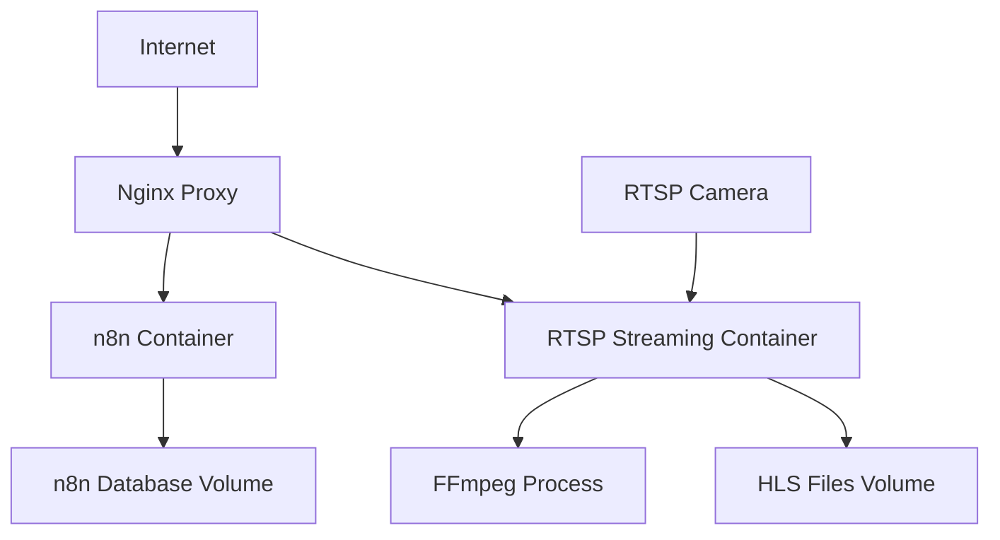

# Guia de Deploy Docker: n8n + FFmpeg + Servidor RTSP

## 1. Visão Geral da Arquitetura

Esta configuração permite executar n8n, FFmpeg e o servidor de streaming RTSP em uma única VPS usando Docker, otimizando recursos e facilitando o gerenciamento.



## 2. Estrutura de Arquivos

```
vps-deployment/
├── docker-compose.yml
├── nginx/
│   ├── nginx.conf
│   └── ssl/
├── rtsp-streaming/
│   ├── Dockerfile
│   ├── server.js
│   └── package.json
├── volumes/
│   ├── n8n/
│   ├── hls/
│   └── nginx-logs/
└── .env
```

## 3. Docker Compose Configuration

### 3.1 docker-compose.yml

```yaml
version: '3.8'

services:
  # Nginx Reverse Proxy
  nginx:
    image: nginx:alpine
    container_name: nginx-proxy
    ports:
      - "80:80"
      - "443:443"
    volumes:
      - ./nginx/nginx.conf:/etc/nginx/nginx.conf:ro
      - ./nginx/ssl:/etc/nginx/ssl:ro
      - ./volumes/nginx-logs:/var/log/nginx
      - hls-data:/var/www/hls:ro
    depends_on:
      - n8n
      - rtsp-streaming
    restart: unless-stopped
    networks:
      - app-network

  # n8n Automation Platform
  n8n:
    image: n8nio/n8n:latest
    container_name: n8n
    environment:
      - N8N_BASIC_AUTH_ACTIVE=true
      - N8N_BASIC_AUTH_USER=${N8N_USER}
      - N8N_BASIC_AUTH_PASSWORD=${N8N_PASSWORD}
      - N8N_HOST=${DOMAIN}
      - N8N_PORT=5678
      - N8N_PROTOCOL=https
      - WEBHOOK_URL=https://${DOMAIN}/
      - GENERIC_TIMEZONE=${TIMEZONE}
    volumes:
      - n8n-data:/home/node/.n8n
    restart: unless-stopped
    networks:
      - app-network
    healthcheck:
      test: ["CMD", "wget", "--quiet", "--tries=1", "--spider", "http://localhost:5678/healthz"]
      interval: 30s
      timeout: 10s
      retries: 3

  # RTSP Streaming Service
  rtsp-streaming:
    build:
      context: ./rtsp-streaming
      dockerfile: Dockerfile
    container_name: rtsp-streaming
    environment:
      - NODE_ENV=production
      - RTSP_URL=${RTSP_URL}
      - HLS_PATH=/app/hls
      - SERVER_PORT=3001
    volumes:
      - hls-data:/app/hls
    restart: unless-stopped
    networks:
      - app-network
    healthcheck:
      test: ["CMD", "curl", "-f", "http://localhost:3001/health"]
      interval: 30s
      timeout: 10s
      retries: 3

volumes:
  n8n-data:
    driver: local
    driver_opts:
      type: none
      o: bind
      device: ./volumes/n8n
  hls-data:
    driver: local
    driver_opts:
      type: none
      o: bind
      device: ./volumes/hls

networks:
  app-network:
    driver: bridge
```

### 3.2 Arquivo .env

```env
# Domínio e SSL
DOMAIN=seu-dominio.com
TIMEZONE=America/Sao_Paulo

# n8n Configuration
N8N_USER=admin
N8N_PASSWORD=sua-senha-segura

# RTSP Configuration
RTSP_URL=rtsp://192.168.0.53:554/stream

# Database (se necessário)
POSTGRES_USER=n8n
POSTGRES_PASSWORD=senha-postgres
POSTGRES_DB=n8n
```

## 4. Dockerfile para RTSP Streaming

### 4.1 rtsp-streaming/Dockerfile

```dockerfile
FROM node:18-alpine

# Instalar FFmpeg e dependências
RUN apk add --no-cache \
    ffmpeg \
    curl \
    bash

# Criar diretório da aplicação
WORKDIR /app

# Copiar arquivos de configuração
COPY package*.json ./

# Instalar dependências Node.js
RUN npm ci --only=production

# Copiar código da aplicação
COPY . .

# Criar diretório para arquivos HLS
RUN mkdir -p /app/hls && chmod 755 /app/hls

# Expor porta
EXPOSE 3001

# Health check
HEALTHCHECK --interval=30s --timeout=10s --start-period=5s --retries=3 \
    CMD curl -f http://localhost:3001/health || exit 1

# Comando de inicialização
CMD ["node", "server.js"]
```

### 4.2 rtsp-streaming/package.json

```json
{
  "name": "rtsp-streaming-server",
  "version": "1.0.0",
  "description": "RTSP to HLS streaming server with FFmpeg",
  "main": "server.js",
  "scripts": {
    "start": "node server.js",
    "dev": "nodemon server.js"
  },
  "dependencies": {
    "express": "^4.18.2",
    "cors": "^2.8.5",
    "child_process": "^1.0.2",
    "fs-extra": "^11.1.1",
    "path": "^0.12.7"
  },
  "engines": {
    "node": ">=18.0.0"
  }
}
```

### 4.3 rtsp-streaming/server.js

```javascript
const express = require('express');
const cors = require('cors');
const { spawn } = require('child_process');
const fs = require('fs-extra');
const path = require('path');

const app = express();
const PORT = process.env.SERVER_PORT || 3001;
const RTSP_URL = process.env.RTSP_URL || 'rtsp://192.168.0.53:554/stream';
const HLS_PATH = process.env.HLS_PATH || '/app/hls';

// Middleware
app.use(cors());
app.use(express.json());

// Servir arquivos HLS
app.use('/hls', express.static(HLS_PATH));

let ffmpegProcess = null;
let isStreaming = false;

// Função para iniciar FFmpeg
function startFFmpeg() {
    if (ffmpegProcess) {
        console.log('FFmpeg já está rodando');
        return;
    }

    // Garantir que o diretório HLS existe
    fs.ensureDirSync(HLS_PATH);

    const ffmpegArgs = [
        '-i', RTSP_URL,
        '-c:v', 'libx264',
        '-c:a', 'aac',
        '-preset', 'ultrafast',
        '-tune', 'zerolatency',
        '-f', 'hls',
        '-hls_time', '2',
        '-hls_list_size', '3',
        '-hls_flags', 'delete_segments',
        '-hls_allow_cache', '0',
        '-y',
        path.join(HLS_PATH, 'stream.m3u8')
    ];

    console.log('Iniciando FFmpeg com argumentos:', ffmpegArgs.join(' '));
    
    ffmpegProcess = spawn('ffmpeg', ffmpegArgs);
    isStreaming = true;

    ffmpegProcess.stdout.on('data', (data) => {
        console.log(`FFmpeg stdout: ${data}`);
    });

    ffmpegProcess.stderr.on('data', (data) => {
        console.log(`FFmpeg stderr: ${data}`);
    });

    ffmpegProcess.on('close', (code) => {
        console.log(`FFmpeg process exited with code ${code}`);
        ffmpegProcess = null;
        isStreaming = false;
        
        // Restart automaticamente em caso de erro
        if (code !== 0) {
            console.log('Reiniciando FFmpeg em 5 segundos...');
            setTimeout(startFFmpeg, 5000);
        }
    });

    ffmpegProcess.on('error', (error) => {
        console.error('Erro no FFmpeg:', error);
        ffmpegProcess = null;
        isStreaming = false;
    });
}

// Função para parar FFmpeg
function stopFFmpeg() {
    if (ffmpegProcess) {
        ffmpegProcess.kill('SIGTERM');
        ffmpegProcess = null;
        isStreaming = false;
        console.log('FFmpeg parado');
    }
}

// Rotas da API
app.get('/health', (req, res) => {
    res.json({ 
        status: 'ok', 
        streaming: isStreaming,
        timestamp: new Date().toISOString()
    });
});

app.get('/stream/status', (req, res) => {
    const manifestPath = path.join(HLS_PATH, 'stream.m3u8');
    const manifestExists = fs.existsSync(manifestPath);
    
    res.json({
        streaming: isStreaming,
        manifestExists,
        manifestPath: manifestExists ? '/hls/stream.m3u8' : null
    });
});

app.post('/stream/start', (req, res) => {
    if (isStreaming) {
        return res.json({ message: 'Stream já está ativo' });
    }
    
    startFFmpeg();
    res.json({ message: 'Stream iniciado' });
});

app.post('/stream/stop', (req, res) => {
    stopFFmpeg();
    res.json({ message: 'Stream parado' });
});

app.post('/stream/restart', (req, res) => {
    stopFFmpeg();
    setTimeout(() => {
        startFFmpeg();
        res.json({ message: 'Stream reiniciado' });
    }, 2000);
});

// Iniciar servidor
app.listen(PORT, () => {
    console.log(`Servidor RTSP rodando na porta ${PORT}`);
    console.log(`HLS Path: ${HLS_PATH}`);
    console.log(`RTSP URL: ${RTSP_URL}`);
    
    // Iniciar streaming automaticamente
    setTimeout(startFFmpeg, 2000);
});

// Cleanup ao sair
process.on('SIGTERM', () => {
    console.log('Recebido SIGTERM, parando FFmpeg...');
    stopFFmpeg();
    process.exit(0);
});

process.on('SIGINT', () => {
    console.log('Recebido SIGINT, parando FFmpeg...');
    stopFFmpeg();
    process.exit(0);
});
```

## 5. Configuração do Nginx

### 5.1 nginx/nginx.conf

```nginx
events {
    worker_connections 1024;
}

http {
    include /etc/nginx/mime.types;
    default_type application/octet-stream;
    
    # Logs
    access_log /var/log/nginx/access.log;
    error_log /var/log/nginx/error.log;
    
    # Gzip compression
    gzip on;
    gzip_vary on;
    gzip_min_length 1024;
    gzip_types text/plain text/css application/json application/javascript text/xml application/xml application/xml+rss text/javascript;
    
    # Rate limiting
    limit_req_zone $binary_remote_addr zone=api:10m rate=10r/s;
    
    # Upstream servers
    upstream n8n_backend {
        server n8n:5678;
    }
    
    upstream rtsp_backend {
        server rtsp-streaming:3001;
    }
    
    # HTTP to HTTPS redirect
    server {
        listen 80;
        server_name _;
        return 301 https://$host$request_uri;
    }
    
    # Main HTTPS server
    server {
        listen 443 ssl http2;
        server_name seu-dominio.com;
        
        # SSL Configuration
        ssl_certificate /etc/nginx/ssl/fullchain.pem;
        ssl_certificate_key /etc/nginx/ssl/privkey.pem;
        ssl_protocols TLSv1.2 TLSv1.3;
        ssl_ciphers ECDHE-RSA-AES256-GCM-SHA512:DHE-RSA-AES256-GCM-SHA512:ECDHE-RSA-AES256-GCM-SHA384:DHE-RSA-AES256-GCM-SHA384;
        ssl_prefer_server_ciphers off;
        ssl_session_cache shared:SSL:10m;
        ssl_session_timeout 10m;
        
        # Security headers
        add_header X-Frame-Options DENY;
        add_header X-Content-Type-Options nosniff;
        add_header X-XSS-Protection "1; mode=block";
        add_header Strict-Transport-Security "max-age=31536000; includeSubDomains" always;
        
        # n8n proxy
        location / {
            proxy_pass http://n8n_backend;
            proxy_set_header Host $host;
            proxy_set_header X-Real-IP $remote_addr;
            proxy_set_header X-Forwarded-For $proxy_add_x_forwarded_for;
            proxy_set_header X-Forwarded-Proto $scheme;
            
            # WebSocket support
            proxy_http_version 1.1;
            proxy_set_header Upgrade $http_upgrade;
            proxy_set_header Connection "upgrade";
            
            # Timeouts
            proxy_connect_timeout 60s;
            proxy_send_timeout 60s;
            proxy_read_timeout 60s;
        }
        
        # RTSP Streaming API
        location /api/rtsp/ {
            limit_req zone=api burst=20 nodelay;
            
            proxy_pass http://rtsp_backend/;
            proxy_set_header Host $host;
            proxy_set_header X-Real-IP $remote_addr;
            proxy_set_header X-Forwarded-For $proxy_add_x_forwarded_for;
            proxy_set_header X-Forwarded-Proto $scheme;
            
            # CORS headers
            add_header Access-Control-Allow-Origin *;
            add_header Access-Control-Allow-Methods "GET, POST, OPTIONS";
            add_header Access-Control-Allow-Headers "Origin, X-Requested-With, Content-Type, Accept";
        }
        
        # HLS streaming files
        location /hls/ {
            alias /var/www/hls/;
            
            # CORS headers for HLS
            add_header Access-Control-Allow-Origin *;
            add_header Access-Control-Allow-Methods "GET, OPTIONS";
            add_header Access-Control-Allow-Headers "Origin, X-Requested-With, Content-Type, Accept";
            
            # Cache control for HLS
            location ~* \.m3u8$ {
                expires -1;
                add_header Cache-Control "no-cache, no-store, must-revalidate";
            }
            
            location ~* \.ts$ {
                expires 1h;
                add_header Cache-Control "public, immutable";
            }
        }
    }
}
```

## 6. Scripts de Deploy

### 6.1 deploy.sh

```bash
#!/bin/bash

# Script de deploy para VPS
set -e

echo "🚀 Iniciando deploy do ambiente Docker..."

# Criar diretórios necessários
echo "📁 Criando estrutura de diretórios..."
mkdir -p volumes/{n8n,hls,nginx-logs}
mkdir -p nginx/ssl

# Definir permissões
chmod 755 volumes/hls
chown -R 1000:1000 volumes/n8n

# Verificar se o arquivo .env existe
if [ ! -f .env ]; then
    echo "❌ Arquivo .env não encontrado!"
    echo "Copie o arquivo .env.example e configure as variáveis."
    exit 1
fi

# Parar containers existentes
echo "🛑 Parando containers existentes..."
docker-compose down --remove-orphans

# Construir imagens
echo "🔨 Construindo imagens Docker..."
docker-compose build --no-cache

# Iniciar serviços
echo "▶️ Iniciando serviços..."
docker-compose up -d

# Aguardar inicialização
echo "⏳ Aguardando inicialização dos serviços..."
sleep 30

# Verificar status
echo "🔍 Verificando status dos containers..."
docker-compose ps

# Verificar logs
echo "📋 Últimos logs dos serviços:"
docker-compose logs --tail=20

echo "✅ Deploy concluído!"
echo "🌐 n8n: https://seu-dominio.com"
echo "📺 RTSP API: https://seu-dominio.com/api/rtsp/"
echo "🎥 HLS Stream: https://seu-dominio.com/hls/stream.m3u8"
```

### 6.2 ssl-setup.sh

```bash
#!/bin/bash

# Script para configurar SSL com Let's Encrypt
set -e

DOMAIN=${1:-"seu-dominio.com"}
EMAIL=${2:-"seu-email@exemplo.com"}

echo "🔒 Configurando SSL para $DOMAIN..."

# Instalar Certbot
if ! command -v certbot &> /dev/null; then
    echo "📦 Instalando Certbot..."
    apt update
    apt install -y certbot
fi

# Parar Nginx temporariamente
docker-compose stop nginx

# Obter certificado
echo "📜 Obtendo certificado SSL..."
certbot certonly --standalone \
    --email $EMAIL \
    --agree-tos \
    --no-eff-email \
    -d $DOMAIN

# Copiar certificados
echo "📋 Copiando certificados..."
cp /etc/letsencrypt/live/$DOMAIN/fullchain.pem nginx/ssl/
cp /etc/letsencrypt/live/$DOMAIN/privkey.pem nginx/ssl/

# Ajustar permissões
chmod 644 nginx/ssl/fullchain.pem
chmod 600 nginx/ssl/privkey.pem

# Reiniciar Nginx
docker-compose start nginx

echo "✅ SSL configurado com sucesso!"
echo "🔄 Configure a renovação automática com: crontab -e"
echo "0 12 * * * /usr/bin/certbot renew --quiet && docker-compose restart nginx"
```

## 7. Monitoramento e Logs

### 7.1 monitoring.sh

```bash
#!/bin/bash

# Script de monitoramento
echo "📊 Status dos Containers:"
docker-compose ps

echo -e "\n🔍 Uso de Recursos:"
docker stats --no-stream --format "table {{.Container}}\t{{.CPUPerc}}\t{{.MemUsage}}\t{{.NetIO}}"

echo -e "\n📋 Logs Recentes - n8n:"
docker-compose logs --tail=10 n8n

echo -e "\n📋 Logs Recentes - RTSP Streaming:"
docker-compose logs --tail=10 rtsp-streaming

echo -e "\n📋 Logs Recentes - Nginx:"
docker-compose logs --tail=10 nginx

echo -e "\n💾 Uso de Disco:"
df -h

echo -e "\n🌐 Teste de Conectividade:"
curl -s -o /dev/null -w "n8n: %{http_code}\n" http://localhost/
curl -s -o /dev/null -w "RTSP API: %{http_code}\n" http://localhost/api/rtsp/health
```

## 8. Backup e Manutenção

### 8.1 backup.sh

```bash
#!/bin/bash

# Script de backup
BACKUP_DIR="/backup/$(date +%Y%m%d_%H%M%S)"
mkdir -p $BACKUP_DIR

echo "💾 Iniciando backup..."

# Backup dos volumes
echo "📁 Backup dos dados n8n..."
tar -czf $BACKUP_DIR/n8n-data.tar.gz -C volumes n8n

# Backup das configurações
echo "⚙️ Backup das configurações..."
cp -r nginx $BACKUP_DIR/
cp docker-compose.yml $BACKUP_DIR/
cp .env $BACKUP_DIR/env.backup

# Backup dos logs
echo "📋 Backup dos logs..."
tar -czf $BACKUP_DIR/logs.tar.gz -C volumes nginx-logs

echo "✅ Backup concluído em: $BACKUP_DIR"

# Limpar backups antigos (manter últimos 7 dias)
find /backup -type d -mtime +7 -exec rm -rf {} +
```

## 9. Otimizações de Performance

### 9.1 Configurações de Sistema

```bash
# /etc/sysctl.conf - Otimizações de rede
net.core.rmem_max = 134217728
net.core.wmem_max = 134217728
net.ipv4.tcp_rmem = 4096 65536 134217728
net.ipv4.tcp_wmem = 4096 65536 134217728
net.core.netdev_max_backlog = 5000
```

### 9.2 Limites de Recursos Docker

```yaml
# Adicionar ao docker-compose.yml
services:
  n8n:
    deploy:
      resources:
        limits:
          cpus: '1.0'
          memory: 1G
        reservations:
          cpus: '0.5'
          memory: 512M
  
  rtsp-streaming:
    deploy:
      resources:
        limits:
          cpus: '2.0'
          memory: 2G
        reservations:
          cpus: '1.0'
          memory: 1G
```

## 10. Troubleshooting

### 10.1 Problemas Comuns

**FFmpeg não inicia:**
```bash
# Verificar logs
docker-compose logs rtsp-streaming

# Testar conectividade RTSP
docker exec rtsp-streaming ffmpeg -i $RTSP_URL -t 10 -f null -
```

**n8n não carrega:**
```bash
# Verificar permissões
sudo chown -R 1000:1000 volumes/n8n

# Reiniciar container
docker-compose restart n8n
```

**SSL não funciona:**
```bash
# Verificar certificados
ls -la nginx/ssl/

# Testar configuração Nginx
docker exec nginx nginx -t
```

### 10.2 Comandos Úteis

```bash
# Ver logs em tempo real
docker-compose logs -f

# Entrar no container
docker exec -it rtsp-streaming /bin/sh

# Reiniciar serviço específico
docker-compose restart rtsp-streaming

# Atualizar imagens
docker-compose pull && docker-compose up -d

# Limpar recursos não utilizados
docker system prune -a
```

## 11. Custos Estimados

### 11.1 VPS Recomendada
- **CPU:** 2-4 vCPUs
- **RAM:** 4-8 GB
- **Storage:** 50-100 GB SSD
- **Bandwidth:** 1-5 TB/mês
- **Custo:** R$ 40-80/mês

### 11.2 Provedores Sugeridos
- **DigitalOcean:** Droplets a partir de $20/mês
- **Vultr:** VPS a partir de $12/mês
- **Linode:** Instâncias a partir de $20/mês
- **AWS Lightsail:** A partir de $20/mês

## 12. Conclusão

Esta configuração Docker permite executar n8n, FFmpeg e o servidor RTSP em uma única VPS de forma eficiente e escalável. Os benefícios incluem:

- **Isolamento:** Cada serviço roda em seu próprio container
- **Escalabilidade:** Fácil de escalar recursos por serviço
- **Manutenção:** Backups e atualizações simplificadas
- **Monitoramento:** Logs centralizados e health checks
- **Segurança:** SSL/TLS e isolamento de rede
- **Custo-efetivo:** Todos os serviços em uma única VPS

Para deploy em produção, siga os scripts fornecidos e ajuste as configurações conforme suas necessidades específicas.