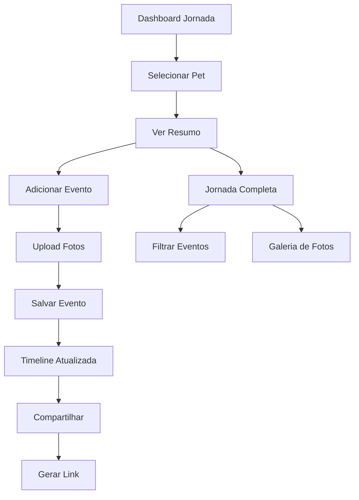

# Melhorias da Jornada de Crescimento - Documento de Requisitos

## 1. Visão Geral do Produto

Este documento define as melhorias para a funcionalidade "Jornada de Crescimento" do PetShop Romeo & Julieta, transformando-a de um sistema estático com dados mockados em uma plataforma dinâmica e interativa que permite aos usuários documentar, acompanhar e compartilhar momentos especiais de seus pets.

O objetivo é criar um sistema completo de histórico e eventos que integre com os serviços existentes do petshop, permitindo upload de fotos, suporte a múltiplos pets, geração automática de eventos e funcionalidades de compartilhamento.

## 2. Funcionalidades Principais

### 2.1 Papéis de Usuário

| Papel | Método de Registro | Permissões Principais |
|-------|-------------------|----------------------|
| Cliente | Registro por email | Pode gerenciar pets próprios, adicionar eventos, fazer upload de fotos |
| Funcionário | Convite administrativo | Pode adicionar eventos para qualquer pet, gerar eventos automáticos |
| Administrador | Acesso direto | Controle total do sistema, moderação de conteúdo |

### 2.2 Módulos de Funcionalidade

Nossas melhorias da Jornada de Crescimento consistem nas seguintes páginas principais:

1. **Dashboard da Jornada**: visualização resumida, seleção de pets, últimos eventos
2. **Jornada Completa**: linha do tempo detalhada, filtros por tipo de evento, galeria de fotos
3. **Adicionar Evento**: formulário de criação, upload de fotos, categorização
4. **Gerenciar Pets**: cadastro de pets, informações básicas, configurações de privacidade
5. **Compartilhamento**: geração de links, configurações de privacidade, exportação

### 2.3 Detalhes das Páginas

| Nome da Página | Nome do Módulo | Descrição da Funcionalidade |
|----------------|----------------|-----------------------------|
| Dashboard da Jornada | Seletor de Pet | Dropdown para escolher pet ativo, foto e informações básicas |
| Dashboard da Jornada | Resumo de Eventos | Exibir últimos 3-5 eventos com fotos em miniatura |
| Dashboard da Jornada | Estatísticas | Contador de eventos, fotos, marcos importantes |
| Jornada Completa | Linha do Tempo | Exibição cronológica de todos os eventos com fotos e descrições |
| Jornada Completa | Filtros | Filtrar por tipo de evento, data, categoria |
| Jornada Completa | Galeria | Visualização em grid de todas as fotos do pet |
| Adicionar Evento | Formulário | Campos para título, descrição, data, tipo de evento |
| Adicionar Evento | Upload de Fotos | Arrastar e soltar múltiplas imagens, preview, redimensionamento |
| Adicionar Evento | Categorização | Seleção de categoria, tags personalizadas |
| Gerenciar Pets | Lista de Pets | Visualizar todos os pets do usuário, adicionar novo pet |
| Gerenciar Pets | Informações do Pet | Nome, raça, idade, foto de perfil, informações médicas |
| Compartilhamento | Gerador de Links | Criar links públicos para eventos específicos ou jornada completa |
| Compartilhamento | Configurações | Definir privacidade, duração do link, permissões |

## 3. Fluxo Principal de Processos

**Fluxo do Cliente:**
1. Usuário acessa Dashboard da Jornada
2. Seleciona pet desejado no dropdown
3. Visualiza resumo dos últimos eventos
4. Pode clicar em "Ver Jornada Completa" para timeline detalhada
5. Adiciona novo evento através do botão "+" 
6. Faz upload de fotos e preenche informações
7. Evento é salvo e aparece na timeline
8. Pode compartilhar eventos específicos ou jornada completa

**Fluxo de Eventos Automáticos:**
1. Sistema monitora agendamentos e serviços realizados
2. Quando serviço é concluído, evento é gerado automaticamente
3. Funcionário pode adicionar fotos e observações
4. Cliente recebe notificação sobre novo evento
5. Cliente pode editar ou complementar informações

## 4. Design da Interface do Usuário

### 4.1 Estilo de Design

- **Cores Primárias**: #3B82F6 (azul principal), #10B981 (verde sucesso)
- **Cores Secundárias**: #6B7280 (cinza texto), #F3F4F6 (fundo claro)
- **Estilo de Botões**: Arredondados (border-radius: 8px), com sombras suaves
- **Fontes**: Inter para textos, tamanhos 14px (corpo), 18px (títulos), 24px (cabeçalhos)
- **Layout**: Design baseado em cards, navegação lateral fixa
- **Ícones**: Lucide React, estilo outline, tamanho 20px padrão
- **Animações**: Transições suaves com Framer Motion, fade-in para carregamento

### 4.2 Visão Geral do Design das Páginas

| Nome da Página | Nome do Módulo | Elementos da UI |
|----------------|----------------|----------------|
| Dashboard da Jornada | Seletor de Pet | Card com foto circular do pet, dropdown estilizado, informações básicas |
| Dashboard da Jornada | Resumo de Eventos | Grid de cards 3x1, cada card com foto, título, data, ícone de categoria |
| Jornada Completa | Linha do Tempo | Layout vertical com linha conectora, cards alternados esquerda/direita |
| Jornada Completa | Filtros | Barra horizontal com chips clicáveis, datepicker, search input |
| Adicionar Evento | Upload de Fotos | Área de drag-and-drop, preview em grid, progress bars |
| Compartilhamento | Gerador de Links | Modal overlay, toggle switches para configurações, botão de copiar |

### 4.3 Responsividade

Design mobile-first com breakpoints:
- Mobile: até 768px (stack vertical, navegação bottom sheet)
- Tablet: 768px-1024px (grid 2 colunas, sidebar colapsível)
- Desktop: 1024px+ (layout completo, sidebar fixa)

Otimização para touch em dispositivos móveis com botões maiores (min 44px) e gestos de swipe na timeline.