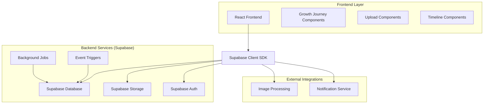
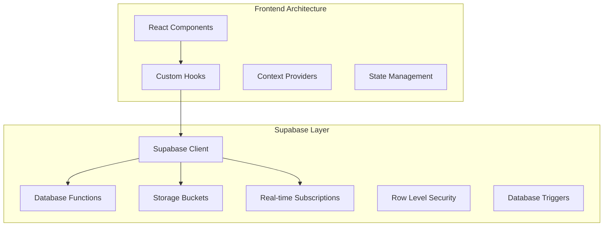
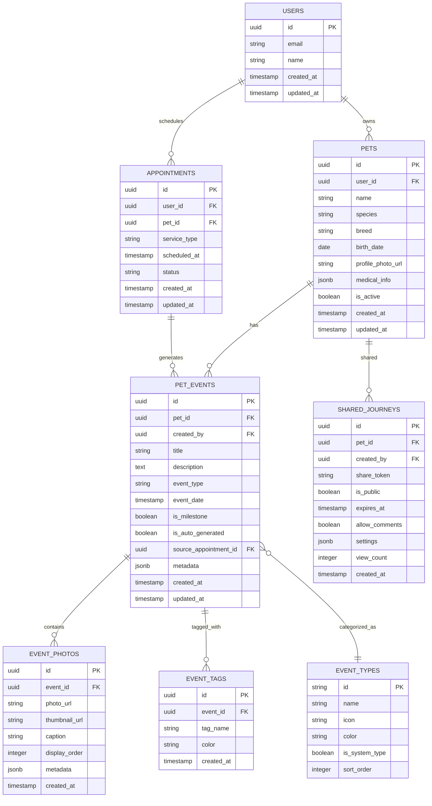

# Arquitetura Técnica - Melhorias da Jornada de Crescimento

## 1. Design da Arquitetura



## 2. Descrição das Tecnologias

* **Frontend**: React\@18 + TypeScript + TailwindCSS\@3 + Vite + Framer Motion

* **Backend**: Supabase (PostgreSQL + Storage + Auth + Real-time)

* **Upload**: Supabase Storage com processamento de imagens

* **Notificações**: Supabase Real-time subscriptions

## 3. Definições de Rotas

| Rota                      | Propósito                                     |
| ------------------------- | --------------------------------------------- |
| /dashboard                | Dashboard principal com resumo da jornada     |
| /journey/:petId           | Jornada completa de um pet específico         |
| /journey/:petId/add-event | Formulário para adicionar novo evento         |
| /pets/manage              | Gerenciamento de pets do usuário              |
| /journey/shared/:shareId  | Visualização pública de jornada compartilhada |
| /journey/:petId/gallery   | Galeria de fotos do pet                       |

## 4. Definições de API

### 4.1 APIs Principais

**Eventos do Pet**

```typescript
// GET /api/pets/{petId}/events
interface GetPetEventsResponse {
  events: PetEvent[];
  total: number;
  hasMore: boolean;
}

// POST /api/pets/{petId}/events
interface CreateEventRequest {
  title: string;
  description?: string;
  event_type: EventType;
  event_date: string;
  photos?: File[];
  tags?: string[];
  is_milestone: boolean;
}
```

**Upload de Fotos**

```typescript
// POST /api/events/{eventId}/photos
interface UploadPhotosRequest {
  photos: File[];
  captions?: string[];
}

interface UploadPhotosResponse {
  uploaded_photos: EventPhoto[];
  failed_uploads?: string[];
}
```

**Compartilhamento**

```typescript
// POST /api/journey/share
interface CreateShareLinkRequest {
  pet_id: string;
  event_ids?: string[];
  expires_at?: string;
  is_public: boolean;
  allow_comments: boolean;
}

interface ShareLinkResponse {
  share_id: string;
  share_url: string;
  expires_at: string;
}
```

## 5. Arquitetura do Servidor



## 6. Modelo de Dados

### 6.1 Definição do Modelo de Dados



### 6.2 Linguagem de Definição de Dados

**Tabela de Eventos do Pet (pet\_events)**

```sql
-- Criar tabela de eventos
CREATE TABLE pet_events (
    id UUID PRIMARY KEY DEFAULT gen_random_uuid(),
    pet_id UUID NOT NULL REFERENCES pets_pet(id) ON DELETE CASCADE,
    created_by UUID NOT NULL REFERENCES auth.users(id),
    title VARCHAR(255) NOT NULL,
    description TEXT,
    event_type VARCHAR(50) NOT NULL DEFAULT 'custom',
    event_date TIMESTAMP WITH TIME ZONE NOT NULL,
    is_milestone BOOLEAN DEFAULT false,
    is_auto_generated BOOLEAN DEFAULT false,
    source_appointment_id UUID REFERENCES appointments(id),
    metadata JSONB DEFAULT '{}',
    created_at TIMESTAMP WITH TIME ZONE DEFAULT NOW(),
    updated_at TIMESTAMP WITH TIME ZONE DEFAULT NOW()
);

-- Criar índices
CREATE INDEX idx_pet_events_pet_id ON pet_events(pet_id);
CREATE INDEX idx_pet_events_event_date ON pet_events(event_date DESC);
CREATE INDEX idx_pet_events_type ON pet_events(event_type);
CREATE INDEX idx_pet_events_milestone ON pet_events(is_milestone) WHERE is_milestone = true;

-- RLS (Row Level Security)
ALTER TABLE pet_events ENABLE ROW LEVEL SECURITY;

-- Política para usuários autenticados verem apenas eventos de seus pets
CREATE POLICY "Users can view events of their pets" ON pet_events
    FOR SELECT USING (
        pet_id IN (
            SELECT id FROM pets_pet WHERE user_id = auth.uid()
        )
    );

-- Política para usuários criarem eventos para seus pets
CREATE POLICY "Users can create events for their pets" ON pet_events
    FOR INSERT WITH CHECK (
        pet_id IN (
            SELECT id FROM pets_pet WHERE user_id = auth.uid()
        ) AND created_by = auth.uid()
    );

-- Permissões
GRANT SELECT ON pet_events TO anon;
GRANT ALL PRIVILEGES ON pet_events TO authenticated;
```

**Tabela de Fotos de Eventos (event\_photos)**

```sql
-- Criar tabela de fotos
CREATE TABLE event_photos (
    id UUID PRIMARY KEY DEFAULT gen_random_uuid(),
    event_id UUID NOT NULL REFERENCES pet_events(id) ON DELETE CASCADE,
    photo_url TEXT NOT NULL,
    thumbnail_url TEXT,
    caption TEXT,
    display_order INTEGER DEFAULT 0,
    metadata JSONB DEFAULT '{}',
    created_at TIMESTAMP WITH TIME ZONE DEFAULT NOW()
);

-- Criar índices
CREATE INDEX idx_event_photos_event_id ON event_photos(event_id);
CREATE INDEX idx_event_photos_order ON event_photos(event_id, display_order);

-- RLS
ALTER TABLE event_photos ENABLE ROW LEVEL SECURITY;

CREATE POLICY "Users can view photos of their pet events" ON event_photos
    FOR SELECT USING (
        event_id IN (
            SELECT pe.id FROM pet_events pe
            JOIN pets_pet p ON pe.pet_id = p.id
            WHERE p.user_id = auth.uid()
        )
    );

-- Permissões
GRANT SELECT ON event_photos TO anon;
GRANT ALL PRIVILEGES ON event_photos TO authenticated;
```

**Tabela de Tipos de Eventos (event\_types)**

```sql
-- Criar tabela de tipos de eventos
CREATE TABLE event_types (
    id VARCHAR(50) PRIMARY KEY,
    name VARCHAR(100) NOT NULL,
    icon VARCHAR(50) NOT NULL,
    color VARCHAR(7) NOT NULL,
    is_system_type BOOLEAN DEFAULT false,
    sort_order INTEGER DEFAULT 0
);

-- Inserir tipos padrão
INSERT INTO event_types (id, name, icon, color, is_system_type, sort_order) VALUES
('vaccination', 'Vacinação', 'syringe', '#10B981', true, 1),
('checkup', 'Check-up', 'stethoscope', '#3B82F6', true, 2),
('grooming', 'Banho e Tosa', 'scissors', '#8B5CF6', true, 3),
('birthday', 'Aniversário', 'cake', '#F59E0B', true, 4),
('milestone', 'Marco Importante', 'star', '#EF4444', true, 5),
('play', 'Brincadeira', 'gamepad-2', '#06B6D4', true, 6),
('training', 'Treinamento', 'graduation-cap', '#84CC16', true, 7),
('custom', 'Personalizado', 'camera', '#6B7280', false, 99);

-- Permissões
GRANT SELECT ON event_types TO anon;
GRANT SELECT ON event_types TO authenticated;
```

**Tabela de Jornadas Compartilhadas (shared\_journeys)**

```sql
-- Criar tabela de compartilhamentos
CREATE TABLE shared_journeys (
    id UUID PRIMARY KEY DEFAULT gen_random_uuid(),
    pet_id UUID NOT NULL REFERENCES pets_pet(id) ON DELETE CASCADE,
    created_by UUID NOT NULL REFERENCES auth.users(id),
    share_token VARCHAR(32) UNIQUE NOT NULL DEFAULT encode(gen_random_bytes(16), 'hex'),
    is_public BOOLEAN DEFAULT false,
    expires_at TIMESTAMP WITH TIME ZONE,
    allow_comments BOOLEAN DEFAULT false,
    settings JSONB DEFAULT '{}',
    view_count INTEGER DEFAULT 0,
    created_at TIMESTAMP WITH TIME ZONE DEFAULT NOW()
);

-- Criar índices
CREATE INDEX idx_shared_journeys_token ON shared_journeys(share_token);
CREATE INDEX idx_shared_journeys_pet ON shared_journeys(pet_id);
CREATE INDEX idx_shared_journeys_expires ON shared_journeys(expires_at) WHERE expires_at IS NOT NULL;

-- RLS
ALTER TABLE shared_journeys ENABLE ROW LEVEL SECURITY;

CREATE POLICY "Users can manage their pet journey shares" ON shared_journeys
    FOR ALL USING (
        pet_id IN (
            SELECT id FROM pets_pet WHERE user_id = auth.uid()
        )
    );

-- Política para acesso público via token
CREATE POLICY "Public access via share token" ON shared_journeys
    FOR SELECT USING (is_public = true AND (expires_at IS NULL OR expires_at > NOW()));

-- Permissões
GRANT SELECT ON shared_journeys TO anon;
GRANT ALL PRIVILEGES ON shared_journeys TO authenticated;
```

**Função para Gerar Eventos Automáticos**

```sql
-- Função para criar evento automático após agendamento
CREATE OR REPLACE FUNCTION create_auto_event_from_appointment()
RETURNS TRIGGER AS $$
BEGIN
    -- Criar evento apenas se o agendamento foi concluído
    IF NEW.status = 'completed' AND OLD.status != 'completed' THEN
        INSERT INTO pet_events (
            pet_id,
            created_by,
            title,
            description,
            event_type,
            event_date,
            is_auto_generated,
            source_appointment_id
        ) VALUES (
            NEW.pet_id,
            NEW.user_id,
            CASE NEW.service_type
                WHEN 'grooming' THEN 'Banho e Tosa Realizado'
                WHEN 'vaccination' THEN 'Vacinação Aplicada'
                WHEN 'checkup' THEN 'Check-up Realizado'
                ELSE 'Serviço Realizado'
            END,
            'Evento gerado automaticamente após conclusão do agendamento.',
            NEW.service_type,
            NEW.scheduled_at,
            true,
            NEW.id
        );
    END IF;
    
    RETURN NEW;
END;
$$ LANGUAGE plpgsql;

-- Trigger para criar eventos automáticos
CREATE TRIGGER trigger_auto_event_from_appointment
    AFTER UPDATE ON appointments
    FOR EACH ROW
    EXECUTE FUNCTION create_auto_event_from_appointment();
```

**Storage Buckets para Fotos**

```sql
-- Criar bucket para fotos de eventos
INSERT INTO storage.buckets (id, name, public) VALUES ('pet-event-photos', 'pet-event-photos', true);

-- Política de upload para usuários autenticados
CREATE POLICY "Users can upload photos for their pet events" ON storage.objects
    FOR INSERT WITH CHECK (
        bucket_id = 'pet-event-photos' AND
        auth.role() = 'authenticated' AND
        (storage.foldername(name))[1] = auth.uid()::text
    );

-- Política de visualização pública
CREATE POLICY "Public access to pet event photos" ON storage.objects
    FOR SELECT USING (bucket_id = 'pet-event-photos');
```

