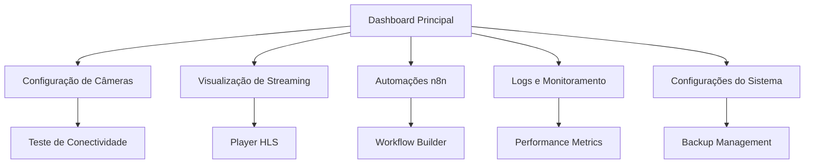

# Documento de Requisitos do Produto: Sistema de Streaming RTSP para PetShop

## 1. Product Overview
Sistema integrado de streaming RTSP para monitoramento de pets em tempo real, combinando automação n8n, conversão de vídeo FFmpeg e interface web responsiva.
O produto resolve a necessidade de monitoramento remoto de animais em petshops, permitindo que proprietários acompanhem seus pets durante hospedagem ou tratamento através de streaming de vídeo seguro e confiável.
O sistema visa aumentar a confiança dos clientes e diferenciar o petshop no mercado através de transparência e tecnologia avançada.

## 2. Core Features

### 2.1 User Roles
| Role | Registration Method | Core Permissions |
|------|---------------------|------------------|
| Administrador | Acesso direto via credenciais | Configuração completa do sistema, gerenciamento de câmeras, acesso a logs |
| Cliente | Código de acesso fornecido pelo petshop | Visualização do streaming do seu pet, histórico limitado |
| Funcionário | Cadastro interno pelo administrador | Monitoramento de múltiplas câmeras, controle básico de streaming |

### 2.2 Feature Module
Nosso sistema de streaming RTSP consiste nas seguintes páginas principais:
1. **Dashboard Principal**: painel de controle, status do sistema, monitoramento de câmeras ativas.
2. **Visualização de Streaming**: player de vídeo HLS, controles de qualidade, tela cheia.
3. **Configuração de Câmeras**: gerenciamento de URLs RTSP, teste de conectividade, configurações de qualidade.
4. **Automações n8n**: workflows personalizados, notificações automáticas, integração com APIs.
5. **Logs e Monitoramento**: histórico de eventos, métricas de performance, alertas de sistema.
6. **Configurações do Sistema**: variáveis de ambiente, backup/restore, gerenciamento de usuários.

### 2.3 Page Details
| Page Name | Module Name | Feature description |
|-----------|-------------|---------------------|
| Dashboard Principal | Status Overview | Exibir status de todos os serviços (n8n, FFmpeg, Nginx), métricas em tempo real, alertas críticos |
| Dashboard Principal | Camera Grid | Visualizar múltiplas câmeras simultaneamente, alternar entre visualizações, indicadores de status |
| Visualização de Streaming | HLS Player | Reproduzir stream HLS com controles personalizados, ajuste de qualidade, modo tela cheia |
| Visualização de Streaming | Stream Controls | Iniciar/parar streaming, reiniciar FFmpeg, ajustar configurações de codificação |
| Configuração de Câmeras | RTSP Management | Adicionar/editar URLs RTSP, testar conectividade, configurar credenciais |
| Configuração de Câmeras | Quality Settings | Configurar resolução, bitrate, FPS, codec de vídeo/áudio |
| Automações n8n | Workflow Builder | Criar automações personalizadas, triggers baseados em eventos, integração com APIs externas |
| Automações n8n | Notification System | Configurar alertas por email/SMS, webhooks, notificações push |
| Logs e Monitoramento | System Logs | Visualizar logs de FFmpeg, Nginx, n8n com filtros e busca |
| Logs e Monitoramento | Performance Metrics | Gráficos de CPU/RAM, bandwidth, uptime, estatísticas de streaming |
| Configurações do Sistema | Environment Config | Gerenciar variáveis de ambiente, configurações de rede, SSL |
| Configurações do Sistema | Backup Management | Agendar backups automáticos, restore de configurações, exportar dados |

## 3. Core Process

### Fluxo do Administrador
1. Acessa dashboard principal para verificar status geral do sistema
2. Configura câmeras RTSP através da página de configuração
3. Testa conectividade e ajusta qualidade de streaming
4. Cria automações no n8n para notificações e integrações
5. Monitora logs e métricas de performance
6. Gerencia backups e configurações do sistema

### Fluxo do Cliente
1. Recebe código de acesso do petshop
2. Acessa página de visualização de streaming
3. Visualiza streaming do seu pet em tempo real
4. Utiliza controles básicos (tela cheia, qualidade)
5. Recebe notificações automáticas quando configurado

### Fluxo do Funcionário
1. Acessa dashboard com múltiplas câmeras
2. Monitora diferentes áreas do petshop simultaneamente
3. Controla streaming individual de cada câmera
4. Verifica logs básicos e status do sistema

## 4. User Interface Design

### 4.1 Design Style
- **Cores Primárias**: Azul escuro (#1e3a8a) para header e navegação, Verde (#10b981) para status positivo
- **Cores Secundárias**: Cinza claro (#f8fafc) para background, Vermelho (#ef4444) para alertas
- **Estilo de Botões**: Rounded corners (8px), gradiente sutil, hover effects suaves
- **Fonte**: Inter ou system fonts, tamanhos 14px (corpo), 18px (títulos), 24px (headers)
- **Layout**: Grid responsivo, sidebar fixa, cards com sombra sutil, navegação top-level
- **Ícones**: Lucide React ou Heroicons, estilo outline, tamanho 20px padrão

### 4.2 Page Design Overview

| Page Name | Module Name | UI Elements |
|-----------|-------------|-------------|
| Dashboard Principal | Status Overview | Cards com métricas em tempo real, indicadores coloridos (verde/vermelho), gráficos simples de linha |
| Dashboard Principal | Camera Grid | Grid 2x2 ou 3x3 responsivo, thumbnails de vídeo, overlay com status, botões de ação flutuantes |
| Visualização de Streaming | HLS Player | Player full-width com controles customizados, botão tela cheia, indicador de qualidade, loading spinner |
| Configuração de Câmeras | RTSP Management | Formulário em duas colunas, campos de input com validação, botão de teste com feedback visual |
| Automações n8n | Workflow Builder | Interface drag-and-drop integrada, painel lateral com nós disponíveis, preview de execução |
| Logs e Monitoramento | System Logs | Tabela com filtros, search bar, paginação, export button, refresh automático |

### 4.3 Responsiveness
O produto é desktop-first com adaptação mobile completa. Interface otimizada para tablets em modo landscape para monitoramento. Touch interactions otimizadas para controles de vídeo e navegação em dispositivos móveis.

## 5. Technical Requirements

### 5.1 Performance
- Latência de streaming < 3 segundos
- Suporte a múltiplas conexões simultâneas (até 50 usuários)
- Uptime mínimo de 99.5%
- Tempo de resposta da API < 500ms

### 5.2 Security
- Autenticação obrigatória para todos os acessos
- Comunicação HTTPS/WSS exclusivamente
- Logs de auditoria para todas as ações
- Backup criptografado das configurações

### 5.3 Compatibility
- Suporte a câmeras RTSP padrão (H.264/H.265)
- Browsers modernos (Chrome 90+, Firefox 88+, Safari 14+)
- Dispositivos móveis iOS 14+ e Android 10+
- Resolução mínima 1280x720, máxima 4K

### 5.4 Scalability
- Arquitetura containerizada com Docker
- Horizontal scaling através de load balancer
- Armazenamento de logs com rotação automática
- Configuração via variáveis de ambiente

## 6. Integration Requirements

### 6.1 External APIs
- Integração com APIs de notificação (email, SMS)
- Webhooks para sistemas externos do petshop
- API REST para integração com aplicativos móveis
- Suporte a MQTT para IoT devices

### 6.2 Data Storage
- Configurações persistentes em volumes Docker
- Logs estruturados com retenção configurável
- Backup automático para storage externo
- Métricas históricas para análise de performance

## 7. Deployment Requirements

### 7.1 Infrastructure
- VPS com mínimo 4GB RAM, 2 vCPUs
- 50GB storage SSD para sistema e logs
- Bandwidth mínimo 100Mbps para streaming
- Domínio próprio com certificado SSL

### 7.2 Monitoring
- Health checks automáticos para todos os serviços
- Alertas por email em caso de falhas
- Métricas de sistema (CPU, RAM, disk, network)
- Logs centralizados com rotação automática

## 8. Success Metrics

### 8.1 Technical KPIs
- Uptime > 99.5%
- Latência média < 2 segundos
- Zero perda de frames durante streaming
- Tempo de recuperação < 30 segundos após falhas

### 8.2 Business KPIs
- Aumento de 25% na satisfação do cliente
- Redução de 40% em ligações de consulta sobre pets
- Aumento de 15% na taxa de retorno de clientes
- ROI positivo em 6 meses de operação