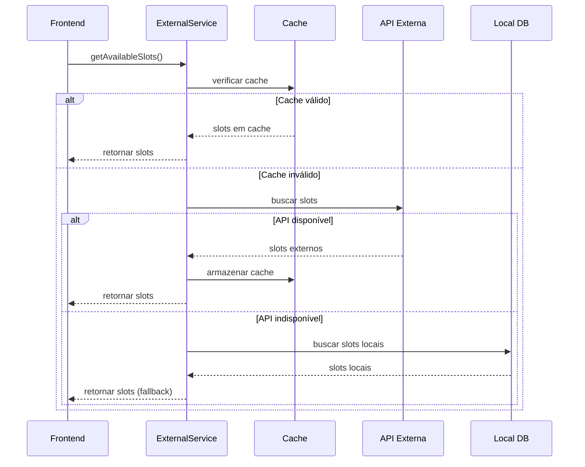
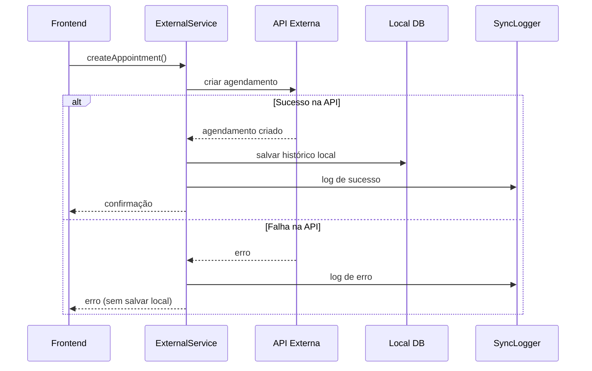

# Arquitetura de Integração com API Externa - PetShop Romeo & Julieta

## 🏗️ Visão Geral da Arquitetura

### Princípios de Design
- **Não-intrusivo**: Manter sistema atual funcionando
- **Gradual**: Implementação em fases
- **Resiliente**: Fallback para sistema local
- **Auditável**: Logs completos de sincronização
- **Flexível**: Suporte a múltiplos provedores

## 📁 Estrutura de Arquivos Proposta

```
src/
├── services/
│   ├── external/
│   │   ├── externalSchedulingService.ts     # Interface principal com API externa
│   │   ├── schedulingAdapter.ts             # Adaptação de dados
│   │   ├── syncService.ts                   # Serviço de sincronização
│   │   ├── conflictResolver.ts              # Resolução de conflitos
│   │   └── providers/
│   │       ├── baseProvider.ts              # Interface base para provedores
│   │       ├── genericAPIProvider.ts        # Provedor genérico REST API
│   │       └── customProvider.ts            # Provedor específico (se necessário)
│   ├── sync/
│   │   ├── realtimeSync.ts                  # Sincronização em tempo real
│   │   ├── batchSync.ts                     # Sincronização por lotes
│   │   ├── syncMonitoring.ts                # Monitoramento de sincronização
│   │   └── syncLogger.ts                    # Sistema de logs
│   └── cache/
│       ├── slotCache.ts                     # Cache de slots
│       └── syncCache.ts                     # Cache de sincronização
├── types/
│   ├── external.ts                          # Tipos para API externa
│   └── sync.ts                              # Tipos para sincronização
├── hooks/
│   ├── useExternalSlots.ts                  # Hook para slots externos
│   └── useSyncStatus.ts                     # Hook para status de sync
└── components/
    ├── sync/
    │   ├── SyncStatusIndicator.tsx          # Indicador de status
    │   └── SyncErrorHandler.tsx             # Tratamento de erros
    └── booking/
        └── ExternalSlotSelector.tsx         # Seletor de slots externos
```

## 🔧 Implementação dos Serviços

### 1. Interface Base para Provedores

```typescript
// src/types/external.ts
export interface ExternalProvider {
  name: string
  baseUrl: string
  authenticate(): Promise<string>
  getAvailableSlots(params: SlotQueryParams): Promise<ExternalSlot[]>
  createAppointment(data: ExternalAppointmentRequest): Promise<ExternalAppointment>
  updateAppointment(id: string, data: Partial<ExternalAppointmentRequest>): Promise<ExternalAppointment>
  cancelAppointment(id: string): Promise<boolean>
  getAppointment(id: string): Promise<ExternalAppointment>
  syncAppointments(since?: Date): Promise<ExternalAppointment[]>
}

export interface SlotQueryParams {
  serviceId?: string
  dateFrom: string
  dateTo: string
  timeFrom?: string
  timeTo?: string
}

export interface ExternalSlot {
  id: string
  providerId: string
  date: string
  startTime: string
  endTime: string
  duration: number
  available: boolean
  serviceId?: string
  serviceType?: string
  maxCapacity: number
  currentBookings: number
  price?: number
  metadata?: Record<string, any>
}

export interface ExternalAppointment {
  id: string
  providerId: string
  slotId: string
  customerData: {
    name: string
    email: string
    phone: string
    document?: string
  }
  petData?: {
    name: string
    breed?: string
    age?: number
    weight?: number
    notes?: string
  }
  serviceId: string
  serviceType: string
  status: 'confirmed' | 'pending' | 'cancelled' | 'completed'
  price?: number
  notes?: string
  createdAt: string
  updatedAt: string
  metadata?: Record<string, any>
}
```

### 2. Provedor Genérico REST API

```typescript
// src/services/external/providers/genericAPIProvider.ts
export class GenericAPIProvider implements ExternalProvider {
  name = 'Generic REST API'
  
  constructor(
    public baseUrl: string,
    private apiKey: string,
    private apiSecret?: string
  ) {}

  async authenticate(): Promise<string> {
    if (this.apiSecret) {
      // OAuth 2.0 flow
      const response = await fetch(`${this.baseUrl}/auth/token`, {
        method: 'POST',
        headers: {
          'Content-Type': 'application/json',
          'X-API-Key': this.apiKey
        },
        body: JSON.stringify({
          grant_type: 'client_credentials',
          client_secret: this.apiSecret
        })
      })
      
      const { access_token } = await response.json()
      return access_token
    }
    
    // API Key simples
    return this.apiKey
  }

  async getAvailableSlots(params: SlotQueryParams): Promise<ExternalSlot[]> {
    const token = await this.authenticate()
    const queryParams = new URLSearchParams({
      date_from: params.dateFrom,
      date_to: params.dateTo,
      ...(params.serviceId && { service_id: params.serviceId }),
      ...(params.timeFrom && { time_from: params.timeFrom }),
      ...(params.timeTo && { time_to: params.timeTo })
    })

    const response = await fetch(`${this.baseUrl}/slots?${queryParams}`, {
      headers: {
        'Authorization': `Bearer ${token}`,
        'Content-Type': 'application/json'
      }
    })

    if (!response.ok) {
      throw new Error(`Failed to fetch slots: ${response.statusText}`)
    }

    const data = await response.json()
    return this.normalizeSlots(data.slots || data)
  }

  async createAppointment(data: ExternalAppointmentRequest): Promise<ExternalAppointment> {
    const token = await this.authenticate()
    
    const response = await fetch(`${this.baseUrl}/appointments`, {
      method: 'POST',
      headers: {
        'Authorization': `Bearer ${token}`,
        'Content-Type': 'application/json'
      },
      body: JSON.stringify(this.normalizeAppointmentRequest(data))
    })

    if (!response.ok) {
      throw new Error(`Failed to create appointment: ${response.statusText}`)
    }

    const appointment = await response.json()
    return this.normalizeAppointment(appointment)
  }

  private normalizeSlots(rawSlots: any[]): ExternalSlot[] {
    return rawSlots.map(slot => ({
      id: slot.id || slot.slot_id,
      providerId: this.name,
      date: slot.date,
      startTime: slot.start_time || slot.startTime,
      endTime: slot.end_time || slot.endTime,
      duration: slot.duration || 60,
      available: slot.available !== false,
      serviceId: slot.service_id || slot.serviceId,
      serviceType: slot.service_type || slot.serviceType,
      maxCapacity: slot.max_capacity || slot.maxCapacity || 1,
      currentBookings: slot.current_bookings || slot.currentBookings || 0,
      price: slot.price,
      metadata: slot.metadata || {}
    }))
  }

  private normalizeAppointment(rawAppointment: any): ExternalAppointment {
    return {
      id: rawAppointment.id,
      providerId: this.name,
      slotId: rawAppointment.slot_id || rawAppointment.slotId,
      customerData: {
        name: rawAppointment.customer?.name || rawAppointment.customer_name,
        email: rawAppointment.customer?.email || rawAppointment.customer_email,
        phone: rawAppointment.customer?.phone || rawAppointment.customer_phone,
        document: rawAppointment.customer?.document
      },
      petData: rawAppointment.pet ? {
        name: rawAppointment.pet.name,
        breed: rawAppointment.pet.breed,
        age: rawAppointment.pet.age,
        weight: rawAppointment.pet.weight,
        notes: rawAppointment.pet.notes
      } : undefined,
      serviceId: rawAppointment.service_id || rawAppointment.serviceId,
      serviceType: rawAppointment.service_type || rawAppointment.serviceType,
      status: rawAppointment.status,
      price: rawAppointment.price,
      notes: rawAppointment.notes,
      createdAt: rawAppointment.created_at || rawAppointment.createdAt,
      updatedAt: rawAppointment.updated_at || rawAppointment.updatedAt,
      metadata: rawAppointment.metadata || {}
    }
  }

  // Implementar outros métodos...
}
```

### 3. Serviço Principal de Integração

```typescript
// src/services/external/externalSchedulingService.ts
export class ExternalSchedulingService {
  private provider: ExternalProvider
  private cache: SlotCache
  private syncLogger: SyncLogger

  constructor(provider: ExternalProvider) {
    this.provider = provider
    this.cache = new SlotCache()
    this.syncLogger = new SyncLogger()
  }

  async getAvailableSlots(
    serviceId: string,
    dateRange: { from: string; to: string },
    useCache = true
  ): Promise<AvailableSlot[]> {
    try {
      // Verificar cache primeiro
      if (useCache) {
        const cachedSlots = await this.cache.getSlots(serviceId, dateRange)
        if (cachedSlots.length > 0) {
          return cachedSlots
        }
      }

      // Buscar da API externa
      const externalSlots = await this.provider.getAvailableSlots({
        serviceId,
        dateFrom: dateRange.from,
        dateTo: dateRange.to
      })

      // Adaptar para formato interno
      const adaptedSlots = SchedulingAdapter.externalToInternalSlots(externalSlots)

      // Armazenar no cache
      await this.cache.storeSlots(serviceId, dateRange, adaptedSlots)

      // Log da operação
      await this.syncLogger.log({
        action: 'fetch_slots',
        entity_type: 'slot',
        status: 'success',
        data_snapshot: { count: adaptedSlots.length, serviceId, dateRange }
      })

      return adaptedSlots

    } catch (error) {
      await this.syncLogger.log({
        action: 'fetch_slots',
        entity_type: 'slot',
        status: 'error',
        error_message: error.message,
        data_snapshot: { serviceId, dateRange }
      })

      // Fallback para slots locais
      return await this.getFallbackSlots(serviceId, dateRange)
    }
  }

  async createAppointment(appointmentData: CreateAppointmentRequest): Promise<Appointment> {
    const transaction = await this.startTransaction()
    
    try {
      // 1. Criar na API externa
      const externalAppointment = await this.provider.createAppointment(
        SchedulingAdapter.internalToExternalAppointment(appointmentData)
      )

      // 2. Salvar histórico local
      const localAppointment = await supabase
        .from('appointments_pet')
        .insert({
          ...appointmentData,
          external_id: externalAppointment.id,
          external_provider: this.provider.name,
          status: 'confirmed',
          source: 'external',
          sync_status: 'synced'
        })
        .select()
        .single()

      // 3. Log de sucesso
      await this.syncLogger.log({
        action: 'create',
        entity_type: 'appointment',
        local_id: localAppointment.id,
        external_id: externalAppointment.id,
        status: 'success',
        data_snapshot: externalAppointment
      })

      await transaction.commit()
      return localAppointment

    } catch (error) {
      await transaction.rollback()
      
      // Log de erro
      await this.syncLogger.log({
        action: 'create',
        entity_type: 'appointment',
        status: 'error',
        error_message: error.message,
        data_snapshot: appointmentData
      })

      throw new Error(`Falha ao criar agendamento: ${error.message}`)
    }
  }

  private async getFallbackSlots(serviceId: string, dateRange: any): Promise<AvailableSlot[]> {
    // Buscar slots locais como fallback
    const { data: localSlots } = await supabase
      .from('available_slots_pet')
      .select('*')
      .eq('service_id', serviceId)
      .gte('date', dateRange.from)
      .lte('date', dateRange.to)
      .eq('is_available', true)

    return localSlots || []
  }
}
```

### 4. Hook para Integração com React

```typescript
// src/hooks/useExternalSlots.ts
export function useExternalSlots(serviceId: string, dateRange: { from: string; to: string }) {
  const [slots, setSlots] = useState<AvailableSlot[]>([])
  const [loading, setLoading] = useState(false)
  const [error, setError] = useState<string | null>(null)
  const [source, setSource] = useState<'external' | 'local' | 'cache'>('external')

  const externalService = useMemo(() => {
    const provider = new GenericAPIProvider(
      process.env.REACT_APP_EXTERNAL_API_URL!,
      process.env.REACT_APP_EXTERNAL_API_KEY!,
      process.env.REACT_APP_EXTERNAL_API_SECRET
    )
    return new ExternalSchedulingService(provider)
  }, [])

  const fetchSlots = useCallback(async (useCache = true) => {
    if (!serviceId || !dateRange.from || !dateRange.to) return

    setLoading(true)
    setError(null)

    try {
      const fetchedSlots = await externalService.getAvailableSlots(
        serviceId,
        dateRange,
        useCache
      )
      
      setSlots(fetchedSlots)
      
      // Determinar fonte dos dados
      if (fetchedSlots.some(slot => slot.external_id)) {
        setSource(useCache ? 'cache' : 'external')
      } else {
        setSource('local')
      }
      
    } catch (err) {
      setError(err.message)
      console.error('Erro ao buscar slots:', err)
    } finally {
      setLoading(false)
    }
  }, [serviceId, dateRange, externalService])

  useEffect(() => {
    fetchSlots()
  }, [fetchSlots])

  const refetch = useCallback(() => {
    fetchSlots(false) // Forçar busca sem cache
  }, [fetchSlots])

  return {
    slots,
    loading,
    error,
    source,
    refetch
  }
}
```

### 5. Componente de Status de Sincronização

```typescript
// src/components/sync/SyncStatusIndicator.tsx
export function SyncStatusIndicator() {
  const { syncStatus, lastSync, errors } = useSyncStatus()

  const getStatusColor = (status: SyncStatus) => {
    switch (status) {
      case 'synced': return 'green'
      case 'syncing': return 'blue'
      case 'error': return 'red'
      case 'conflict': return 'orange'
      default: return 'gray'
    }
  }

  const getStatusText = (status: SyncStatus) => {
    switch (status) {
      case 'synced': return 'Sincronizado'
      case 'syncing': return 'Sincronizando...'
      case 'error': return 'Erro na sincronização'
      case 'conflict': return 'Conflito detectado'
      default: return 'Status desconhecido'
    }
  }

  return (
    <div className="flex items-center gap-2 text-sm">
      <div 
        className={`w-2 h-2 rounded-full bg-${getStatusColor(syncStatus)}-500`}
        title={getStatusText(syncStatus)}
      />
      <span className="text-gray-600">
        {getStatusText(syncStatus)}
      </span>
      {lastSync && (
        <span className="text-gray-400 text-xs">
          Última sync: {formatDistanceToNow(new Date(lastSync), { 
            addSuffix: true, 
            locale: ptBR 
          })}
        </span>
      )}
      {errors.length > 0 && (
        <button 
          className="text-red-500 hover:text-red-700"
          onClick={() => {/* Mostrar detalhes dos erros */}}
        >
          ({errors.length} erro{errors.length > 1 ? 's' : ''})
        </button>
      )}
    </div>
  )
}
```

## 🔄 Fluxos de Sincronização

### 1. Sincronização de Slots (Leitura)



### 2. Criação de Agendamento



## 📊 Monitoramento e Métricas

### Dashboard de Sincronização

```typescript
// src/components/admin/SyncDashboard.tsx
export function SyncDashboard() {
  const { healthReport, isLoading } = useSyncHealth()

  if (isLoading) return <LoadingSpinner />

  return (
    <div className="grid grid-cols-1 md:grid-cols-2 lg:grid-cols-4 gap-6">
      <MetricCard
        title="Taxa de Sucesso"
        value={`${(healthReport.successRate * 100).toFixed(1)}%`}
        color={healthReport.successRate > 0.95 ? 'green' : 'orange'}
      />
      
      <MetricCard
        title="Operações (24h)"
        value={healthReport.totalOperations}
        color="blue"
      />
      
      <MetricCard
        title="Erros"
        value={healthReport.errorCount}
        color={healthReport.errorCount === 0 ? 'green' : 'red'}
      />
      
      <MetricCard
        title="Conflitos"
        value={healthReport.conflictCount}
        color={healthReport.conflictCount === 0 ? 'green' : 'orange'}
      />
      
      <div className="col-span-full">
        <SyncLogTable logs={healthReport.recentLogs} />
      </div>
    </div>
  )
}
```

## 🚀 Plano de Implementação

### Fase 1: Preparação (1-2 dias)
- ✅ Corrigir estrutura da tabela `appointments_pet`
- ✅ Criar tabelas de sincronização
- ✅ Configurar variáveis de ambiente

### Fase 2: Leitura de Slots (3-5 dias)
- ✅ Implementar `GenericAPIProvider`
- ✅ Criar `ExternalSchedulingService`
- ✅ Desenvolver `useExternalSlots` hook
- ✅ Adaptar componente `Booking.tsx`
- ✅ Implementar sistema de cache

### Fase 3: Criação de Agendamentos (3-5 dias)
- ✅ Implementar criação via API externa
- ✅ Sistema de rollback
- ✅ Logs de sincronização
- ✅ Tratamento de erros

### Fase 4: Sincronização Avançada (5-7 dias)
- ✅ Webhooks para tempo real
- ✅ Sistema de polling
- ✅ Resolução de conflitos
- ✅ Dashboard de monitoramento

### Fase 5: Testes e Otimização (3-5 dias)
- ✅ Testes unitários e integração
- ✅ Testes de carga
- ✅ Otimização de performance
- ✅ Documentação final

## 🔐 Configuração de Segurança

### Variáveis de Ambiente

```env
# API Externa
REACT_APP_EXTERNAL_API_URL=https://api.external-scheduling.com/v1
REACT_APP_EXTERNAL_API_KEY=your_api_key_here
REACT_APP_EXTERNAL_API_SECRET=your_api_secret_here

# Configurações de Sincronização
REACT_APP_SYNC_ENABLED=true
REACT_APP_SYNC_INTERVAL_MINUTES=15
REACT_APP_CACHE_TTL_MINUTES=5
REACT_APP_CONFLICT_RESOLUTION=external_wins

# Webhook
REACT_APP_WEBHOOK_URL=https://your-domain.com/api/webhooks/sync
REACT_APP_WEBHOOK_SECRET=your_webhook_secret
```

---

**Documento gerado em:** $(date)  
**Versão:** 1.0  
**Status:** Arquitetura Completa - Pronto para Implementação